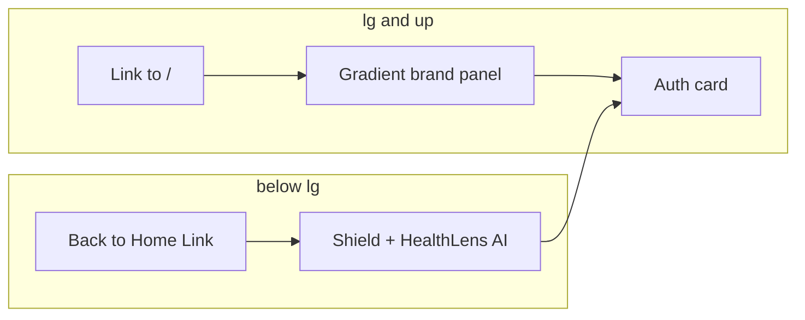

# Auth UI Upgrade + Chat Backend

## Phase 1 — Authentication pages

### Layout shell fixes

- **Hide global Navbar** on `/login` and `/register` in [`client/src/App.jsx`](client/src/App.jsx) (same pattern as `hideGlobalFooter`) so the split layout fills the viewport.
- Add `.bg-medical-gradient` to [`client/src/index.css`](client/src/index.css):

```css
.bg-medical-gradient {
  background: linear-gradient(135deg, #004e47 0%, #00685f 100%);
}
```

- Extract shared left panel into [`client/src/components/Auth/AuthBrandPanel.jsx`](client/src/components/Auth/AuthBrandPanel.jsx) to avoid duplicating brand narrative between Login and Register.

### Back-to-home navigation (new requirement)

Users must never be trapped on auth routes:

1. **Desktop (left gradient panel):** Wrap the `Shield` icon + "HealthLens AI" heading in `<Link to="/">` inside `AuthBrandPanel`. Preserve all existing Tailwind classes on the wrapper; only add link semantics (`className` unchanged on inner elements).

2. **Mobile (right form column):** Above the auth card header ("Welcome back" / "Create an Account"), add:

```jsx
<Link
  to="/"
  className="text-sm text-outline hover:text-primary transition-colors flex items-center gap-2 mb-6"
>
  <ArrowLeft size={16} />
  Back to Home
</Link>
```

Place this inside the `max-w-md` container, before the `lg:hidden` mobile logo block (or immediately after it — visible on all breakpoints but most useful when left panel is hidden). Login and Register both get the same link.

### Login — [`client/src/pages/Login.jsx`](client/src/pages/Login.jsx)

- Replace markup with prototype split layout (`<main className="flex w-full min-h-screen">`).
- **Preserve** existing state: `email`, `password`, `error`, `loading`.
- **Preserve** submit logic (`handleSubmit` / login flow → `loginUser` → `navigate('/dashboard')`).
- Convert Material icons to lucide-react: `Shield`, `Mail`, `Lock`, `Eye` / `EyeOff`, `ArrowRight`, `Fingerprint`, `Key`.
- Add `showPassword` state for visibility toggle (prototype behavior).
- Wire controlled inputs to `email` / `password`; show `error` banner inside auth card; disable submit + show loading label when `loading`.
- Social buttons (Biometric / SSO): `type="button"`, no-op (decorative).
- Footer toggle: `<Link to="/register">` for "Sign up".
- **Do not change** any layout/spacing/gradient/shadow Tailwind classes from the HTML prototype.

### Register — [`client/src/pages/Register.jsx`](client/src/pages/Register.jsx)

- Same layout shell via `AuthBrandPanel` + right column.
- **Preserve** state: `name`, `email`, `password`, `error`, `loading` and `registerUser` submit flow.
- Adapt headers: **"Create an Account"** + appropriate subtitle.
- Add **Full Name** field above Email with `User` icon (same input styling as email).
- Submit button label: e.g. "Create Account" + `ArrowRight` (or match prototype CTA style).
- Footer toggle: `<Link to="/login">` for "Sign in".



---

## Phase 2 — Chat backend (The Brain)

### Context builder — new [`utils/chatContextBuilder.js`](utils/chatContextBuilder.js)

- `buildVaultContext(reports)` — compact text block per report: `reportType`, `reportDate`, measurements (name/value/unit/status), `aiInterpretation.summary`, abnormal findings.
- `buildChatPrompt({ profileContext, vaultContext, message, history })` — concatenates profile (reuse [`buildProfileContext`](utils/profileContextBuilder.js)), full vault history, optional prior turns, and the user's new message.

### AI service — extend [`services/aiService.js`](services/aiService.js)

- Add `getChatModel()` — `gemini-flash-latest`, **plain text** response (no JSON schema).
- Add `generateChatResponse(prompt, deps)` — conversational system instruction: context-aware assistant, no diagnosis/prescription, cite vault data, medical disclaimer.

### Route — new [`routes/chat.js`](routes/chat.js)

- `POST /api/chat` with `protect` middleware.
- Body: `{ message: string, history?: [{ role: 'user'|'assistant', content: string }] }`.
- Load `User.findById(req.user.id)` + `Report.find({ userId }).sort({ reportDate: 1 })`.
- Call `generateChatResponse`; return `{ success: true, reply: string }`.
- Mount in [`server.js`](server.js): `app.use("/api/chat", chatRouter)`.

### Frontend — [`client/src/pages/Chat.jsx`](client/src/pages/Chat.jsx) + [`client/src/lib/api.js`](client/src/lib/api.js)

- Add `sendChatMessage({ message, history })`.
- Replace static demo messages with `messages` state array.
- Initial assistant message: dynamic welcome using real report count from `fetchReportHistory()` on mount.
- `handleSend`: append user bubble, call API, append assistant reply; `loading` state + scroll-to-bottom on new messages.
- Remove hardcoded triglyceride demo content once API is live.

### Tests

- `tests/chatContextBuilder.test.js` — vault context formatting.
- `tests/chatRoute.test.js` — handler validation, mocked Gemini, 401/400 cases.
- `tests/chatService.test.js` or extend `aiService.test.js` — mock model returns text.
- Expect test count to increase from 58.

---

## Phase 3 — PROJECT_CONTEXT.md

Update after implementation: auth UI, back-to-home links, `POST /api/chat`, new files, test count.

---

## Verification

1. `/login` and `/register` — no Navbar; full split layout on desktop.
2. Click brand on left panel → navigates to `/`.
3. On mobile width, "Back to Home" visible and works.
4. Login/register still authenticate and redirect to `/dashboard`.
5. `/chat` — send message, receive Gemini reply grounded in vault data.
6. `npm test` — all tests pass.
