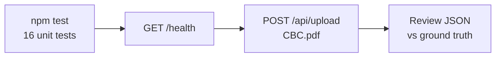

# CBC.pdf Manual Testing Plan

## Goal

Verify the **Plan 4 baseline** end-to-end using [`CBC.pdf`](c:\Users\aryan\Downloads\CBC.pdf) as the test document: automated unit tests pass, server accepts the upload, extraction returns sensible CBC structured output.

**Scope:** Manual testing only (no new test files or fixture copies).

---

## CBC.pdf ground truth (from embedded text)

The PDF is a **digital, text-selectable** CBC report (1 page). Key content:

| Field      | Expected in report                                |
| ---------- | ------------------------------------------------- |
| Patient    | MRS. ANJANA THAKUR, 46 Years FEMALE               |
| Section    | COMPLETE BLOOD COUNT (HAEMOGRAM)                  |
| Hemoglobin | **10.0** g/dl (flagged Low; ref 11–16)            |
| RBC        | 4.24 mill/cu.mm                                   |
| PCV        | 33.3%                                             |
| MCV        | 78.54 fL                                          |
| MCH        | 23.58 Pg                                          |
| MCHC       | 30.03%                                            |
| RDW        | 29.1%                                             |
| WBC        | 7400 /ul (labeled "Total White Blood Cell Count") |
| Platelets  | 3.15 Lakh/cumm                                    |
| MPV        | 9.2 fL (not in regex catalog)                     |

Differential counts (Neutrophils, Lymphocytes, etc.) and platelet indices (PCT, PDW) are **out of scope** for current [`parameterRegexMap.js`](utils/clinical/parameterRegexMap.js).

---

## Test flow



---

## Step 1 — Prerequisites

From project root [`c:\Users\aryan\Downloads\College\Projects\HealthLens AI`](c:\Users\aryan\Downloads\College\Projects\HealthLens AI):

```powershell
npm install
```

Confirm [`.env`](.env) exists (copy from [`.env.example`](.env.example) if missing). Defaults are fine:

- `PORT=5000`
- `UPLOAD_MAX_SIZE_MB=10`
- `PDF_MIN_TEXT_LENGTH=100`

Confirm CBC.pdf exists at `C:\Users\aryan\Downloads\CBC.pdf`.

---

## Step 2 — Run unit test suite

```powershell
npm test
```

**Pass criteria:** **16/16** tests green across:

- [`tests/rowStitcher.test.js`](tests/rowStitcher.test.js)
- [`tests/sectionExtractor.test.js`](tests/sectionExtractor.test.js)
- [`tests/integrationExtraction.test.js`](tests/integrationExtraction.test.js)
- [`tests/extractionIntegration.test.js`](tests/extractionIntegration.test.js)
- plus enrichment tests (`standardizeNames`, `unitNormalizer`, `validationSanityEngine`, `reportClassifier`, `traceability`)

If any fail, stop before API testing — baseline is broken.

---

## Step 3 — Start server

```powershell
npm run dev
```

(or `npm start` without auto-reload)

**Pass criteria:** Log shows `Server running on http://localhost:5000`.

Quick smoke check:

```powershell
curl.exe http://localhost:5000/health
```

Expect: `{ "success": true, "status": "ok", ... }`

---

## Step 4 — Upload CBC.pdf

```powershell
curl.exe -X POST http://localhost:5000/api/upload -F "report=@C:/Users/aryan/Downloads/CBC.pdf"
```

Pipe to a file for easier review:

```powershell
curl.exe -X POST http://localhost:5000/api/upload -F "report=@C:/Users/aryan/Downloads/CBC.pdf" -o cbc-response.json
```

**Pass criteria (top-level):**

- HTTP **200**
- `success: true`
- `originalFilename: "CBC.pdf"`
- `extractionMethod`: likely **`pdf-parse`** (digital PDF; OCR fallback only if text &lt; `PDF_MIN_TEXT_LENGTH`)
- `cleanedTextFull` and `cleanedTextClinical` are non-empty
- `structured.reportType` or `structured.reportTypes` includes **`CBC`**

---

## Step 5 — Validate structured output

Use this checklist when inspecting `structured` in the response.

### 5a. Section detection

- `structured.sections` contains a block with `section: "CBC"`
- `rowCount` &gt; 0 (report has ~25 measurement-related lines)

### 5b. Core CBC measurements (must extract)

These map to canonical IDs in [`canonicalMap.json`](utils/canonicalMap.json):

| ID               | Expected value | Notes                             |
| ---------------- | -------------- | --------------------------------- |
| `cbc_hemoglobin` | 10.0           | status likely **low** (ref 11–16) |
| `cbc_rbc`        | 4.24           |                                   |
| `cbc_pcv`        | 33.3           |                                   |
| `cbc_mcv`        | 78.54          | likely low vs ref 90–120          |
| `cbc_mch`        | 23.58          | likely low                        |
| `cbc_mchc`       | 30.03          | likely low                        |
| `cbc_rdw`        | 29.1           | likely high vs ref 10–16          |

Each measurement should have enriched fields per schema: `normalizedValue`, `unit`, `validation.ok`, `extractionScope: "CBC"`, `method`, `sourceLineText`.

### 5c. Likely gaps (document, do not fix in this session)

These are **known Plan 4 limitations**, not test failures unless core rows above are wrong:

| Analyte                         | Why it may be missing/wrong                                                                                                                                                                     |
| ------------------------------- | ----------------------------------------------------------------------------------------------------------------------------------------------------------------------------------------------- |
| **WBC** (`cbc_wbc`)             | Regex expects `Total Leucocyte Count`, `TLC`, or `WBC` — CBC.pdf uses **"Total White Blood Cell Count"** ([`parameterRegexMap.js` L22–26](utils/clinical/parameterRegexMap.js))                 |
| **Platelets** (`cbc_platelets`) | Unit is `Lakh/cumm`; regex expects `10^3/μl` style. Known platelet/MPV misbind risk per project context                                                                                         |
| **Patient metadata**            | [`metadataPrepass.js`](utils/clinical/metadataPrepass.js) expects `Patient Name:` and `Age/Gender:` — CBC.pdf uses `PATIENT'S NAME` / `Age /Sex` layout → `patient_info` fields may be **null** |
| **Clinical flags**              | `possible_anemia` triggers only when Hb **&lt; 10** ([`clinicalFlags.js` L8](services/clinicalFlags.js)); Hb = 10.0 → flag may be **absent**                                                    |
| **Traceability**                | Digital `pdf-parse` path → `sourcePage` / `sourceBBox` often **null**, `confidenceSource: "text_only"`                                                                                          |

### 5d. Negative checks

- No `diabetes_hba1c` or other non-CBC analytes (single-section CBC report)
- No HbA1c leakage into CBC block (Plan 4 regression)
- `structured.measurements` length reasonable (~7–10 core CBC params; not dozens of false positives)

---

## Step 6 — Record results

Capture a short test report:

1. `npm test` result (16/16 or failures)
2. `extractionMethod` used
3. List of extracted measurement `id` + `normalizedValue` + `status`
4. Any gaps from §5c (WBC, platelets, metadata)
5. Any unexpected false positives or wrong values

**Overall pass definition for this manual session:**

- Unit tests: **16/16**
- API: **200** with CBC section detected
- **At least hemoglobin + RBC + PCV + MCV/MCH/MCHC/RDW** extracted with correct numeric values
- Document (not block) WBC/platelets/metadata gaps if present

---

## Files involved (read-only reference)

| Role                   | File                                                                                                           |
| ---------------------- | -------------------------------------------------------------------------------------------------------------- |
| Pipeline entry         | [`services/extractionService.js`](services/extractionService.js)                                               |
| API route              | [`routes/upload.js`](routes/upload.js)                                                                         |
| Clinical orchestration | [`services/clinicalFilterService.js`](services/clinicalFilterService.js)                                       |
| Section scoping        | [`services/sectionExtractor.js`](services/sectionExtractor.js), [`utils/rowStitcher.js`](utils/rowStitcher.js) |
| Regex catalog          | [`utils/clinical/parameterRegexMap.js`](utils/clinical/parameterRegexMap.js)                                   |

No code changes required for manual-only testing.
