# CBC Parsing and Filtering Fix Plan

## Problem summary (from CBC.pdf test)

| Symptom                                                    | Root cause                                                                                                                                                                                                                                                                   |
| ---------------------------------------------------------- | ---------------------------------------------------------------------------------------------------------------------------------------------------------------------------------------------------------------------------------------------------------------------------- |
| `sections[0].section === "UNKNOWN"`, only ~9 stitched rows | [`extractionService.js`](services/extractionService.js) passes **`cleanupTextClinical`-filtered lines** into `stitchRows`, dropping headers like `COMPLETE BLOOD COUNT (HAEMOGRAM)` ([`candidateFilter.js`](utils/clinical/candidateFilter.js) requires measurement signals) |
| Only 1 measurement via `FALLBACK`                          | No CBC section block → section-scoped regex never runs                                                                                                                                                                                                                       |
| Hemoglobin = **11** (ref low) not **10.0**                 | Table layout `11 - 16 : L 10.0` — regex grabs **first** number on line                                                                                                                                                                                                       |
| RBC/PCV/MCV/etc. would also bind ref lows                  | Same ref-before-value pattern on **every** CBC row                                                                                                                                                                                                                           |
| WBC missing                                                | Regex lacks **"Total White Blood Cell Count"** alias                                                                                                                                                                                                                         |
| Platelets missing                                          | Regex/unit mismatch (`Lakh/cumm` vs `10^3/μl`)                                                                                                                                                                                                                               |
| `patient_info` all null                                    | [`metadataPrepass.js`](utils/clinical/metadataPrepass.js) expects `Patient Name:` / `Age/Gender:` — CBC.pdf uses `PATIENT'S NAME`, `Age /Sex`, name on next line                                                                                                             |

```mermaid
flowchart TD
  subgraph broken [Current broken path]
    full[cleanedTextFull]
    clinicalSeed[cleanupTextClinical]
    filter[candidateFilter drops headers]
    stitch1[stitchRows ~9 lines]
    unknown[section UNKNOWN]
    full --> clinicalSeed --> filter --> stitch1 --> unknown
  end

  subgraph fixed [Fixed path]
    full2[cleanedTextFull]
    stitch2[stitchRows all lines]
    cbcSection[section CBC block]
    scoped[section-scoped regex]
    clinicalOut[filterClinicalData builds cleanedTextClinical]
    full2 --> stitch2 --> cbcSection --> scoped --> clinicalOut
  end
```



---

## Phase 1 — Fix orchestration pipeline

**File:** [`services/extractionService.js`](services/extractionService.js)

**Change:** Split `cleanedTextFull` into lines and pass **full lines** to `stitchRows` / `extractSections`. Remove pre-filtering via `cleanupTextClinical` in the orchestration step.

```javascript
const fullLines = cleanedTextFull
  .split("\n")
  .map((line) => line.trim())
  .filter(Boolean);
const allWords = ocrPages.flatMap((page) => page.words || []);
const stitchedRows = stitchRows(fullLines, allWords);
const sections = extractSections(stitchedRows);
```

- Remove unused `cleanupTextClinical` import (final clinical text still produced inside [`clinicalFilterService.js`](services/clinicalFilterService.js) via `buildCleanedTextClinical`).
- **No change** to [`filterClinicalData`](services/clinicalFilterService.js) signature — it already receives `cleanedTextFull`, `stitchedRows`, and `sections`.

**Why this is safe:** Existing unit tests call `filterClinicalData` / `stitchRows` / `extractSections` directly with fixtures; they are unaffected. Only the upload pipeline path changes.

---

## Phase 2 — Fortify section extractor

**File:** [`services/sectionExtractor.js`](services/sectionExtractor.js)

**Change:** Add British spelling alias to CBC header map (line 2):

```javascript
CBC: ["complete blood count", "cbc", "hemogram", "haemogram"],
```

**Optional hardening (small):** Before the `wordCount > 6` early return in `detectHeaderSection`, check whether `normalized.includes(label)` for any multi-word label (e.g. `"complete blood count"`). This prevents a stitched-overlong header row from missing CBC when Phase 1 alone isn't enough. Keep change minimal — only reorder: substring match first, then word-count guard for fuzzy overlap.

**Test:** Extend [`tests/sectionExtractor.test.js`](tests/sectionExtractor.test.js) with a row `{ text: "COMPLETE BLOOD COUNT (HAEMOGRAM)", ... }` → `section === "CBC"`.

---

## Phase 3 — Regex map + shared table-row value resolver

**File:** [`utils/clinical/parameterRegexMap.js`](utils/clinical/parameterRegexMap.js)

### 3a. Shared ref-before-value helper (user-selected approach)

Add a deterministic helper used inside `extractMeasurements` **after** regex capture:

```javascript
function resolveTableRowValue(line, capturedValue) {
  // Indian lab table pattern: "<low> - <high> : [L|H] <result> [duplicate]"
  const tableMatch = line.match(
    /\d+(?:\.\d+)?\s*[-–]\s*\d+(?:\.\d+)?\s*:\s*(?:[LH]\s+)?(\d+(?:\.\d+)?)/i,
  );
  if (tableMatch) {
    return Number(tableMatch[1]);
  }
  return capturedValue;
}
```

Apply when building `value` (line ~378): `const value = resolveTableRowValue(candidate.line, Number(match[valueGroup]));`

This fixes **Hemoglobin, RBC, PCV, MCV, MCH, MCHC, RDW, WBC, Platelets** on CBC.pdf without per-definition rewrites or Plan 5-style row-only binding.

### 3b. Targeted regex / hint updates

Adapt to existing schema (`name`, `category`, `priority`, `regex` — **not** `id`/`section` fields):

| Definition                         | Update                                                                                                                                                                                     |
| ---------------------------------- | ------------------------------------------------------------------------------------------------------------------------------------------------------------------------------------------ |
| **WBC** (L22–26)                   | Extend regex: `\b(?:Total\s+White\s+Blood\s+Cell\s+Count\|Total\s+Leucocyte\s+Count\|TLC\|WBC)\b`                                                                                          |
| **Platelets** (L28–33)             | Relax to allow unit/ref before value: `/\bPlatelet(?:s)?\s*(?:Count)?\b.*?(Lakh\|10\^3\|\/)?.*?(\d+(?:\.\d+)?)/i` with `valueGroup: 2` — combined with `resolveTableRowValue` for `: 3.15` |
| **definitionHintRegex WBC** (L287) | Add `total white blood cell count` to hint aliases                                                                                                                                         |

**Hemoglobin regex:** Leave mostly as-is; `resolveTableRowValue` handles the `: L 10.0` case. Optionally tighten to skip HbA1c lines (existing guard at L333 remains).

**Do not** re-implement Plan 5 wholesale (row-only binding, `shouldSkipDefinition`, phase metadata, numeric dedupe).

---

## Phase 4 — Metadata layout expansion

**File:** [`utils/clinical/metadataPrepass.js`](utils/clinical/metadataPrepass.js)

Add **fallback patterns** after existing matches (preserve current behavior for standard labs):

| Field           | New pattern(s) for CBC.pdf layout                                                        |
| --------------- | ---------------------------------------------------------------------------------------- | ---- | --------------------------------------------------------------------- |
| **reportDate**  | Leading date: `/^(\d{1,2}\/\d{1,2}\/\d{4})/m`; `Reg\.?\s*Date` variants                  |
| **age**         | `/Age\s*[\/\-]?\s*Sex.*?(\d{1,3})\s*(?:Years\|Yrs\|Y)\b/i`                               |
| **gender**      | Same line: `/Age\s*[\/\-]?\s*Sex.*?\b(FEMALE\|MALE\|F\|M)\b/i` → reuse `normalizeGender` |
| **patientName** | Title line fallback: `/\b(MRS?\.                                                         | MR\. | MS\.)\s+[A-Za-z]+(?:\s+[A-Za-z]+)\*\b/`(captures`MRS. ANJANA THAKUR`) |

**Caution:** Run name patterns **after** rejecting lines that look like headers (`PATIENT'S NAME`, `REF. By Dr.`). Prefer the title-line pattern over a greedy `name\b` capture on header rows.

**Test:** New [`tests/metadataPrepass.test.js`](tests/metadataPrepass.test.js) with a short CBC.pdf text snippet.

---

## Phase 5 — Regression tests + verification

### New integration test (inline fixture, no PDF copy)

**File:** [`tests/cbcPdfExtraction.test.js`](tests/cbcPdfExtraction.test.js)

Use representative lines from CBC.pdf (same format as [`integrationExtraction.test.js`](tests/integrationExtraction.test.js)):

1. Build `fullLines` → `stitchRows` → `extractSections` → `filterClinicalData(cleanedTextFull, { stitchedRows, sections })`
2. Assert:
   - `sections.some(s => s.section === "CBC")`
   - Core IDs with expected values: `cbc_hemoglobin` **10**, `cbc_rbc` **4.24**, `cbc_pcv` **33.3**, `cbc_mcv` **78.54**, `cbc_mch` **23.58**, `cbc_mchc` **30.03**, `cbc_rdw` **29.1**
   - `cbc_hemoglobin.status === "low"`
   - `extractionScope === "CBC"` for core params (not `FALLBACK`)
   - No `diabetes_hba1c`
3. Optionally assert `patient_info.age === "46"`, `gender === "Female"`, name contains `ANJANA`

### Verification commands

```powershell
npm test                    # expect 16+ tests (new tests added)
npm start                   # or npm run dev
curl.exe -X POST http://localhost:5000/api/upload -F "report=@C:/Users/aryan/Downloads/CBC.pdf" -o cbc-response.json
```

**Manual pass criteria (CBC.pdf):**

- `structured.sections` includes `CBC` with `rowCount` >> 9
- 7+ core CBC measurements with correct values
- Hemoglobin status **low**; `possible_anemia` flag still absent at exactly 10.0 (existing [`clinicalFlags.js`](services/clinicalFlags.js) threshold `< 10` — document, do not change unless requested)
- WBC/platelets extracted if regex + resolver succeed (document if platelet unit remains unnormalized — `Lakh/cumm` not in [`unitNormalizer.js`](utils/unitNormalizer.js))

---

## Files touched (summary)

| File                                                                         | Change                                  |
| ---------------------------------------------------------------------------- | --------------------------------------- |
| [`services/extractionService.js`](services/extractionService.js)             | Phase 1 — full-line stitching           |
| [`services/sectionExtractor.js`](services/sectionExtractor.js)               | Phase 2 — `haemogram` alias             |
| [`utils/clinical/parameterRegexMap.js`](utils/clinical/parameterRegexMap.js) | Phase 3 — resolver + WBC/platelet regex |
| [`utils/clinical/metadataPrepass.js`](utils/clinical/metadataPrepass.js)     | Phase 4 — lab layout patterns           |
| [`tests/sectionExtractor.test.js`](tests/sectionExtractor.test.js)           | haemogram header case                   |
| [`tests/metadataPrepass.test.js`](tests/metadataPrepass.test.js)             | new                                     |
| [`tests/cbcPdfExtraction.test.js`](tests/cbcPdfExtraction.test.js)           | new end-to-end fixture                  |

**Out of scope:** README update, unit normalizer for `Lakh/cumm`, clinical flag threshold change, Plan 5 reintroduction, editing `.cursor/plans/*`.

---

## Architecture preserved

- Local extraction only; no LLM
- Same API response shape
- Same pipeline: cleanup → stitch → section → `filterClinicalData` → enrich/dedupe/flags
- Deterministic regex + explicit table-row resolver (no ML)
