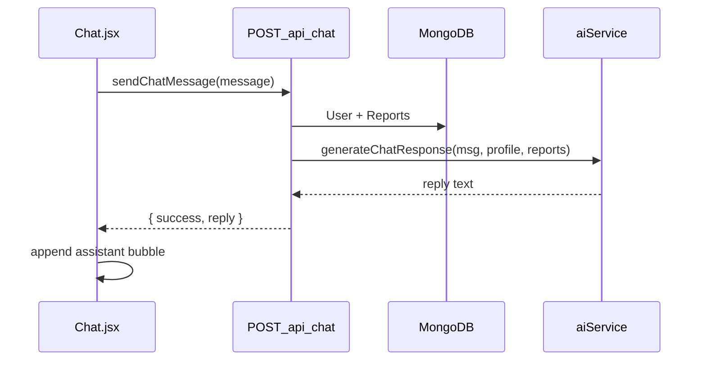

# Context-Aware Chat — Align to Spec

## Current state (already shipped)

| Piece                                                                   | Status                                                                                               |
| ----------------------------------------------------------------------- | ---------------------------------------------------------------------------------------------------- |
| [`routes/chat.js`](routes/chat.js) + `server.js` mount                  | Done — `POST /api/chat`, `protect`, returns `{ success, reply }`                                     |
| [`client/src/lib/api.js`](client/src/lib/api.js) `sendChatMessage`      | Done — but accepts `{ message, history }`                                                            |
| [`client/src/pages/Chat.jsx`](client/src/pages/Chat.jsx)                | Done — dynamic `messages.map()`, API wired, uses `loading` not `isTyping`                            |
| [`services/aiService.js`](services/aiService.js) `generateChatResponse` | Done — but signature is `(chatPrompt, deps)` via [`chatContextBuilder`](utils/chatContextBuilder.js) |
| Tests                                                                   | **68/68** passing                                                                                    |

Gap: API shape and prompt construction differ from the new task spec. Refactor in place — no duplicate routes.

---

## Task 1 — Refactor [`services/aiService.js`](services/aiService.js)

Replace `generateChatResponse(chatPrompt, deps)` with:

```js
async function generateChatResponse(userMessage, userProfile, userHistory, deps = {})
```

**Model:** keep `gemini-flash-latest` (already in repo; equivalent to spec's `gemini-1.5-flash`).

**System prompt** (built inside the function):

```js
const systemInstruction = `You are HealthLens AI, an empathetic and highly intelligent clinical assistant. You have access to the user's secure Health Vault.

Patient Profile: ${JSON.stringify(userProfile)}

Medical History (Chronological): ${JSON.stringify(userHistory)}

Answer the user's prompt using ONLY the provided data. If they ask something outside their data, politely inform them you can only discuss their uploaded records. Be concise, reassuring, and highly specific to their vitals. Do not provide medical diagnoses; advise consulting a doctor for critical issues.`;
```

**Call pattern:**

```js
const model = genAI.getGenerativeModel({
  model: "gemini-flash-latest",
  systemInstruction,
});
const result = await model.generateContent(userMessage);
return result.response.text().trim();
```

**Profile payload:** pass `user.profile` (password excluded — route already loads full User doc; strip `password` before stringify).

**History payload:** pass lean report array from MongoDB (`reportType`, `reportDate`, `measurements`, `aiInterpretation`, `vitalityScore` if present).

Keep `getChatModel` only if still useful for tests; prefer injecting `deps.getModel(systemInstruction)` for testability.

---

## Task 2 — Simplify [`routes/chat.js`](routes/chat.js)

Remove dependency on [`chatContextBuilder`](utils/chatContextBuilder.js) in the route (file can remain for tests or be deleted if unused).

Handler flow:

1. Validate `req.body.message` (non-empty string).
2. `User.findById(req.user.id)` — omit password from profile passed to AI.
3. `Report.find({ userId: req.user.id }).sort({ reportDate: 1 })`.
4. `reply = await generateChatResponse(message.trim(), user.profile, reports)`.
5. Return `{ success: true, reply }`.

**Remove** optional `history` body validation (not in new spec). Update [`tests/chatRoute.test.js`](tests/chatRoute.test.js): delete invalid-history test; assert `generateChatResponse` receives `(message, profile, reports)`.

---

## Task 3 — Simplify [`client/src/lib/api.js`](client/src/lib/api.js)

Change to spec signature:

```js
export async function sendChatMessage(message) {
  const res = await fetch("/api/chat", {
    method: "POST",
    headers: { "Content-Type": "application/json", ...authHeaders() },
    body: JSON.stringify({ message }),
  });
  return parseJsonResponse(res);
}
```

---

## Task 4 — Align [`client/src/pages/Chat.jsx`](client/src/pages/Chat.jsx)

| Change        | Detail                                                                                                                                                                                                           |
| ------------- | ---------------------------------------------------------------------------------------------------------------------------------------------------------------------------------------------------------------- |
| Initial state | `useState([{ role: 'assistant', content: 'Hello! I have full access to your medical records and clinical profile. How can I assist you with your health data today?' }])` — remove `fetchReportHistory` on mount |
| Rename        | `loading` → `isTyping`                                                                                                                                                                                           |
| `handleSend`  | push user msg → clear input → `setIsTyping(true)` → `sendChatMessage(trimmed)` → push `{ role: 'assistant', content: res.reply }` → `setIsTyping(false)`                                                         |
| Render        | keep existing `.map()` bubble layout (already matches spec); show typing indicator when `isTyping`                                                                                                               |
| Remove        | `initializing`, dynamic welcome, `history` passed to API, hardcoded demo bubbles (already removed)                                                                                                               |



---

## Tests & docs

- Update [`tests/aiService.test.js`](tests/aiService.test.js) — call `generateChatResponse(message, profile, reports, { getModel })`; assert system prompt contains stringified profile/history.
- Keep [`tests/chatContextBuilder.test.js`](tests/chatContextBuilder.test.js) OR remove file if `chatContextBuilder` is deleted (prefer keep file + tests if utility stays unused — minimal diff: leave utility, route stops using it).
- Run `npm test` — expect 68 passing (minus 1 if history validation test removed, plus any new assertions).
- Patch [`PROJECT_CONTEXT.md`](PROJECT_CONTEXT.md) changelog: chat API signature alignment.

---

## Verification

1. Log in, open `/chat` — static welcome message visible.
2. Send a question — user bubble appears, `isTyping` spinner shows, assistant reply renders.
3. Question about uploaded biomarkers — reply references vault data (with `GEMINI_API_KEY` set).
4. Unauthenticated `POST /api/chat` — 401 from `protect`.
5. `npm test` — all green.
