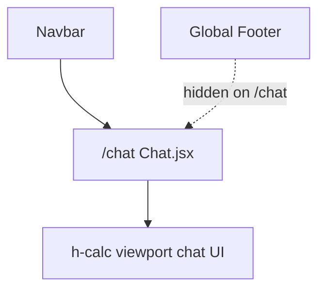

# Chat Page Prototype Conversion

## Scope

Mechanical conversion of the prototype chat UI into React — no backend/API wiring yet. Static seed messages from the HTML remain as demo content.

---

## Task 1 — Create [`client/src/pages/Chat.jsx`](client/src/pages/Chat.jsx)

### Root element

Return a single root `<div>` matching the spec (height calc added for global Navbar):

```jsx
<div className="flex-1 flex flex-col max-w-3xl mx-auto w-full px-margin-mobile h-[calc(100vh-80px)]">
```

Strip prototype shell: ignore `<header>`, `<aside>`, mobile bottom `<nav>`, and `<main>` wrapper classes (`md:ml-64`, `pt-20`, etc.).

### Markup sections (classes unchanged)

Convert the inner chat container verbatim to JSX:

1. **Chat header** — assistant avatar (`Brain`), title, online status dot, `MoreVertical` menu button
2. **Messages list** — `flex-1 overflow-y-auto py-lg space-y-lg chat-scroll` with three static bubbles:
   - AI welcome message (`Sparkles` avatar)
   - User question (avatar `` from prototype URL)
   - AI triglyceride response with inline data card (`AlertTriangle`, "View Trends" button)
3. **Input bar** — `Paperclip` attach button, controlled text input, `Send` submit button, disclaimer text

### Icon mapping (lucide-react)

| Prototype      | Lucide          | Size hint                 |
| -------------- | --------------- | ------------------------- |
| `psychology`   | `Brain`         | 24px in header avatar     |
| `more_vert`    | `MoreVertical`  | default                   |
| `auto_awesome` | `Sparkles`      | 18px in message avatars   |
| `warning`      | `AlertTriangle` | default, `text-secondary` |
| `attach_file`  | `Paperclip`     | default                   |
| `send`         | `Send`          | default in send button    |

Replace `<span class="material-symbols-outlined">` with Lucide components; keep all parent/wrapper Tailwind classes.

### Form state

```jsx
const [message, setMessage] = useState("");

function handleSend(e) {
  e.preventDefault();
  if (!message.trim()) return;
  // TODO: wire to chat API
  setMessage("");
}
```

- Wrap the floating input bar in `<form onSubmit={handleSend}>`
- Bind input: `value={message}` + `onChange={(e) => setMessage(e.target.value)}`
- Send button: `type="submit"`

### Scroll behavior

Port prototype auto-scroll with `useRef` on the messages container + `useEffect` to set `scrollTop = scrollHeight` on mount (demo messages only).

---

## Task 2 — CSS for `.chat-scroll`

Add to [`client/src/index.css`](client/src/index.css) `@layer utilities` (from prototype `<style>` block):

```css
.chat-scroll::-webkit-scrollbar {
  width: 4px;
}
.chat-scroll::-webkit-scrollbar-track {
  background: transparent;
}
.chat-scroll::-webkit-scrollbar-thumb {
  background: #bec9c6;
  border-radius: 10px;
}
```

No Tailwind config changes needed — design tokens (`shadow-ambient`, `px-margin-mobile`, color tokens) already exist in [`client/tailwind.config.js`](client/tailwind.config.js).

---

## Task 3 — Routing in [`client/src/App.jsx`](client/src/App.jsx)

- Import `Chat` from `./pages/Chat`
- Add protected route:

```jsx
<Route
  path="/chat"
  element={
    <ProtectedRoute>
      <Chat />
    </ProtectedRoute>
  }
/>
```

- Extend `hideGlobalFooter` to include `/chat` (per your choice — keeps fixed viewport, no page scroll):

```jsx
const hideGlobalFooter = ["/", "/login", "/register", "/chat"].includes(
  pathname,
);
```



---

## Task 4 — Navbar in [`client/src/components/Layout/Navbar.jsx`](client/src/components/Layout/Navbar.jsx)

In the authenticated nav block (after Vault link), add:

```jsx
<Link
  to="/chat"
  className="text-sm text-on-surface-variant hover:text-primary transition-colors"
>
  Assistant
</Link>
```

Matches existing Dashboard/Vault link styling. Optional enhancement: `useLocation()` active state (`text-primary font-medium`) — skip unless nav feels incomplete without it.

---

## Task 5 — PROJECT_CONTEXT.md

After implementation, update:

- **Last Updated** → June 8, 2026
- **Changelog** — Chat prototype page, `/chat` route, Navbar Assistant link, `chat-scroll` utility
- **Key files map** — add `Chat.jsx`
- **Done section** — note UI-only chat shell (API wiring planned)

---

## Verification

1. `npm run dev` — log in, visit `/chat`: fixed-height chat under Navbar, no page/footer scroll
2. Input is controlled; Enter/submit clears field via `handleSend`
3. Navbar shows **Assistant** when authenticated; link navigates to `/chat`
4. `/chat` without token redirects to `/login`
5. `npm test` — no backend changes; expect 58/58 passing
