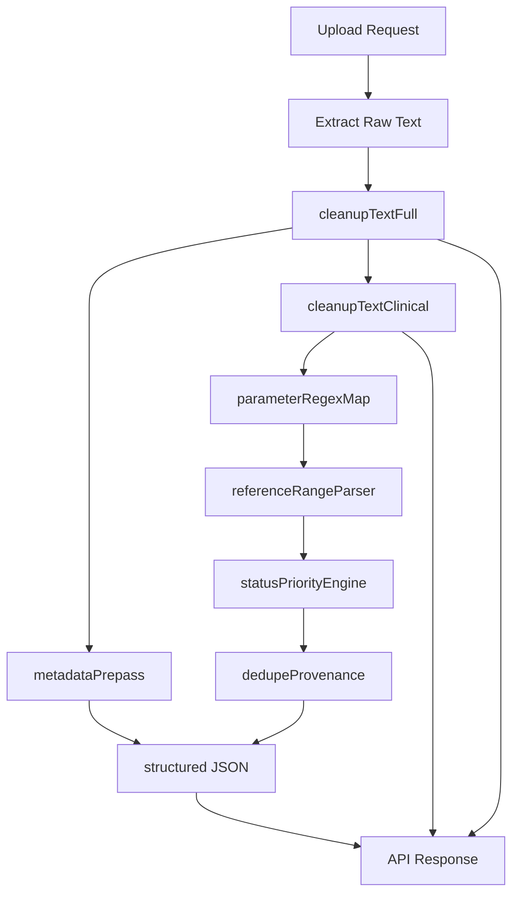

# HealthLens AI Clinical Filtering Plan

## Goal

Upgrade the extraction MVP from single-output cleanup to a deterministic clinical pipeline that returns:

- `cleanedTextFull`
- `cleanedTextClinical`
- `structured` (patient metadata + measurements + status/priority)

## Current Baseline (Confirmed)

- Current pipeline is: upload → OCR/PDF extraction → single cleanup → response.
- Current cleanup is centralized in [utils/textCleanup.js](utils/textCleanup.js).
- Extraction orchestration is in [services/extractionService.js](services/extractionService.js).
- Upload response is shaped in [routes/upload.js](routes/upload.js).

## Implementation Plan

### 1) Introduce a staged deterministic clinical pipeline

Create modular deterministic helpers under `utils/clinical/` and orchestrate them via a new service:

- [services/clinicalFilterService.js](services/clinicalFilterService.js)
- [utils/clinical/metadataPrepass.js](utils/clinical/metadataPrepass.js)
- [utils/clinical/boilerplateRemoval.js](utils/clinical/boilerplateRemoval.js)
- [utils/clinical/candidateFilter.js](utils/clinical/candidateFilter.js)
- [utils/clinical/parameterRegexMap.js](utils/clinical/parameterRegexMap.js)
- [utils/clinical/referenceRangeParser.js](utils/clinical/referenceRangeParser.js)
- [utils/clinical/statusPriorityEngine.js](utils/clinical/statusPriorityEngine.js)
- [utils/clinical/dedupeProvenance.js](utils/clinical/dedupeProvenance.js)

Reason: keeps regex/rule complexity out of route handlers and avoids turning `extractionService` into a monolith.

### 2) Preserve existing cleanup while adding dual text outputs

Refactor [utils/textCleanup.js](utils/textCleanup.js) into explicit functions:

- `cleanupTextFull(rawText)` for traceable normalized text.
- `cleanupTextClinical(cleanedTextFull)` for strict clinical subset.

Maintain backward compatibility in early step by temporarily keeping `cleanupText()` alias until route response migration is complete.

### 3) Metadata-first extraction to avoid data loss

In the clinical pipeline, run `metadataPrepass` before aggressive boilerplate removal so fields like report date are not dropped too early.

Extract only planned metadata keys:

- `patientName`
- `gender`
- `age`
- `reportDate`
- `labName`

### 4) Build robust parameter extraction map

Implement canonical parameter registry with synonyms and category mapping for rubric groups (CBC, Diabetes, Lipid, Kidney, Liver, Iron, Vitamins, Thyroid).

Each parsed measurement should include:

- `category`, `name`, `value`, `unit`, `reference_range`, `status`, `priority`
- `sourceLine` (for traceability)

### 5) Add reference parsing + status/priority engine

Implement deterministic status logic:

- Range-based status when reference range exists.
- Threshold fallback for known items (HbA1c, Vitamin D, eGFR).
- Otherwise set `status: null`.

Priority should come from a central map so clinical urgency is data-driven and easy to tune.

### 6) Integrate into extraction service and response contract

Update [services/extractionService.js](services/extractionService.js) to return:

- `methodUsed`
- `cleanedTextFull`
- `cleanedTextClinical`
- `structured`

Update [routes/upload.js](routes/upload.js) response shape to include these new fields.

Keep temporary compatibility option in README notes if older consumers expect `cleanedText`.

### 7) Logging and safety refinement

Update [utils/logger.js](utils/logger.js) usage so logs prefer summaries and short previews rather than full PHI text dumps in normal flow.

### 8) Documentation and validation updates

Update [README.md](README.md):

- new response schema
- deterministic clinical filtering explanation
- verification steps for extracted values and removed boilerplate lines

Add focused tests (if included in this phase) for:

- boilerplate removal
- metadata capture
- parameter extraction
- range parsing/status
- dedupe behavior

## Data Flow

## Acceptance Criteria

- API returns `cleanedTextFull`, `cleanedTextClinical`, and `structured` in one upload response.
- `cleanedTextClinical` is significantly shorter and focused on clinical signal.
- Boilerplate lines (booking IDs, machine/method paragraphs, page markers, marketing text) are removed from clinical output.
- Key sample values (e.g., Hemoglobin, HbA1c, Vitamin D, Glucose, Cholesterol, Creatinine) are extracted into `structured.measurements` with units when present.
- Metadata fields are populated when present without being lost during cleanup.
- Status/priority logic applies deterministically (range-based first, threshold fallback second).
