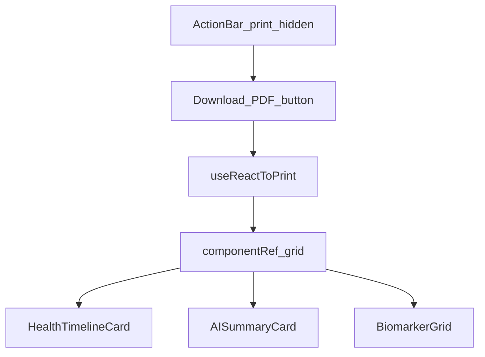

# Dashboard PDF Export

## Context

[`client/src/components/Dashboard/Dashboard.jsx`](client/src/components/Dashboard/Dashboard.jsx) currently renders a 12-column grid (timeline, summary, status card, biomarker grid) with no export capability. Day 6 roadmap lists PDF export; this implements browser print-to-PDF via `react-to-print`.

Current structure:

```jsx
<div className="min-h-screen bg-background">
  <div className="max-w-[1440px] mx-auto p-6 md:p-10">
    <div className="grid grid-cols-1 md:grid-cols-12 gap-6">
      {/* HealthTimelineCard, AISummaryCard, status card, BiomarkerGrid */}
    </div>
  </div>
</div>
```

---

## Task 1: Install dependency

In [`client/`](client/):

```bash
npm install react-to-print
```

Updates [`client/package.json`](client/package.json) and `package-lock.json` only.

---

## Task 2: Update Dashboard — [`client/src/components/Dashboard/Dashboard.jsx`](client/src/components/Dashboard/Dashboard.jsx)

### Imports

```js
import { useRef } from "react";
import { useReactToPrint } from "react-to-print";
import { CircleCheckBig, Download } from "lucide-react";
```

### Ref + print handler

**API note:** Latest `react-to-print` v3 uses `contentRef` (not the v2 `content` callback from your spec). Equivalent implementation:

```js
const componentRef = useRef(null);

const handlePrint = useReactToPrint({
  contentRef: componentRef,
  documentTitle: "HealthLens_AI_Report",
});
```

Use `onClick={() => handlePrint()}` on the button — passing `handlePrint` directly breaks v3 because React passes the click event as the first argument.

### JSX layout

Insert an **Action Bar** as a sibling **above** the printable grid (inside the max-width container):

```jsx
<div className="flex items-center justify-between mb-6 print:hidden">
  <h2 className="text-xl font-semibold text-on-surface">Your Health Intelligence</h2>
  <button
    type="button"
    onClick={() => handlePrint()}
    className="bg-white border border-outline-variant/50 text-primary hover:bg-surface-container-low px-4 py-2 rounded-lg flex items-center gap-2"
  >
    <Download size={18} />
    Download PDF
  </button>
</div>

<div ref={componentRef} className="grid grid-cols-1 md:grid-cols-12 gap-6">
  {/* existing cards unchanged */}
</div>
```

- `componentRef` attaches to the **grid div** only (timeline + summary + status + biomarkers) — action bar excluded from print output
- `print:hidden` on the action bar is belt-and-suspenders (already outside `contentRef`)

No changes needed to child cards (`AISummaryCard`, `BiomarkerGrid`, `HealthTimelineCard`).



---

## Task 3: Print CSS

No Tailwind config changes required — Tailwind v3 includes the `print:` variant by default ([`client/tailwind.config.js`](client/tailwind.config.js)).

Action bar gets `print:hidden` per Task 2. Optional follow-up (not in scope unless charts clip): add `@media print` rules in [`client/src/index.css`](client/src/index.css) if Recharts SVGs need width fixes during print.

---

## Definition of done

- [`PROJECT_CONTEXT.md`](PROJECT_CONTEXT.md): changelog + move PDF export from Day 6 todo to partial done (dashboard print-to-PDF)
- Manual test: resolve dashboard after upload → click **Download PDF** → browser print dialog opens with title `HealthLens_AI_Report`; action bar absent from preview

---

## Out of scope

- Server-side PDF generation
- Including App header / logout in print output
- Hiding App-level chrome globally during print
- Backend or test changes (client-only feature)
