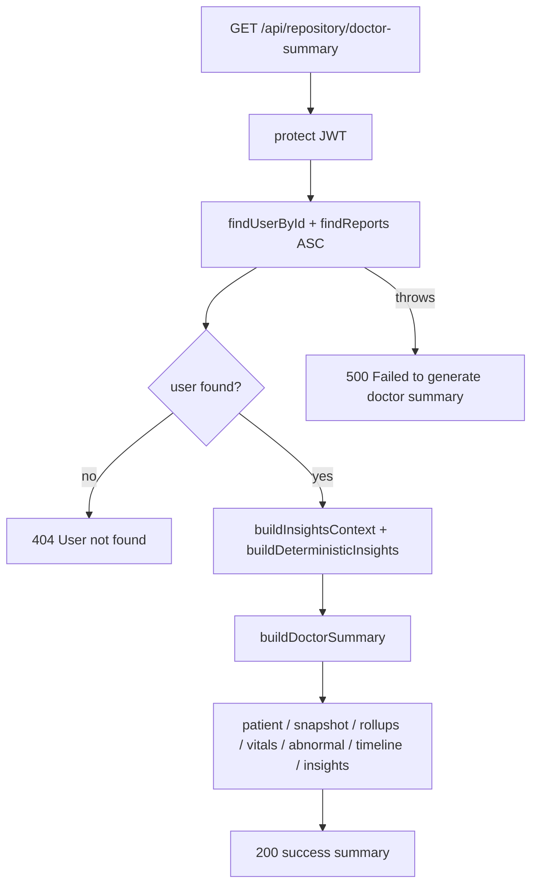

# Stage 2.1 - Doctor Summary Data Builder (backend only)

Build the clean backend contract first; the printable `DoctorSummary.jsx` (Stage 2.2) consumes this single endpoint later. No Gemini in v1 - the insight block is rebuilt deterministically from existing structured data.

## 1. New builder: `utils/doctorSummaryBuilder.js`

Pure, dependency-light module (mirrors the style of [`utils/longitudinalInsights.js`](utils/longitudinalInsights.js)). Reuses existing helpers - no new aggregation logic.

Imports to reuse:
- `aggregateMedications`, `aggregateDiagnoses`, `aggregateSymptoms`, `aggregateAdvice` from [`utils/repositoryAggregator.js`](utils/repositoryAggregator.js)
- `buildTimeline` from [`utils/timelineBuilder.js`](utils/timelineBuilder.js)
- `buildInsightsContext`, `buildDeterministicInsights`, `INSIGHTS_DISCLAIMER` from [`utils/longitudinalInsights.js`](utils/longitudinalInsights.js)
- `calculateAge`, `calculateBmi` from [`utils/profileContextBuilder.js`](utils/profileContextBuilder.js)

Exported functions (all date math takes an injectable `referenceDate` for deterministic tests):
- `buildPatientBlock(user, { referenceDate = new Date() } = {})` - `{ name, email, age, gender, bloodGroup, heightCm, weightKg, bmi, chronicConditions, lifestyle }`. Age via `calculateAge(dob, referenceDate)`, BMI via existing helper; safe defaults when `profile` missing.
- `buildLatestVitals(reports)` - picks the most recent `lab_report` (replicate a small local `latestLabReport(reports)` helper since `labReportsAsc` is not exported) and maps **all** of its `measurements` to a compact `{ name, value, unit, status, referenceRange, reportId, reportDate }`. No AI interpretation, no OCR/provenance.
- `buildAbnormalMarkers(reports)` - from the latest lab report, measurements with `status` high/low, shaped `{ marker, value, unit, status, referenceRange, reportId, reportDate }` (traceable to source report).
- `buildTimelineHighlights(reports)` - `buildTimeline(reports)` (newest-first, already carries `id`/`date`) then `.slice(0, 8)`.
- `buildDoctorSummary({ user, reports, insights, generatedAt = new Date().toISOString(), referenceDate = new Date() })` - orchestrates all blocks plus `snapshot` and `insights` subset; threads `referenceDate` into `buildPatientBlock` and uses the injected `generatedAt`.

`snapshot` (deterministic): `totalReports`, `latestReportDate` (max of **valid** report dates only; `null` when no reports or all dates invalid - never `Invalid Date`), `labReportCount`, `activeConditionCount` (diagnoses rollup with `latestStatus === "active"`), `currentMedicationCount` (deduped medications rollup length), `abnormalMarkerCount`.

`insights` subset (from passed-in deterministic insights): `{ summary, improvingSignals, needsAttention, doctorQuestions, followUpSuggestions }` only - **omit `generatedBy`** (the doctor summary does not expose AI-vs-deterministic provenance). `disclaimer = INSIGHTS_DISCLAIMER`.

## 2. Route handler in `routes/repository.js`

Add `doctorSummaryHandler(req, res, deps = {})` modeled on the existing `insightsHandler` (lines 93-146 of [`routes/repository.js`](routes/repository.js)) - it also needs both User and Report, so it cannot use `makeHandler`.

- deps: `findReports` (default `defaultFindReports(req)`), `findUserById` (default `User.findById`), `buildInsights` (default `buildDeterministicInsights`), `buildSummary` (default `buildDoctorSummary`) for test injection.
- `Promise.all([findUserById, findReports])` in try/catch -> `500 { success:false, message:"Failed to generate doctor summary." }`.
- `if (!user)` -> `404 { success:false, message:"User not found." }`.
- `const context = buildInsightsContext({ reports, user }); const insights = buildInsights(context);`
- `return res.json({ success: true, summary: buildSummary({ user, reports, insights }) })`.
- Register `router.get("/doctor-summary", protect, doctorSummaryHandler);` and export `module.exports.doctorSummaryHandler = doctorSummaryHandler;`.

Empty reports -> still `200`: populated `patient` block, empty arrays, zeroed snapshot (deterministic insights returns its "no lab reports" educational summary).

## 3. Flow



## 4. Response shape (contract)

```js
{
  success: true,
  summary: {
    patient: { name, email, age, gender, bloodGroup, heightCm, weightKg, bmi, chronicConditions, lifestyle },
    snapshot: { totalReports, latestReportDate, labReportCount, activeConditionCount, currentMedicationCount, abnormalMarkerCount },
    medications: [], diagnoses: [], symptoms: [], advice: [],
    latestVitals: [ /* { name, value, unit, status, referenceRange, reportId, reportDate } */ ],
    abnormalMarkers: [ /* { marker, value, unit, status, referenceRange, reportId, reportDate } */ ],
    timelineHighlights: [ /* buildTimeline events, id/date, capped at 8 */ ],
    insights: { summary, improvingSignals, needsAttention, doctorQuestions, followUpSuggestions },
    disclaimer, generatedAt
  }
}
```

## 5. Tests

New `tests/doctorSummaryBuilder.test.js` (node:test + node:assert, pure builder calls, fixed `referenceDate` + `generatedAt` for determinism): patient block includes computed age + bmi (asserted against fixed referenceDate); latestVitals come from the most recent lab report and carry `reportId`/`reportDate`; abnormal markers collected with required + traceability fields; med/diagnosis/symptom/advice rollups present; `latestReportDate` is `null` for empty/invalid-date reports; empty reports -> patient populated, arrays empty, snapshot zeroed; timeline highlights capped at <= 8; embedded `insights` omits `generatedBy`.

Extend `tests/repositoryRoute.test.js` (reuse `createMockRes`, `stubReports`, deps injection): handler success (asserts `summary.patient`, `summary.snapshot`, arrays); missing user -> 404; DB failure -> 500 (`/Failed to generate doctor summary/`); empty reports -> 200 with empty arrays.

## 6. Docs (definition of done)

Per [`.cursor/rules/project-context-maintenance.mdc`](.cursor/rules/project-context-maintenance.mdc), update [`PROJECT_CONTEXT.md`](PROJECT_CONTEXT.md): Last Updated date; prepend Stage 2.1 changelog bullet; add `GET /api/repository/doctor-summary` row to the section 2 endpoint table; bump section 7 test count; add a milestone-history row.

## Decisions made (low-risk, documented rather than blocking)
- `abnormalMarkers` scope = latest lab report only (clinically current snapshot, matches the latest-vitals rule). Cross-report worsening trends already live in `insights.needsAttention`.
- `currentMedicationCount` = deduped medication rollup length. True active-vs-discontinued needs stop-date data we lack; deferred.
- `timelineHighlights` cap = 8 (top of the stated 5-8 range).
- No Gemini call in this endpoint (v1). AI rewording reuse can be a later enhancement.

## Out of scope (Stage 2.2)
Printable `DoctorSummary.jsx`, the "Doctor Summary" buttons on Dashboard/Vault, and `fetchDoctorSummary()` in `client/src/lib/api.js`.