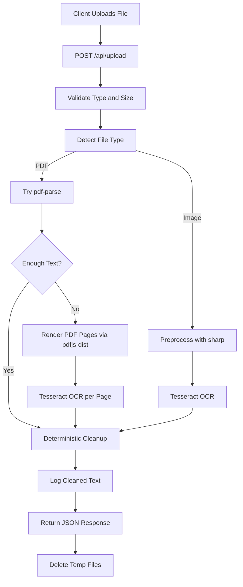

# HealthLens AI Extraction MVP Plan

## Goal

Deliver a backend-only MVP that accepts medical report uploads, extracts text locally, applies deterministic cleanup, logs cleaned text, and returns the cleaned text in the upload response.

## Scope Boundaries

- Include: upload API, health route, file validation/limits, local extraction, deterministic cleanup, temp-file cleanup, basic error handling, README.
- Exclude: AI analysis, Gemini/Groq, MongoDB, frontend.

## Proposed Implementation

### 1) Project scaffold and dependencies

- Initialize backend with `express` + `dotenv` and standard scripts (`dev`, `start`).
- Install core packages: `multer`, `pdf-parse`, `tesseract.js`, `sharp`.
- Add scanned-PDF page rendering via `pdfjs-dist` (Node-side page rasterization before OCR).

Target files:

- [server.js](server.js)
- [package.json](package.json)
- [.env.example](.env.example)
- [.gitignore](.gitignore)

### 2) Upload middleware with strict validation

- Configure Multer disk storage into [uploads/](uploads/).
- Enforce allowed MIME/extensions: PDF, JPG, JPEG, PNG.
- Enforce size limit via env-backed constant.
- Provide clear rejection messages for invalid type/size.

Target file:

- [middleware/upload.js](middleware/upload.js)

### 3) Extraction pipeline service

- Build a single orchestrator service that selects extraction strategy by file type:
  - **Digital PDF path**: `pdf-parse` first.
  - **Fallback scanned PDF path**: if parsed text is empty/too short, rasterize pages with `pdfjs-dist` and OCR each page with `tesseract.js`.
  - **Image path**: preprocess with `sharp`, then OCR with `tesseract.js`.
- Return both `cleanedText` and `methodUsed` (e.g., `pdf-parse`, `pdf-ocr-fallback`, `image-ocr`).

Target files:

- [services/extractionService.js](services/extractionService.js)
- [services/pdfService.js](services/pdfService.js)
- [services/ocrService.js](services/ocrService.js)

### 4) Deterministic text cleanup utilities

- Implement reusable cleanup function to:
  - normalize whitespace and line breaks,
  - strip page numbers (`Page X`, `X/Y`, etc.),
  - remove repeated header/footer lines across pages,
  - remove obvious OCR artifacts (isolated symbols/noise-heavy fragments).
- Keep logic deterministic and rule-based (no AI).

Target file:

- [utils/textCleanup.js](utils/textCleanup.js)

### 5) File lifecycle and logging

- Add temporary file cleanup utility for uploaded files and generated intermediates.
- Ensure cleanup runs in success and failure paths.
- Add logger utility (simple console wrapper, upgrade-ready for pino).
- Log extraction method and cleaned text snippet/full output for proof during testing.

Target files:

- [utils/fileCleanup.js](utils/fileCleanup.js)
- [utils/logger.js](utils/logger.js)

### 6) Routes and API contract

- Add health route (`GET /health`).
- Add upload route (`POST /api/upload`) using Multer middleware.
- Response format:
  - `success`
  - `originalFilename`
  - `extractionMethod`
  - `cleanedText`
- Add centralized basic error handler in `server.js`.

Target files:

- [routes/upload.js](routes/upload.js)
- [server.js](server.js)

### 7) Documentation and verification guide

- Write README with:
  - setup/install/run steps,
  - supported files and limits,
  - cURL examples for PDF/image uploads,
  - expected JSON response,
  - verification checklist for text-based PDF, scanned PDF, image.

Target file:

- [README.md](README.md)

## Data Flow (Current Phase)

## Reasonable Defaults to Apply

- Short-text threshold for PDF fallback OCR: ~80-120 non-whitespace chars (final value fixed in config).
- OCR language default: `eng`.
- Upload size default: 10 MB via env.
- Keep extraction synchronous-per-request for simplicity in MVP (no queue/worker yet).

## Acceptance Criteria

- `GET /health` returns healthy status.
- `POST /api/upload` accepts PDF/JPG/JPEG/PNG and rejects others.
- Text-based PDF uses direct parse path when sufficient text exists.
- Scanned PDF and images return OCR-derived cleaned text.
- Console logs show extraction success and cleaned text output.
- Temp files are removed after request completion.
- README allows reproducing all three verification scenarios.
