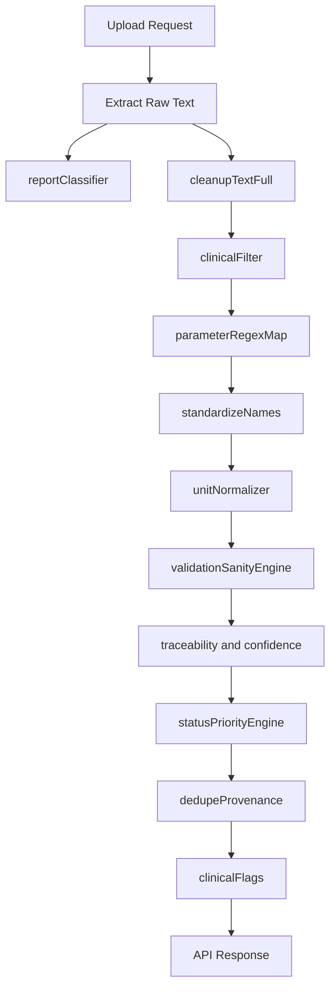

# HealthLens AI Enrichment Delta Plan

## Goal

Extend the current extraction + clinical filtering pipeline to output clinically robust, traceable measurements with canonical IDs, normalized units/values, validation status, confidence, and flags.

## Current State (baseline)

- Current response already includes `cleanedTextFull`, `cleanedTextClinical`, and `structured`.
- Measurement records currently rely on display names and line-level traceability.
- OCR/PDF services currently return text-only payloads (no word-level confidence/bbox metadata).

Key files in use now:

- [services/extractionService.js](services/extractionService.js)
- [services/clinicalFilterService.js](services/clinicalFilterService.js)
- [services/ocrService.js](services/ocrService.js)
- [services/pdfService.js](services/pdfService.js)
- [routes/upload.js](routes/upload.js)
- [utils/clinical/parameterRegexMap.js](utils/clinical/parameterRegexMap.js)

## Delta Implementation (ordered)

### 1) Canonical name/ID foundation

Add canonical mapping and resolver utilities:

- [utils/canonicalMap.json](utils/canonicalMap.json)
- [utils/standardizeNames.js](utils/standardizeNames.js)

Purpose:

- alias → canonical name/id/category/priority
- stable measurement IDs for dedupe, validation, and flags

### 2) Unit normalization layer

Add:

- [utils/unitNormalizer.js](utils/unitNormalizer.js)

Then replace inline unit normalization in [utils/clinical/parameterRegexMap.js](utils/clinical/parameterRegexMap.js) with this shared module.

### 3) Numeric sanity engine

Add:

- [services/validationSanityEngine.js](services/validationSanityEngine.js)

Purpose:

- configurable plausible ranges by canonical ID
- per-measurement `validation` object (`ok`, `reason`)
- confidence penalty for implausible values

### 4) Report classification (multi-label)

Add:

- [services/reportClassifier.js](services/reportClassifier.js)

Behavior:

- detect likely report panel types from cleaned text
- return `primaryReportType` and scored `reportTypes`
- feed extraction prioritization (not hard-filtering)

### 5) OCR/PDF metadata plumbing for traceability

Modify:

- [services/ocrService.js](services/ocrService.js)
- [services/pdfService.js](services/pdfService.js)

Behavior:

- OCR path returns words with confidence + bbox + page index
- PDF OCR fallback propagates page index per rendered page
- digital `pdf-parse` path keeps trace fields nullable

### 6) Traceability and confidence utilities

Add:

- [utils/traceability.js](utils/traceability.js)

Behavior:

- map matched value tokens to OCR words
- produce `sourcePage`, `sourceBBox`, approximate `sourceLine`
- confidence scoring per taxonomy (`regex_exact`, `regex_fuzzy`, `ocr_token_match`, etc.)

### 7) Enrich measurement schema in clinical orchestration

Modify:

- [services/clinicalFilterService.js](services/clinicalFilterService.js)
- [utils/clinical/dedupeProvenance.js](utils/clinical/dedupeProvenance.js)
- [utils/clinical/parameterRegexMap.js](utils/clinical/parameterRegexMap.js)

Add per-measurement fields:

- `id`, `name`
- `rawValue`, `normalizedValue`
- `unit`, `normalizedUnit`
- `referenceRange`
- `status`, `priority`
- `confidence`, `method`, `confidenceSource`
- `sourcePage`, `sourceBBox`, `sourceLine`, `sourceLineText`
- `validation`

### 8) Clinical flags layer

Add:

- [services/clinicalFlags.js](services/clinicalFlags.js)

Behavior:

- rules over canonical IDs + normalized values
- output `structured.flags` (+ optional severity map)

### 9) Clinical text builder split

Add:

- [utils/clinicalFilter.js](utils/clinicalFilter.js)

Move line-selection/build logic out of service so [services/clinicalFilterService.js](services/clinicalFilterService.js) remains orchestration-only.

### 10) API + logging hardening

Modify:

- [services/extractionService.js](services/extractionService.js)
- [routes/upload.js](routes/upload.js)
- [utils/logger.js](utils/logger.js)

Behavior:

- return enriched schema while maintaining temporary backward compatibility
- add PHI-redaction mode for previews via env flag (no full text logs)

## Data Flow (target)

## Validation Strategy

Add tests in `tests/`:

- `standardizeNames.test.js`
- `unitNormalizer.test.js`
- `validationSanityEngine.test.js`
- `reportClassifier.test.js`
- `traceability.test.js`
- `extractionIntegration.test.js`

Manual verification with PDF + image upload:

- ensure each measurement includes ID, normalized value/unit, confidence, method, and trace fields (nullable where unavailable).

## Acceptance Criteria

- API includes canonicalized, normalized, validated, and confidence-scored measurements.
- OCR paths provide non-null traceability fields when token mapping succeeds.
- Digital PDF path safely returns nullable traceability fields without faking geometry.
- Report classification and clinical flags are present in structured output.
- Logging avoids PHI-heavy full text dumps by default.
