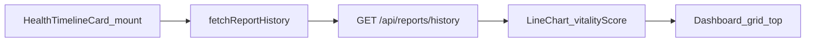

# Health Vitality Trend Chart (Frontend)

## Context

Backend is ready:

- `GET /api/reports/history` returns `{ success: true, reports: [...] }` via [`routes/reports.js`](routes/reports.js)
- Each report includes `reportDate`, `vitalityScore` (Mongoose virtual), and measurements
- Vite proxies `/api` → `localhost:5000` ([`client/vite.config.js`](client/vite.config.js))
- `recharts@^3.8.1` already installed ([`client/package.json`](client/package.json))
- Primary brand color: `#00685f` ([`client/tailwind.config.js`](client/tailwind.config.js))

No backend changes required.



---

## Task 1 — API client

Edit [`client/src/lib/api.js`](client/src/lib/api.js).

Add `fetchReportHistory()` following the existing `parseJsonResponse` pattern used by `uploadReport` and `interpretStructured`:

```js
export async function fetchReportHistory() {
  const res = await fetch("/api/reports/history");
  return parseJsonResponse(res);
}
```

- Non-OK responses and `{ success: false }` throw with `json.message` (same graceful error contract as other helpers).
- Caller (`HealthTimelineCard`) catches and displays a user-friendly message.

---

## Task 2 — `HealthTimelineCard` component

Create [`client/src/components/Dashboard/HealthTimelineCard.jsx`](client/src/components/Dashboard/HealthTimelineCard.jsx).

### State and data fetch

```js
const [history, setHistory] = useState([]);
const [loading, setLoading] = useState(true);
const [error, setError] = useState(null);

useEffect(() => {
  let cancelled = false;
  (async () => {
    try {
      const json = await fetchReportHistory();
      if (!cancelled) setHistory(json.reports ?? []);
    } catch (err) {
      if (!cancelled) setError(err.message || "Failed to load health history.");
    } finally {
      if (!cancelled) setLoading(false);
    }
  })();
  return () => {
    cancelled = true;
  };
}, []);
```

### Date helper

Reports arrive with `reportDate` as ISO strings from MongoDB JSON serialization. Add a small formatter for axis ticks and tooltips:

```js
function formatChartDate(value) {
  const date = new Date(value);
  if (Number.isNaN(date.getTime())) return String(value);
  return date.toLocaleDateString("en-US", { month: "short", day: "numeric" });
}
```

Pass `history` directly to `<LineChart data={history}>` — `reportDate` and `vitalityScore` are already the correct keys.

### UI shell (match existing Dashboard cards)

Mirror [`AISummaryCard.jsx`](client/src/components/Dashboard/AISummaryCard.jsx) / status card patterns:

- Wrapper: `bg-surface-container-lowest rounded-2xl border border-outline-variant/20 shadow-ambient p-6`
- Accept optional `className` prop (for `md:col-span-12` from parent)
- Header: `Activity` icon from `lucide-react` + title **"Health Vitality Trend"**

### Loading / error / empty states

- **Loading:** centered `text-on-surface-variant` message inside the card shell
- **Error:** short error text (no crash)
- **Empty history:** friendly placeholder ("Upload a report to start tracking your vitality score over time.")

### Recharts config

```jsx
import {
  ResponsiveContainer,
  LineChart,
  Line,
  XAxis,
  YAxis,
  CartesianGrid,
  Tooltip,
} from "recharts";

<ResponsiveContainer width="100%" height={300}>
  <LineChart data={history}>
    <CartesianGrid strokeDasharray="3 3" stroke="rgba(188, 201, 198, 0.4)" />
    <XAxis
      dataKey="reportDate"
      tickFormatter={formatChartDate}
      tick={{ fill: "#3d4947", fontSize: 12 }}
      axisLine={{ stroke: "#bcc9c6" }}
    />
    <YAxis
      domain={[0, 100]}
      tick={{ fill: "#3d4947", fontSize: 12 }}
      axisLine={{ stroke: "#bcc9c6" }}
    />
    <Tooltip
      labelFormatter={formatChartDate}
      formatter={(value) => [`${value}`, "Vitality Score"]}
      contentStyle={{
        borderRadius: "12px",
        border: "1px solid rgba(188, 201, 198, 0.4)",
        backgroundColor: "#ffffff",
        boxShadow: "0 15px 30px -5px rgba(0, 106, 97, 0.08)",
      }}
    />
    <Line
      type="monotone"
      dataKey="vitalityScore"
      stroke="#00685f"
      strokeWidth={3}
      dot={{ fill: "#00685f", r: 4 }}
      activeDot={{ r: 6 }}
    />
  </LineChart>
</ResponsiveContainer>;
```

`CartesianGrid` is a minor addition for readability; remove if you prefer minimal diff.

---

## Task 3 — Dashboard layout

Edit [`client/src/components/Dashboard/Dashboard.jsx`](client/src/components/Dashboard/Dashboard.jsx).

1. Import `HealthTimelineCard`
2. Place it as the **first** child in the 12-column grid:

```jsx
<div className="grid grid-cols-1 md:grid-cols-12 gap-6">
  <HealthTimelineCard className="md:col-span-12" />
  <AISummaryCard data={payload.data} className="md:col-span-8" />
  {/* Analysis Complete card — unchanged */}
  <BiomarkerGrid ... className="md:col-span-12" />
</div>
```

Resulting layout: full-width trend chart on top → summary + status row → full-width biomarker grid.

---

## Docs

Update [`PROJECT_CONTEXT.md`](PROJECT_CONTEXT.md):

- Day 4/5 UI: `HealthTimelineCard`, `fetchReportHistory`, vitality trend chart on dashboard
- Changelog entry (frontend only; backend test count unchanged at 43)

---

## Verification

1. Backend + Mongo running: `npm run dev` (root) and `cd client && npm run dev`
2. Upload and interpret at least one report (creates DB record with `vitalityScore`)
3. Open dashboard — chart loads at top; points plot score 0–100
4. Upload a second report — history endpoint returns 2 points; X-axis shows readable dates
5. Stop backend — chart shows error message, dashboard still renders summary/grid
