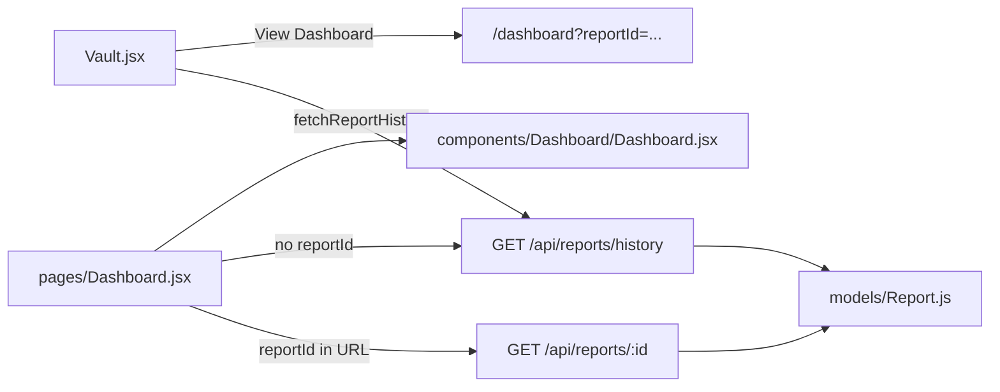

# Health Vault + Report Deep-Link Plan

## Architecture



---

## Task 1 — Install dependencies

In [`client/`](client/), run:

```bash
npm install @fullcalendar/react @fullcalendar/daygrid lucide-react
```

Note: [`client/package.json`](client/package.json) already includes `lucide-react`; the install still satisfies the task and pins FullCalendar packages.

Import FullCalendar base styles in the new Vault page (or [`client/src/index.css`](client/src/index.css)):

```js
import "@fullcalendar/core/index.css";
import "@fullcalendar/daygrid/index.css";
```

---

## Task 2 — Backend: `GET /api/reports/:id`

**File:** [`routes/reports.js`](routes/reports.js)

Add an exported `getByIdHandler` mirroring the testable pattern used by `historyHandler`:

```js
async function getByIdHandler(req, res, deps = {}) {
  const findById = deps.findById ?? ((id) => Report.findById(id));
  try {
    const report = await findById(req.params.id);
    if (!report) {
      return res
        .status(404)
        .json({ success: false, message: "Report not found." });
    }
    if (report.userId.toString() !== req.user.id) {
      return res.status(403).json({ success: false, message: "Forbidden." });
    }
    return res.json({ success: true, report });
  } catch (error) {
    // 500 handler matching historyHandler style
  }
}
```

**Route registration order (critical):** Keep existing `router.get("/history", ...)` **before** the new route:

```js
router.get("/history", protect, historyHandler);
router.get("/:id", protect, getByIdHandler);
```

Export `getByIdHandler` for unit tests (`module.exports.getByIdHandler = getByIdHandler`).

**Tests:** Extend [`tests/reportsRoute.test.js`](tests/reportsRoute.test.js) with cases for:

- 200 + `{ success, report }` when owner matches
- 403 when `userId` differs from `req.user.id`
- 404 when report is null
- 500 on DB error

Expected test count: **54 → 58** (4 new cases).

---

## Task 3 — Frontend API helper

**File:** [`client/src/lib/api.js`](client/src/lib/api.js)

Add after `fetchReportHistory`:

```js
export async function fetchReportById(id) {
  const res = await fetch(`/api/reports/${id}`, { headers: authHeaders() });
  return parseJsonResponse(res);
}
```

`parseJsonResponse` already throws on non-OK responses (403/404 surface as errors with server `message`).

---

## Task 4 — Dashboard deep-link + history load

**File:** [`client/src/pages/Dashboard.jsx`](client/src/pages/Dashboard.jsx)

**Behavior change:** Today this page only shows `UploadZone` until a new upload completes. After this task:

| URL                        | Behavior                                                                                                                                                                       |
| -------------------------- | ------------------------------------------------------------------------------------------------------------------------------------------------------------------------------ |
| `/dashboard?reportId=<id>` | Fetch single report → RESOLVED dashboard                                                                                                                                       |
| `/dashboard` (no param)    | Fetch history; if reports exist, load **latest** (last item — history is sorted ascending by `reportDate` in [`routes/reports.js`](routes/reports.js)); else show `UploadZone` |
| Upload flow                | Unchanged — still chains upload + interpret                                                                                                                                    |

**Implementation sketch:**

1. Import `useEffect`, `useSearchParams` from `react-router-dom`; import `fetchReportById`, `fetchReportHistory`.
2. Add a `loadingHistory` state (use `Loader2` spinner pattern from [`Profile.jsx`](client/src/pages/Profile.jsx), **not** `ProcessingView` — that copy implies active analysis).
3. Add a small mapper (inline or in [`client/src/lib/structured.js`](client/src/lib/structured.js)) to convert a persisted Report document into the existing `ReportDashboard` payload shape:

```js
function reportToDashboardPayload(report) {
  return {
    success: true,
    data: report.aiInterpretation,
    structured: {
      reportType: report.reportType,
      patient_info: { reportDate: report.reportDate },
      measurements: report.measurements ?? [],
    },
  };
}
```

Persisted measurements already have `value`, `unit`, `status` — [`BiomarkerGrid.jsx`](client/src/components/Dashboard/BiomarkerGrid.jsx) handles them and falls back to `"General Vitals"` when `category` is absent.

4. `useEffect` keyed on `searchParams.get('reportId')`:
   - With `reportId`: `fetchReportById` → set payload + `APP_STATE.RESOLVED`
   - Without: `fetchReportHistory` → if `reports.length`, use `reports[reports.length - 1]` → RESOLVED; else stay IDLE
   - On error: set `error` state, remain on UploadZone or show inline error

Upload handler stays as-is; successful new upload still overrides to RESOLVED with fresh data.

---

## Task 5 — Vault page

**New file:** [`client/src/pages/Vault.jsx`](client/src/pages/Vault.jsx)

**State:**

- `reports` — from `fetchReportHistory()` on mount
- `viewMode` — `'list' | 'calendar'` (default `'list'`)
- `loading` / `error` — standard fetch lifecycle

**Layout** (match Vitality Core: `min-h-screen bg-background`, `max-w-[1440px] mx-auto p-6 md:p-10`):

- Header: **Health Vault** title + toggle button group (List | Calendar) using existing token classes (`bg-primary`, `border-outline-variant/20`, etc.)
- Icons from `lucide-react` (e.g. `List`, `Calendar`) for toggle affordance

**List view:** Responsive table or card rows showing:

- `reportDate` (formatted via `toLocaleDateString`)
- `reportType`
- `vitalityScore` (included via Report virtual in JSON responses)
- **View Dashboard** button → `navigate('/dashboard?reportId=' + report._id)` using `useNavigate`

**Calendar view:**

```jsx
import FullCalendar from '@fullcalendar/react'
import dayGridPlugin from '@fullcalendar/daygrid'

const events = reports.map((r) => ({
  title: r.reportType || 'Report',
  start: r.reportDate,
  url: `/dashboard?reportId=${r._id}`,
  allDay: true,
}))

<FullCalendar
  plugins={[dayGridPlugin]}
  initialView="dayGridMonth"
  events={events}
  height="auto"
/>
```

FullCalendar navigates via `event.url` (full page load). Acceptable for v1 per spec; optional follow-up: `eventClick` + `navigate()` for SPA navigation.

**Empty state:** When `reports.length === 0`, show message + link to `/dashboard` to upload first report.

---

## Task 6 — Routing and Navbar

**[`client/src/App.jsx`](client/src/App.jsx):**

```jsx
import Vault from "./pages/Vault";

<Route
  path="/vault"
  element={
    <ProtectedRoute>
      <Vault />
    </ProtectedRoute>
  }
/>;
```

**[`client/src/components/Layout/Navbar.jsx`](client/src/components/Layout/Navbar.jsx):**

Add authenticated link between Dashboard and Profile:

```jsx
<Link
  to="/vault"
  className="text-sm text-on-surface-variant hover:text-primary transition-colors"
>
  Vault
</Link>
```

---

## PROJECT_CONTEXT.md updates (definition of done)

Per workspace rule, after implementation update [`PROJECT_CONTEXT.md`](PROJECT_CONTEXT.md):

- **Last Updated** date
- Changelog bullet: Health Vault page + `GET /api/reports/:id` + Dashboard `?reportId=` deep-link
- §2 endpoints table: add `GET /api/reports/:id`
- §4 Done: Vault list/calendar, report deep-link
- §7 test count: 58/58
- §8 key files: add `Vault.jsx`, update `Dashboard.jsx` / `reports.js`

---

## Verification checklist

1. `npm test` — 58 passing (backend route tests)
2. `npm run dev` — register/login, upload a report, visit `/vault`:
   - List shows report with date/type/vitality score
   - Calendar shows event on correct date; click opens dashboard for that report
3. `/dashboard?reportId=<valid_id>` loads saved report (summary, biomarkers, timeline)
4. `/dashboard?reportId=<other_user_id>` → 403 error handled gracefully
5. `/dashboard` with history auto-loads latest report; with no history shows upload zone
