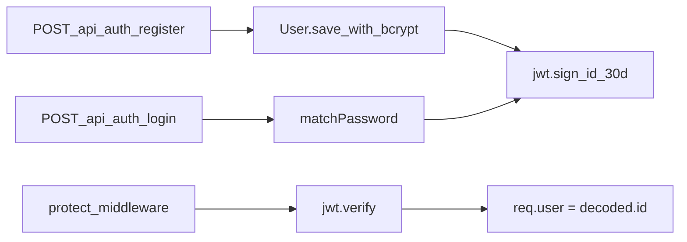

# JWT Authentication Backend

## Context

The backend ([`server.js`](server.js)) already uses CommonJS, Mongoose ([`models/Report.js`](models/Report.js)), and route modules that return `{ success, ... }` JSON ([`routes/reports.js`](routes/reports.js)). There is no auth yet; `Report.userId` defaults to `"anonymous_patient"` and will be wired to real users in a later task.

This plan implements **only** the five tasks you specified — `protect` is created but **not** applied to `/api/reports` or `/api/interpret` yet.



---

## Task 1: Dependencies and environment

**Install** (project root):

```bash
npm install bcryptjs jsonwebtoken
```

**Environment variables:**

| File                           | Action                                                                |
| ------------------------------ | --------------------------------------------------------------------- |
| [`.env`](.env)                 | Add `JWT_SECRET=your_super_secret_string_here` (per your instruction) |
| [`.env.example`](.env.example) | Add same key with placeholder so other devs know it is required       |

No code changes to [`package.json`](package.json) beyond what `npm install` writes to `package-lock.json`.

---

## Task 2: User model — [`models/User.js`](models/User.js)

New file, matching [`models/Report.js`](models/Report.js) style (`mongoose` require, schema export).

```js
const userSchema = new mongoose.Schema({
  name: { type: String, required: true },
  email: { type: String, required: true, unique: true },
  password: { type: String, required: true },
});
```

**Pre-save hook** (async, salt rounds `10`):

- Guard with `if (!this.isModified("password")) return;`
- `this.password = await bcrypt.hash(this.password, 10);`

**Instance method** `matchPassword(enteredPassword)`:

- `return bcrypt.compare(enteredPassword, this.password);`

Export: `mongoose.model("User", userSchema)`.

---

## Task 3: Auth middleware — [`middleware/authMiddleware.js`](middleware/authMiddleware.js)

Sits alongside existing [`middleware/upload.js`](middleware/upload.js).

Export `protect`:

1. Read `Authorization` header; expect `Bearer <token>` (split on space, take index `1`).
2. If missing → `401` with `{ success: false, message: "Not Authorized" }`.
3. `jwt.verify(token, process.env.JWT_SECRET)` → attach `req.user = decoded.id` → `next()`.
4. On verify failure → same `401` response.

**JWT payload convention:** sign with `{ id: user._id }` so `decoded.id` matches your spec (use `.toString()` on ObjectId when signing for consistency).

---

## Task 4: Auth routes — [`routes/auth.js`](routes/auth.js)

Express router, same patterns as [`routes/reports.js`](routes/reports.js): async handlers, try/catch, logger on 500s.

Shared helper (inline in file):

```js
const generateToken = (id) =>
  jwt.sign({ id }, process.env.JWT_SECRET, { expiresIn: "30d" });
```

### `POST /register` (mounted as `/api/auth/register`)

Body: `{ name, email, password }`.

| Case                                             | Status | Response                                                          |
| ------------------------------------------------ | ------ | ----------------------------------------------------------------- |
| Missing fields                                   | 400    | `{ success: false, message: "..." }`                              |
| Email already exists (`User.findOne({ email })`) | 400    | `{ success: false, message: "User already exists" }` (or similar) |
| Success                                          | 201    | `{ success: true, user: { _id, name, email }, token }`            |

Use `User.create(...)` — pre-save hook hashes password. Never return `password` in JSON.

### `POST /login` (mounted as `/api/auth/login`)

Body: `{ email, password }`.

| Case                                    | Status | Response                                               |
| --------------------------------------- | ------ | ------------------------------------------------------ |
| Missing fields                          | 400    | validation message                                     |
| User not found OR `matchPassword` false | 401    | `{ success: false, message: "Invalid credentials" }`   |
| Success                                 | 200    | `{ success: true, user: { _id, name, email }, token }` |

Optional (matches project testability pattern): export `registerHandler` / `loginHandler` with injectable deps — **not required** unless you want unit tests in this pass.

---

## Task 5: Mount in [`server.js`](server.js)

After existing imports:

```js
const authRoutes = require("./routes/auth");
```

After `express.json()` and before error handler:

```js
app.use("/api/auth", authRoutes);
```

Final route table:

| Method | Path                 |
| ------ | -------------------- |
| POST   | `/api/auth/register` |
| POST   | `/api/auth/login`    |

---

## Definition of done (post-implementation)

Per [`.cursor/rules/project-context-maintenance.mdc`](.cursor/rules/project-context-maintenance.mdc), update [`PROJECT_CONTEXT.md`](PROJECT_CONTEXT.md):

- Mark JWT/bcrypt as **in repo** (no longer "No JWT yet")
- Add auth endpoints to section 2
- Add `models/User.js`, `middleware/authMiddleware.js`, `routes/auth.js` to section 8
- Changelog entry for auth layer

**Manual smoke test** (after `npm run dev` + MongoDB running):

```bash
curl -X POST http://localhost:5000/api/auth/register -H "Content-Type: application/json" -d "{\"name\":\"Test\",\"email\":\"test@example.com\",\"password\":\"secret123\"}"

curl -X POST http://localhost:5000/api/auth/login -H "Content-Type: application/json" -d "{\"email\":\"test@example.com\",\"password\":\"secret123\"}"
```

Verify duplicate register returns 400 and bad password returns 401.

---

## Out of scope (future work)

- Applying `protect` to `/api/reports/history`, `/api/interpret`, or upload
- Linking `Report.userId` to authenticated user on interpret save
- Frontend login/register UI or token storage in [`client/src/lib/api.js`](client/src/lib/api.js)
- Auth unit tests (not requested; add later if desired)
