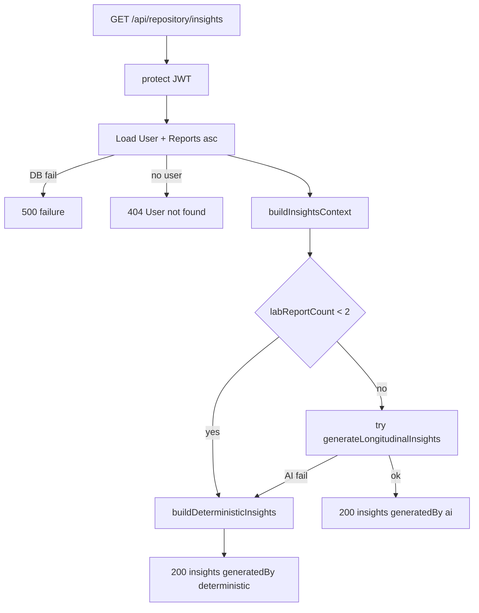

# HealthLens Stage 1.2 — Longitudinal Insights

## Decision (accepted, with one correction)

I accept the proposed shape. One important correction vs. the brief: the repository route's existing `makeHandler` factory (`[routes/repository.js](routes/repository.js)`) only loads reports, so `insightsHandler` must be a **custom handler** (not built via `makeHandler`) because it also needs the `User` profile — exactly like `[routes/chat.js](routes/chat.js)`.

Insights are computed-on-read. No persistence, no Doctor Summary, no repository redesign (those are later stages).

## Reviewer refinements (accepted)

- Refresh insights after upload + reviewed-document save (extract a reusable `loadInsights()` in the page).
- Render the flagship card **outside** the lab/entity branch (whole-history, always visible).
- Short-circuit AI when `< 2` lab reports exist: return deterministic educational/empty state without calling Gemini.
- Normalize AI output (arrays coerced, disclaimer forced, `generatedBy:"ai"` added); malformed JSON → deterministic fallback.
- Add top-level `generatedAt: new Date().toISOString()` to the response.
- `buildInsightsContext()` returns compact report objects only (dates, type, selected measurements, entity rollups, timeline, comparisons) — never full Mongoose docs.
- `User.findById` miss → `404 { success:false, message:"User not found." }`.

## Data realities confirmed (grounds the deterministic engine)

- `Report.measurements[]` persist `{ name, value:Number, unit, status: low|normal|high|unknown, referenceRange }` (`[models/Report.js](models/Report.js)`). Numeric `value` is always present, so the server series can use it directly (no need for the frontend's `normalizedValue/rawValue` fallbacks in `[client/src/lib/trends.js](client/src/lib/trends.js)`).
- Demo patient Priya (`[scripts/demoPatientData.js](scripts/demoPatientData.js)`) has 4 reports: Jan lab (all normal) → Mar lab (HbA1c 6.8 high, Glucose 128 high, Hemoglobin 12.6 low, Chol 222 high) → Mar prescription (Metformin) → Jun lab (HbA1c 6.2 high, Glucose 110 high, Hemoglobin 13.1 normal, Chol 205 high). `compareLatestToPrevious` must use **lab_report docs only** (the prescription has no measurements), giving latest=Jun, previous=Mar.
- This yields the exact target story: HbA1c `improving_but_still_high`, Glucose `improving_but_still_high`, Hemoglobin `resolved_to_normal`, Cholesterol `improving_but_still_high`.

## Backend

### 1. `utils/longitudinalInsights.js` (new, pure/deterministic)
- `buildMetricSeries(reports)` — server port of the frontend trends util; key by lowercased measurement name, `{ label, unit, points:[{date,value,status,referenceRange}] }`, points sorted ascending. Do not import frontend code.
- `compareLatestToPrevious(reports)` — filter to `documentType === 'lab_report'` with non-empty measurements; take last two by `reportDate`; emit `changedMarkers[]` with `{ name, latest, previous, delta, direction, status, unit, referenceRange, interpretation }` where `interpretation` ∈ `improved | worsened | stable | new_abnormal | resolved_to_normal | improving_but_still_high | improving_but_still_low`. Deltas computed in JS only.
- `buildInsightsContext({ reports, user })` — assemble the structured-only context object: `{ profile, latestReport, previousReport, metricSeries, comparisons, medications, diagnoses, symptoms, advice, timeline, labReportCount }`, reusing `[utils/repositoryAggregator.js](utils/repositoryAggregator.js)` and `[utils/timelineBuilder.js](utils/timelineBuilder.js)`. Report objects must be **compact** (date, documentType, selected measurements, entity rollups, comparisons) — no full Mongoose docs, no raw OCR/text fields. `latestReport`/`previousReport` are the compacted last two lab reports.
- `buildDeterministicInsights(context)` — returns the canonical shape `{ summary, whatChanged, improvingSignals, needsAttention, riskFlags, doctorQuestions, followUpSuggestions, disclaimer, generatedBy:"deterministic" }` derived from `changedMarkers` + abnormal latest markers + active medications/advice. Suggestion-worded (never instructions). Handles 0 and 1 report gracefully.
- Constant `INSIGHTS_DISCLAIMER` reused everywhere.

### 2. `services/aiService.js`
- Add `AI_TIMEOUT_MS.longitudinalInsights = 20_000`.
- Add `getLongitudinalModel()` (mirrors `getAiModel` builder) with a strict `responseSchema` for `{ summary, whatChanged[], improvingSignals[], needsAttention[], riskFlags[], doctorQuestions[], followUpSuggestions[], disclaimer }` and the safety system instruction ("may indicate" / "worth discussing" / no diagnosis or prescription).
- Add `generateLongitudinalInsights(context, deps = {})` following the existing pattern: `deps.getModel ?? getLongitudinalModel`, `callWithSingleRetry` + `withTimeout`, send `JSON.stringify(context)` as the user message, `JSON.parse` response, **normalize** (coerce each list to an array, force the disclaimer, tag `generatedBy:"ai"`), and throw a clean `Error("Failed to generate longitudinal insights.")` on failure (including malformed JSON). Export it.

### 3. `routes/repository.js`
- Add custom `insightsHandler(req, res, deps = {})` with injectable deps: `findReports`, `findUserById`, `generateInsights` (AI), `buildDeterministic`.
- Flow: load `User.findById(req.user.id)` + `Report.find({userId}).sort({reportDate:1})`. On DB failure → `500 { success:false, message:"Failed to generate health insights." }`. If user missing → `404 { success:false, message:"User not found." }`. Build context. **If `labReportCount < 2`, skip AI** and return the deterministic empty/educational state. Otherwise `try` AI → on **any** AI error (incl. malformed JSON) fall back to `buildDeterministicInsights`; always return `200 { success:true, insights, generatedAt }` (never 503 — demo reliability).
- Register `router.get("/insights", protect, insightsHandler)` and export `insightsHandler`.

## Frontend

### 4. `client/src/lib/api.js`
- Add `fetchRepositoryInsights()` using `authHeaders()` + `parseJsonResponse` (same shape as the other repository fetchers).

### 5. `client/src/components/Dashboard/LongitudinalInsightsCard.jsx` (new)
- Title "What Changed Since Your Last Report?"; sections Summary / Improving / Needs Attention / Questions for Doctor / Suggested Follow-Up; disclaimer footer; a small badge reading "AI generated" or "Deterministic fallback" from `insights.generatedBy`.
- Loading ("Analyzing your health timeline..."), error ("Longitudinal insights are temporarily unavailable..."), and empty (`< 2` lab reports → "Upload another lab report to unlock trend-based health intelligence.") states. Empty state derived from `history` lab-report count so it works even before the fetch resolves.

### 6. `client/src/pages/Dashboard.jsx`
- Add `insights`, `insightsLoading`, `insightsError` state; extract a reusable `loadInsights()` (sets loading, fetches, clears/sets error). Call it after the initial `loadHistory()` resolves, **and** after `handleFileSelected` (lab upload path) and `handleConfirmDocument` (reviewed save) call `loadHistory()`, so the card never shows stale data. Non-blocking; failure only sets `insightsError`.
- Pass `insights`, `insightsLoading`, `insightsError` (and existing props) into `<ReportDashboard>`.

### 7. `client/src/components/Dashboard/Dashboard.jsx`
- Accept the new props and render `LongitudinalInsightsCard` **outside** the `isEntityDocument` branch (whole-history, always visible even when a prescription is selected), placed prominently above the existing `AIInsightsBanner`. Keep the lab-vs-entity layout branch intact for the other cards.

## Tests (baseline is 149 passing; runner `node --test tests/**/*.test.js`)

- `tests/longitudinalInsights.test.js` (new): metric series from multiple reports; latest-vs-previous (lab-only); detects improvement; detects still-high (`improving_but_still_high`); Hemoglobin `resolved_to_normal`; fallback includes disclaimer + `generatedBy:"deterministic"`; empty reports; single report.
- `tests/repositoryRoute.test.js` (extend): `insightsHandler` returns AI insights when `generateInsights` succeeds; returns deterministic fallback (still `success:true`) when it throws; `500` when report/user load throws; response includes `generatedBy`. Reuse the existing `createMockRes` + deps-injection style.
- `tests/aiService.test.js` (extend): `generateLongitudinalInsights` parses strict JSON via injected `getModel`; system instruction/prompt contains safety language; throws clean error on Gemini failure.

## Definition of done
- All Stage 1.2 acceptance checkboxes met; backend tests pass (new count > 149); `npm run build --prefix client` passes.
- Update `[PROJECT_CONTEXT.md](PROJECT_CONTEXT.md)`: Last Updated, Changelog entry, §2 add `GET /api/repository/insights`, new test count (per project rule).