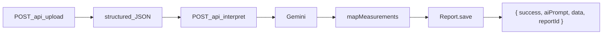

# MongoDB Report Persistence Plan

## Current state

- [`package.json`](package.json) already lists `mongoose@^9.6.3` (lockfile resolved). No `config/` or `models/` directories exist yet.
- [`server.js`](server.js) starts Express with no DB connection.
- [`routes/interpret.js`](routes/interpret.js) is the correct persistence hook: it receives `structured` (from upload) and returns Gemini `data` (`summary`, `findings`, `recommendations`).
- Extraction measurements are rich objects (`id`, `normalizedValue`, `rawValue`, `unit`, `status`, `referenceRange`, traceability fields). The Report schema stores a slim subset only.
- [`client/src/App.jsx`](client/src/App.jsx) already normalizes measurements client-side via `normalizeStructured()`; the server must perform equivalent mapping before save.



---

## Task 1 — DB connection

### 1a. Verify mongoose install

Run `npm install` at repo root (dependency already declared; ensures `node_modules` is current).

### 1b. Create [`config/db.js`](config/db.js)

```js
const mongoose = require("mongoose");

const MONGODB_URI = "mongodb://localhost:27017/healthlens";

async function connectDB() {
  await mongoose.connect(MONGODB_URI);
  // log via existing utils/logger.js for consistency
}

module.exports = connectDB;
```

- Fail fast on connection error (`process.exit(1)` after logging) so the server does not accept traffic without a DB during this milestone.
- **Prerequisite:** local MongoDB must be running on port 27017.

### 1c. Wire [`server.js`](server.js)

- Import `connectDB`.
- Replace bare `app.listen(...)` with:

```js
connectDB()
  .then(() => app.listen(PORT, ...))
  .catch((err) => { logger.error(...); process.exit(1); });
```

Server only binds port 5000 after Mongo connects.

---

## Task 2 — Report model

Create [`models/Report.js`](models/Report.js) using the schema you provided verbatim:

| Field              | Source at save time                                                                                                                                                      |
| ------------------ | ------------------------------------------------------------------------------------------------------------------------------------------------------------------------ |
| `userId`           | Default `'anonymous_patient'` (no JWT yet)                                                                                                                               |
| `reportType`       | `structured.reportType` (fallback `'CBC'`)                                                                                                                               |
| `reportDate`       | Parse `structured.patient_info?.reportDate` (already normalized to `YYYY-MM-DD` by [`clinicalFilterService.js`](services/clinicalFilterService.js)); fallback `Date.now` |
| `measurements[]`   | Mapped from `structured.measurements` (see Task 3)                                                                                                                       |
| `aiInterpretation` | Gemini `interpretation` object directly                                                                                                                                  |
| `createdAt`        | Schema default                                                                                                                                                           |

No changes to extraction pipeline or AI schema.

---

## Task 3 — Persist in interpret route

Modify [`routes/interpret.js`](routes/interpret.js) after `generateInterpretation` succeeds and before `res.json`.

### 3a. Measurement mapper (inline helper or `utils/reportMapper.js`)

Map each OCR measurement to schema shape:

```js
function mapMeasurementsForReport(measurements) {
  return measurements
    .map((m) => {
      const value =
        m.normalizedValue ?? (m.rawValue != null ? Number(m.rawValue) : NaN);
      const status = (m.status || "unknown").toLowerCase();
      return {
        name: m.name,
        value,
        unit: m.unit ?? m.normalizedUnit ?? undefined,
        status: ["low", "normal", "high"].includes(status) ? status : "unknown",
        referenceRange: m.referenceRange ?? undefined,
      };
    })
    .filter((m) => Number.isFinite(m.value));
}
```

This mirrors [`client/src/App.jsx`](client/src/App.jsx) `normalizeStructured()` logic server-side.

### 3b. Build and save Report document

```js
const report = new Report({
  reportType: structured.reportType || "CBC",
  reportDate: structured.patient_info?.reportDate
    ? new Date(structured.patient_info.reportDate)
    : undefined,
  measurements: mapMeasurementsForReport(structured.measurements),
  aiInterpretation: interpretation,
});
const saved = await report.save();
```

### 3c. Extended response contract

```js
return res.status(200).json({
  success: true,
  aiPrompt,
  data: interpretation,
  reportId: saved._id.toString(),
});
```

Existing `data` shape unchanged — frontend [`BiomarkerGrid`](client/src/components/Dashboard/BiomarkerGrid.jsx) and [`AISummaryCard`](client/src/components/Dashboard/AISummaryCard.jsx) keep working without changes. `reportId` is additive for future trend/history features.

### 3d. Test compatibility (critical)

[`tests/interpretRoute.test.js`](tests/interpretRoute.test.js) calls `interpretHandler` with injected `generateInterpretation` and expects no DB. Extend the existing `deps` pattern:

```js
async function interpretHandler(req, res, deps = {}) {
  const saveReport = deps.saveReport ?? (async (doc) => doc.save());
  // ...
  const saved = await saveReport(report);
  // ...
}
```

In tests, inject:

```js
saveReport: async () => ({ _id: "507f1f77bcf86cd799439011" });
```

Assert `res.body.reportId` is present. No live Mongo required in CI.

Add one test for save failure → 500 (optional but low-cost).

---

## Files touched

| Action   | File                                                                                                                                               |
| -------- | -------------------------------------------------------------------------------------------------------------------------------------------------- |
| Create   | [`config/db.js`](config/db.js)                                                                                                                     |
| Create   | [`models/Report.js`](models/Report.js)                                                                                                             |
| Edit     | [`server.js`](server.js) — connect before listen                                                                                                   |
| Edit     | [`routes/interpret.js`](routes/interpret.js) — map, save, `reportId`                                                                               |
| Edit     | [`tests/interpretRoute.test.js`](tests/interpretRoute.test.js) — mock `saveReport`, assert `reportId`                                              |
| Edit     | [`PROJECT_CONTEXT.md`](PROJECT_CONTEXT.md) — MongoDB live, new response field, test count if changed                                               |
| Optional | [`.env.example`](.env.example) — document `MONGODB_URI` if we later externalize the URI (not required for this task; user specified hardcoded URI) |

---

## Verification checklist

1. Start local MongoDB (`mongod` or Docker).
2. `npm run dev` — server logs successful DB connection, then listens on 5000.
3. Upload + interpret via React client or `index.html` flow.
4. Confirm document in Mongo: `db.reports.find().pretty()` in `healthlens` database.
5. `npm test` — all tests pass (37 + any new interpret persistence assertions).

---

## Risks and notes

- **Mongo not running:** server will exit on startup (intentional for this milestone).
- **Measurements with null status:** extraction can leave `status: null`; mapper coerces to `'unknown'` per schema enum.
- **Findings status casing:** Gemini returns `"Low"` / `"High"` strings; stored as-is in `aiInterpretation.findings[].status` (schema is `String`, not enum).
- **Frontend:** no changes required now; `reportId` can be stored in `dashboardData` in a follow-up when building trend/history UI.
