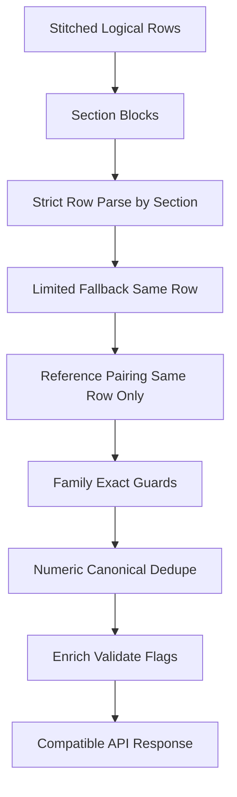

# Row-Scoped Precision Fix Plan

## Goal

Eliminate critical row assignment and sibling-line leakage errors by enforcing strict one-row binding for values and references, plus canonical numeric dedupe.

## Priority Order (Applied)

1. Bilirubin misbinding
2. Platelets row assignment
3. eGFR reference leakage
4. T3/T4 label-only false positives
5. Numeric dedupe normalization

## Current Gaps (Confirmed)

- Measurement extraction can still use lookahead lines in fallback mode, allowing value leakage across nearby rows.
- Reference extraction currently reads from current + next line context, causing cross-row range pairing.
- Ambiguous family labels (bilirubin/cholesterol/leukocyte family) are not fully anchored to exact siblings.
- T3/T4 patterns allow label matches without strict value constraints.
- Dedupe keys by parameter ID only, not by canonicalized numeric value precision variants.

## Implementation Plan

### 1) Enforce row-first value binding

Modify [utils/clinical/parameterRegexMap.js](utils/clinical/parameterRegexMap.js):

- For section-scoped pass, only parse `candidate.line` as value source.
- Remove broad value fallback to arbitrary later numeric lines for strict phase.
- Keep fallback pass but constrained to same logical row context from stitcher output.

Expected effect:

- Platelet values won’t drift to later numeric rows in same section.

### 2) Same-row-only reference pairing

Modify [utils/clinical/parameterRegexMap.js](utils/clinical/parameterRegexMap.js):

- Change `extractReferenceText` input to current row only.
- Never attach `referenceRange` from adjacent rows.

Expected effect:

- eGFR/reference leakage from neighboring lines is prevented.

### 3) Exact family anchoring for ambiguous analytes

Modify [utils/clinical/parameterRegexMap.js](utils/clinical/parameterRegexMap.js):

- Add strict family-specific patterns and guards:
  - `serum bilirubin (total)` only -> total bilirubin
  - `bilirubin (direct)` only -> direct bilirubin (new canonical entry if needed)
  - platelet count excludes MPV lines
  - leukocyte family patterns anchored by explicit label tokens
  - cholesterol ratio lines mapped to ratio IDs only, not cholesterol total
- Ensure sibling analytes cannot match each other by negative guards.

Expected effect:

- Bilirubin/ratio/leukocyte sibling leakage drops sharply.

### 4) Tighten T3/T4 acceptance rules

Modify [utils/clinical/parameterRegexMap.js](utils/clinical/parameterRegexMap.js):

- Reject label-only lines for T3/T4.
- Accept only when row contains:
  - numeric token with decimal (`\d+\.\d+`) OR
  - value with explicit unit-bearing form.
- If stitched row contains label+value, accept; otherwise skip.

Expected effect:

- T3/T4 false positives from headers/labels are removed.

### 5) Numeric canonical dedupe by value form

Modify [utils/clinical/dedupeProvenance.js](utils/clinical/dedupeProvenance.js):

- Add numeric canonicalization helper:
  - normalize `rawValue` forms (`309.70` -> canonical compare key `309.7`)
- Dedupe key becomes: `(id, canonicalValue, normalizedUnit)`.
- Keep highest precision representation for storage:
  - if equivalent numeric forms collide, retain value with more decimal precision in `rawValue`.

Expected effect:

- `309.7` and `309.70` collapse to one measurement deterministically.

### 6) Preserve row provenance strongly

Modify [services/clinicalFilterService.js](services/clinicalFilterService.js):

- Ensure each extracted measurement keeps row-bounded provenance from stitcher:
  - `sourceLines` from one logical stitched row only
  - no reassignment from nearby row during enrichment
- Keep `extractionScope` unchanged for section/fallback diagnostics.

### 7) Tighten row stitcher safeguards for ambiguous merges

Modify [utils/rowStitcher.js](utils/rowStitcher.js):

- For parameter families (bilirubin/cholesterol ratio/leukocyte/platelet), only stitch value lines if whitelist label is present in current row.
- Do not merge a pure family header with unrelated first numeric row.

### 8) Test coverage additions/updates

Modify/add tests:

- [tests/rowStitcher.test.js](tests/rowStitcher.test.js)
- [tests/integrationExtraction.test.js](tests/integrationExtraction.test.js)
- [tests/extractionIntegration.test.js](tests/extractionIntegration.test.js)

Add focused cases:

- Platelet value must bind only to platelet row, not MPV or later numeric row.
- Bilirubin total/direct lines parsed separately and correctly.
- eGFR reference stays null unless same row has range.
- T3/T4 label-only row rejected.
- `309.7` and `309.70` dedupe to one with highest precision retained.

## Data Flow (Reinforced Row Scope)

## Acceptance Criteria

- Each measurement value is bound to nearest logical stitched row only.
- Reference ranges are attached only from same row context.
- Bilirubin/platelet/leukocyte/cholesterol family leakage is prevented.
- T3/T4 label-only lines no longer produce measurements.
- Numeric duplicates (`x.y` vs `x.y0`) collapse deterministically with highest precision retained.
- Existing response compatibility remains intact.
