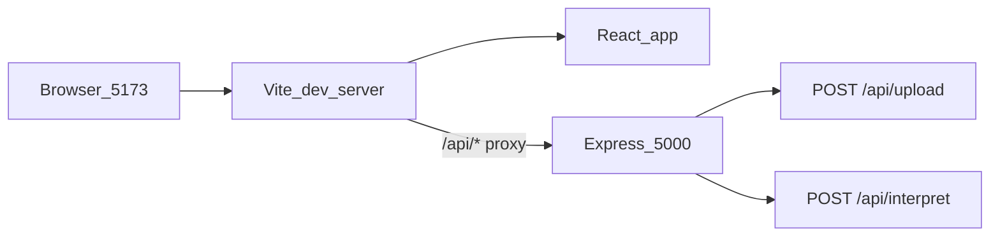

# React Frontend Scaffold + Vitality Core Design System

## Scope

This plan covers **scaffold + design system + dev proxy only** (Day 4 foundation). It does **not** build dashboard pages, wire upload/interpret flows, or port [`code.html`](c:\Users\aryan\Downloads\stitch_vitalinsight_extracted\stitch_vitalinsight_ai_health_companion\healthai_landing_page\code.html) components yet.

## Prerequisites

- Backend already running: `npm run dev` from repo root on **port 5000** ([`server.js`](server.js) — no CORS middleware today, so the Vite proxy is required for browser API calls).
- No `client/` folder exists yet; root [`package.json`](package.json) remains backend-only.

## Architecture after scaffold



## Step 1 — Scaffold Vite React app

From repo root (`HealthLens AI/`):

```bash
npm create vite@latest client -- --template react
cd client
npm install
```

This creates `client/` with ESM (`"type": "module"`), `src/main.jsx`, default `App.jsx`, and `vite.config.js`.

## Step 2 — Install dependencies (Tailwind v3 pinned)

**Runtime deps:**

```bash
npm install lucide-react recharts clsx tailwind-merge
```

**Dev deps — pin v3** (Google Stitch tokens map directly to the v3 JS config object; Vite + PostCSS is the stable path):

```bash
npm install -D tailwindcss@3 postcss autoprefixer
npx tailwindcss init -p
```

`init -p` generates [`client/postcss.config.js`](client/postcss.config.js) with `tailwindcss` and `autoprefixer` plugins. Vite picks this up automatically — no extra Vite plugin needed.

If a prior install accidentally pulled v4, the `@3` pin above forces the correct major version.

## Step 3 — Inject Vitality Core tokens

Design reference validated against the Stitch zip:

- Full token source: [`vitality_core/DESIGN.md`](c:\Users\aryan\Downloads\stitch_vitalinsight_extracted\stitch_vitalinsight_ai_health_companion\vitality_core\DESIGN.md)
- Reference implementation: [`healthai_landing_page/code.html`](c:\Users\aryan\Downloads\stitch_vitalinsight_extracted\stitch_vitalinsight_ai_health_companion\healthai_landing_page\code.html) (includes `ambient-shadow`, `glass-card`, full color map)

Your provided config is a **curated subset** of that system — we preserve it exactly.

### 3a. Overwrite [`client/tailwind.config.js`](client/tailwind.config.js)

Use your exact v3 config verbatim:

```js
/** @type {import('tailwindcss').Config} */
export default {
  content: ["./index.html", "./src/**/*.{js,ts,jsx,tsx}"],
  theme: {
    extend: {
      colors: {
        background: "#f8f9ff",
        surface: "#f8f9ff",
        "surface-dim": "#cbdbf5",
        "surface-container-lowest": "#ffffff",
        "surface-container-low": "#eff4ff",
        "surface-container": "#e5eeff",
        "surface-container-high": "#dce9ff",
        primary: "#00685f",
        "on-primary": "#ffffff",
        "primary-container": "#008378",
        secondary: "#0051d5",
        "outline-variant": "#bcc9c6",
        "on-surface": "#0b1c30",
        "on-surface-variant": "#3d4947",
        error: "#ba1a1a",
        "error-container": "#ffdad6",
      },
      fontFamily: {
        sans: ["Inter", "sans-serif"],
        display: ["Inter", "sans-serif"],
      },
      boxShadow: {
        ambient: "0 15px 30px -5px rgba(0, 106, 97, 0.08)",
      },
      borderRadius: {
        lg: "0.5rem",
        xl: "1rem",
        "2xl": "1.5rem",
      },
    },
  },
  plugins: [],
};
```

### 3b. Replace [`client/src/index.css`](client/src/index.css)

Use your exact v3 base styles:

```css
@import url("https://fonts.googleapis.com/css2?family=Inter:wght@400;500;600;700&display=swap");

@tailwind base;
@tailwind components;
@tailwind utilities;

@layer base {
  body {
    @apply bg-background text-on-surface font-sans antialiased;
  }
}

@layer utilities {
  .glass-card {
    @apply bg-white/80 backdrop-blur-md border border-slate-200/50;
  }
}
```

### 3c. Minimal Vite boilerplate cleanup

Default template conflicts with the design system:

- Remove `import './App.css'` from [`client/src/App.jsx`](client/src/App.jsx) and delete `client/src/App.css`.
- Replace `App.jsx` with a tiny placeholder that proves tokens work, e.g. a `glass-card` div using `bg-background`, `text-primary`, `shadow-ambient` — not a full dashboard.

## Step 4 — Vite config: API proxy only

Update [`client/vite.config.js`](client/vite.config.js) — **no** `@tailwindcss/vite` plugin; PostCSS handles Tailwind:

```js
import { defineConfig } from "vite";
import react from "@vitejs/plugin-react";

export default defineConfig({
  plugins: [react()],
  server: {
    proxy: {
      "/api": {
        target: "http://localhost:5000",
        changeOrigin: true,
      },
    },
  },
});
```

Proxy covers `/api/upload` and `/api/interpret`. `GET /health` is **not** proxied (lives at root); that is fine for this scaffold step.

## Step 5 — Repo housekeeping

| File                                       | Change                                                                                                                                             |
| ------------------------------------------ | -------------------------------------------------------------------------------------------------------------------------------------------------- |
| [`.gitignore`](.gitignore)                 | Add `client/dist` (`node_modules/` already matches nested dirs)                                                                                    |
| [`PROJECT_CONTEXT.md`](PROJECT_CONTEXT.md) | Mark Day 4 frontend scaffold in progress; note `client/` stack (Vite, React, Tailwind v3, lucide-react, recharts); update Last Updated + changelog |
| [`README.md`](README.md)                   | Add `client/` setup commands and `cd client && npm run dev` (port 5173)                                                                            |

Optional (not required now): root convenience script `"dev:client": "npm --prefix client run dev"` — skip unless you want it.

## Step 6 — Verification checklist

1. Terminal A (root): `npm run dev` → backend on `http://localhost:5000`
2. Terminal B (`client/`): `npm run dev` → frontend on `http://localhost:5173`
3. Visual: page background is `#f8f9ff`, Inter font loads, `glass-card` utility renders
4. Proxy smoke test (browser console on 5173): `fetch('/api/interpret', { method: 'POST', headers: { 'Content-Type': 'application/json' }, body: JSON.stringify({ structured: {} }) })` returns a JSON response (even an error proves proxy works)
5. Confirm Tailwind v3: `npm ls tailwindcss` in `client/` shows `tailwindcss@3.x`
6. Existing backend tests unchanged: `npm test` from root → **37/37** still passing

## Deferred to next Day 4 slice (out of scope here)

- `cn()` helper (`clsx` + `tailwind-merge`) in `client/src/lib/utils.js`
- Full typography/spacing tokens from `DESIGN.md` (`text-headline-lg`, `px-margin-desktop`, `max-w-max-width`, etc.) — present in `code.html` but omitted from your curated config intentionally
- Dashboard layout from `a_high_fidelity_.../screen.png` mockup
- Upload → interpret UI wired to existing APIs

## Risk / fallback

| Risk                                                                               | Mitigation                                                       |
| ---------------------------------------------------------------------------------- | ---------------------------------------------------------------- |
| npm pulls Tailwind v4 by default                                                   | Pin `tailwindcss@3` explicitly; verify with `npm ls tailwindcss` |
| `borderRadius` overrides in config (`lg`/`xl`/`2xl`) differ from Tailwind defaults | Expected; matches Vitality Core shape language from DESIGN.md    |
| Recharts/lucide not used yet                                                       | Installed now so Day 4 UI work doesn't re-touch deps             |
