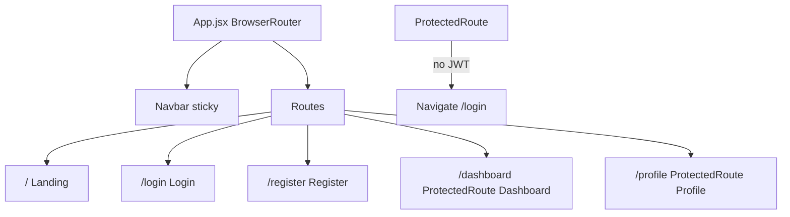

# React Router + Page Scaffold Plan

## Current state

[`client/src/App.jsx`](client/src/App.jsx) is a monolith: inline `AuthForm`, `AppHeader`, upload state machine (`IDLE` / `PROCESSING` / `RESOLVED`), and conditional rendering of `UploadZone`, `ProcessingView`, and [`components/Dashboard/Dashboard.jsx`](client/src/components/Dashboard/Dashboard.jsx).

Measurements already carry a `category` field from the backend pipeline (e.g. `"CBC"`, `"Lipid"`, `"Vitamins"` via [`utils/canonicalMap.json`](utils/canonicalMap.json)).

**Note:** Task 4 mentions importing `"Maps"` from react-router-dom — treat this as **`Navigate`** (redirect helper).

**Note:** `font-headline-sm` is not defined in [`client/tailwind.config.js`](client/tailwind.config.js) yet. Add it during BiomarkerGrid work:

```js
fontSize: {
  'headline-sm': ['1.125rem', { lineHeight: '1.4', fontWeight: '600' }],
},
```

---

## Task 1 — Install dependency

In `client/`:

```bash
npm install react-router-dom
```

No changes to [`client/src/main.jsx`](client/src/main.jsx) — `BrowserRouter` wraps routes inside `App.jsx` per spec.

---

## Task 2 — BiomarkerGrid categorization

**File:** [`client/src/components/Dashboard/BiomarkerGrid.jsx`](client/src/components/Dashboard/BiomarkerGrid.jsx)

Refactor the flat `measurements.map` into grouped sections:

```jsx
const grouped = measurements.reduce((acc, m) => {
  const cat = m.category || "General Vitals";
  (acc[cat] ??= []).push(m);
  return acc;
}, {});
```

For each category key in `Object.entries(grouped)`:

- Render a header: `font-headline-sm text-primary mb-4 mt-6 border-b border-outline-variant/30 pb-2` + lucide icon
- Render the **existing** card grid (`grid grid-cols-1 sm:grid-cols-2 lg:grid-cols-3 xl:grid-cols-4 gap-4`) and card markup unchanged — keep `getStatusStyles`, `resolveValue`, `resolveUnit`, badge colors

**Category → icon map** (local helper, e.g. `getCategoryIcon(category)`):

| Category                  | Icon           |
| ------------------------- | -------------- |
| CBC                       | `Droplets`     |
| Diabetes                  | `Gauge`        |
| Lipid                     | `Heart`        |
| Kidney                    | `Filter`       |
| Liver                     | `Pill`         |
| Iron                      | `Magnet`       |
| Vitamins                  | `Sun`          |
| Thyroid                   | `Zap`          |
| General Vitals (fallback) | `FlaskConical` |

- Remove the old top-level `"Biomarkers"` h2 + single `FlaskConical` header (replaced by per-category headers)
- First category section: use `mt-0` instead of `mt-6` to avoid extra top gap
- Empty state unchanged when `measurements.length === 0`

---

## Task 3 — Page components (`src/pages/`)

Create directory [`client/src/pages/`](client/src/pages/) and split logic from `App.jsx`.

### Shared utilities

Extract from `App.jsx` into [`client/src/lib/structured.js`](client/src/lib/structured.js) (or inline in `pages/Dashboard.jsx` if preferred — small helper):

- `normalizeStructured()` — maps `normalizedValue` / `rawValue` for dashboard display
- `APP_STATE` constants

### [`pages/Landing.jsx`](client/src/pages/Landing.jsx)

Public marketing placeholder:

- Full-width hero on `bg-background`
- Headline: **Empathetic Precision** (Vitality Core styling: `text-primary`, `glass-card`, `shadow-ambient`)
- Subcopy about personal health intelligence (not a report summarizer)
- CTAs: `Link` to `/register` ("Get Started") and `/login`

### [`pages/Login.jsx`](client/src/pages/Login.jsx) & [`pages/Register.jsx`](client/src/pages/Register.jsx)

Split the inline `AuthForm` from `App.jsx`:

- **Login:** email + password; `loginUser()` from [`client/src/lib/api.js`](client/src/lib/api.js); on success `navigate('/dashboard')`
- **Register:** name + email + password; `registerUser()`; on success `navigate('/dashboard')`
- Reuse existing form/card Tailwind classes from current `AuthForm`
- Cross-links via `Link`: Login ↔ Register (replace the in-form mode toggle)
- Error + loading states preserved

### [`pages/Dashboard.jsx`](client/src/pages/Dashboard.jsx)

Move the **authenticated app shell** from `App.jsx`:

- Owns `appState`, `dashboardData`, `error`, `handleFileSelected` (upload → interpret chain)
- Renders:
  - `IDLE` → `UploadZone`
  - `PROCESSING` → `ProcessingView`
  - `RESOLVED` → import existing [`components/Dashboard/Dashboard.jsx`](client/src/components/Dashboard/Dashboard.jsx) with `payload={dashboardData}`

This preserves PDF export, `HealthTimelineCard`, `AISummaryCard`, and categorized `BiomarkerGrid` without duplicating the results layout. The page orchestrates flow; the component folder still holds the results grid.

### [`pages/Profile.jsx`](client/src/pages/Profile.jsx)

Simple protected placeholder:

- `glass-card` settings shell
- "Profile settings coming soon" + user email placeholder (optional: read from a minimal `localStorage` user snapshot saved at login — only if trivial; otherwise static placeholder is fine)

### Cleanup

- Delete inline `AuthForm` and `AppHeader` from `App.jsx`
- Remove old auth-gated conditional render block

---

## Task 4 — Routing shell ([`client/src/App.jsx`](client/src/App.jsx))

Refactor to routing-only:



**Imports:** `BrowserRouter`, `Routes`, `Route`, `Navigate` from `react-router-dom`; `getAuthToken`, `clearAuthToken` from `./lib/api`

**`ProtectedRoute`:**

```jsx
function ProtectedRoute({ children }) {
  if (!getAuthToken()) return <Navigate to="/login" replace />;
  return children;
}
```

**Route table** (exact paths from spec):

| Path         | Element                                          |
| ------------ | ------------------------------------------------ |
| `/`          | `<Landing />`                                    |
| `/login`     | `<Login />`                                      |
| `/register`  | `<Register />`                                   |
| `/dashboard` | `<ProtectedRoute><Dashboard /></ProtectedRoute>` |
| `/profile`   | `<ProtectedRoute><Profile /></ProtectedRoute>`   |

Structure:

```jsx
<BrowserRouter>
  <Navbar />
  <Routes>...</Routes>
</BrowserRouter>
```

---

## Task 5 — Global Navbar

**File:** [`client/src/components/Layout/Navbar.jsx`](client/src/components/Layout/Navbar.jsx)

- `sticky top-0 z-50 bg-surface/90 backdrop-blur-md border-b border-outline-variant/20`
- Auth check: `!!getAuthToken()` (re-render on navigation is sufficient for MVP; no context required)
- **Logged out:** `HeartPulse` + "HealthLens AI" (`Link` to `/`); links "Login" (`/login`) and "Get Started" (`/register`)
- **Logged in:** links "Dashboard" (`/dashboard`), "Profile" (`/profile`); "Logout" button calls `clearAuthToken()` + `useNavigate('/login')`
- Match existing header spacing: `max-w-[1440px] mx-auto px-6 py-4 flex justify-between`

Replace removed `AppHeader` — Navbar is the single global nav.

---

## File change summary

| Action           | File                                                                             |
| ---------------- | -------------------------------------------------------------------------------- |
| Install          | `react-router-dom` in `client/package.json`                                      |
| Edit             | `BiomarkerGrid.jsx`, `tailwind.config.js`                                        |
| Create           | `pages/Landing.jsx`, `Login.jsx`, `Register.jsx`, `Dashboard.jsx`, `Profile.jsx` |
| Create           | `components/Layout/Navbar.jsx`                                                   |
| Refactor         | `App.jsx` → router shell only                                                    |
| Optional extract | `lib/structured.js` for `normalizeStructured`                                    |
| Update           | `PROJECT_CONTEXT.md` — React routing, page structure, changelog                  |

---

## Verification

1. `cd client && npm run dev` — app loads at `/` with Landing + Navbar
2. `/login` and `/register` work; successful auth redirects to `/dashboard`
3. `/dashboard` without token redirects to `/login`
4. Upload flow still works: idle → processing → results with categorized biomarkers
5. `/profile` accessible when logged in; logout clears token and returns to login
6. Backend tests unchanged: `npm test` from repo root (43/43)

---

## Out of scope (not requested)

- Persisting user object across refresh (token-only auth remains)
- Redirect logged-in users away from `/login`
- Findings display / new-report reset (Day 4 remaining items)
