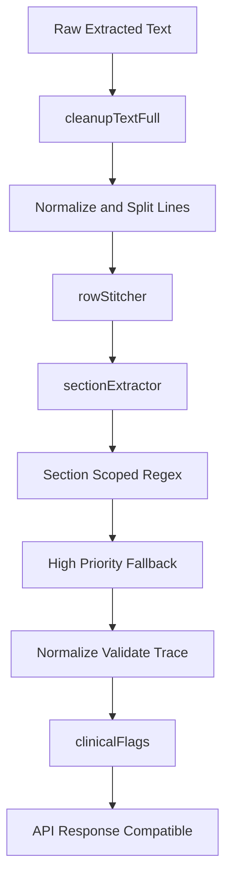

# Section Stitching + Block-Scoped Extraction Plan

## Goal

Reduce parsing errors by stitching broken rows and extracting measurements inside correct section blocks (CBC, LIPID, LIVER, etc.), with section-first extraction and controlled fallback.

## Confirmed Decisions

- Extraction mode: **section-first with limited fallback** for missed high-priority markers.
- API migration: **keep backward-compatible fields** while adding section/stitch metadata.

## Current Integration Points

- Core orchestration entry: [services/extractionService.js](services/extractionService.js)
- Clinical parsing pipeline: [services/clinicalFilterService.js](services/clinicalFilterService.js)
- OCR metadata source: [services/ocrService.js](services/ocrService.js)
- Regex extraction catalog: [utils/clinical/parameterRegexMap.js](utils/clinical/parameterRegexMap.js)

## Implementation Steps

### 1) Add row stitching utility

Create [utils/rowStitcher.js](utils/rowStitcher.js):

- `stitchRows(lines, wordsMeta, options?)`
- Single-pass lookahead merge rules:
  - parameter-name line + next numeric line
  - optional appended reference-range line
  - contiguous numeric continuation up to max lookahead
- Output stitched objects with:
  - `text`, `sourceLines`, `sourcePage`, `confidence`, `method: "row_stitch"`

### 2) Add section extractor service

Create [services/sectionExtractor.js](services/sectionExtractor.js):

- `extractSections(stitchedRows, traceability?)`
- Header detection:
  - keyword + normalized token matching
  - short-line/non-numeric heuristic
  - fuzzy token overlap threshold (>= 0.6)
- Block generation:
  - start at header
  - end at next header or non-measurement gap threshold
- Return blocks:
  - `section`, `startLine`, `endLine`, `rows`, `pageStart`, `pageEnd`

### 3) Wire sectioned flow in orchestrator

Modify [services/extractionService.js](services/extractionService.js):

- Keep existing extraction paths (pdf-parse / pdf-ocr-fallback / image-ocr).
- After `cleanupTextFull`:
  - split to normalized lines
  - run `rowStitcher`
  - run `sectionExtractor`
- Pass stitched rows + section blocks into clinical parsing layer.

### 4) Make clinical extraction section-aware

Modify [services/clinicalFilterService.js](services/clinicalFilterService.js):

- Section-first regex execution:
  - run only section-specific regex set for each block
- Limited fallback pass:
  - only high-priority parameters not already found
  - bounded window search by `reportType`
- Ensure `cleanedTextClinical` is built from relevant stitched block rows (not narrative rows).

### 5) Add section-regex routing metadata

Modify [utils/clinical/parameterRegexMap.js](utils/clinical/parameterRegexMap.js):

- Add section affinity map (e.g., Hemoglobin->CBC, ALT->LIVER).
- Export helpers:
  - `getDefinitionsForSection(section)`
  - `getHighPriorityDefinitions(reportType)`

### 6) Preserve compatibility and enrich metadata

Modify [routes/upload.js](routes/upload.js):

- Keep current response fields.
- Add new fields safely:
  - `structured.sections` (optional summary)
  - per-measurement `sourceLines` from stitcher when available
  - method indicators (`regex_exact`, `regex_fuzzy`, `row_stitch`)

### 7) Ensure OCR metadata propagation remains intact

Modify [services/ocrService.js](services/ocrService.js) only as needed:

- Confirm `words` metadata reaches stitcher/traceability path unchanged.

### 8) Add targeted tests

Add:

- [tests/rowStitcher.test.js](tests/rowStitcher.test.js)
- [tests/sectionExtractor.test.js](tests/sectionExtractor.test.js)
- [tests/integrationExtraction.test.js](tests/integrationExtraction.test.js)

Test focus:

- split rows stitched correctly (Hemoglobin + value + range)
- section boundaries detected reliably
- HbA1c not extracted from CBC block unless fallback conditions trigger
- clinical text excludes narrative blocks

## Data Flow

## Acceptance Criteria

- Broken measurement rows are stitched before regex extraction.
- Section blocks are detected and used to scope regex matching.
- Cross-section false positives are reduced (notably HbA1c leakage into CBC).
- Fallback only recovers missed high-priority measurements.
- Existing response compatibility is preserved while new section/stitch metadata is added.
- New tests pass alongside existing suite.
