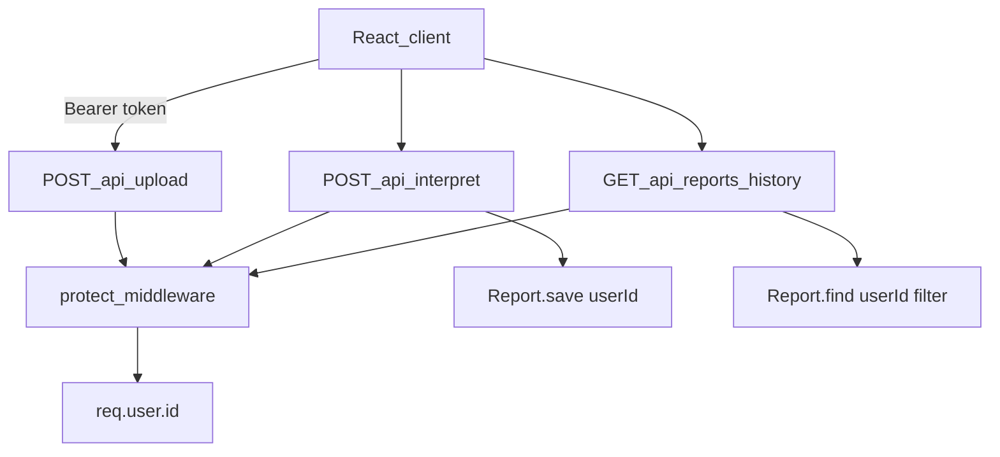

# Secure Routes and User-Scoped Reports

## Context

JWT auth is already live ([`models/User.js`](models/User.js), [`routes/auth.js`](routes/auth.js), [`middleware/authMiddleware.js`](middleware/authMiddleware.js)). Reports still use a string `userId` defaulting to `"anonymous_patient"`, and upload/interpret/history are public.

**Important mismatch to fix first:** [`middleware/authMiddleware.js`](middleware/authMiddleware.js) currently sets `req.user = decoded.id` (a string). Your spec uses `req.user.id` in queries. Update middleware to:

```js
req.user = { id: decoded.id };
```

This aligns with your task spec and leaves room to attach more user fields later.



---

## Task 1: Update Report schema — [`models/Report.js`](models/Report.js)

Replace line 13:

```js
userId: { type: mongoose.Schema.Types.ObjectId, ref: "User", required: true },
```

**Breaking change:** Existing MongoDB documents with `userId: "anonymous_patient"` will not match ObjectId queries. For local dev, drop or migrate the `reports` collection before testing.

**Tests:** [`tests/vitalityScore.test.js`](tests/vitalityScore.test.js) only constructs in-memory `Report` instances (no `.save()`), so they remain valid without changes.

---

## Task 2: Secure history route — [`routes/reports.js`](routes/reports.js)

1. Import: `const { protect } = require("../middleware/authMiddleware");`
2. Update default query inside `historyHandler`:

```js
const findReports =
  deps.findReports ??
  (() => Report.find({ userId: req.user.id }).sort({ reportDate: 1 }));
```

3. Mount with middleware (keep exported handler for tests):

```js
router.get("/history", protect, historyHandler);
```

4. Update [`tests/reportsRoute.test.js`](tests/reportsRoute.test.js): pass mock `req` with `{ user: { id: "507f1f77bcf86cd799439011" } }` in both tests.

---

## Task 3: Secure interpret route — [`routes/interpret.js`](routes/interpret.js)

1. Import `protect`.
2. Add `userId: req.user.id` to `new Report({ ... })` construction (line ~40).
3. Mount: `router.post("/", protect, interpretHandler);`
4. Update [`tests/interpretRoute.test.js`](tests/interpretRoute.test.js): add `user: { id: "507f1f77bcf86cd799439011" }` to all mock `req` objects passed to `interpretHandler`.

Optional assertion: verify `saveReport` receives a doc with `userId` set (via spy in deps) — not required for green tests.

---

## Task 4: Secure upload route — [`routes/upload.js`](routes/upload.js)

1. Import `protect`.
2. Insert **before** multer so unauthenticated requests never write to disk:

```js
router.post("/", protect, upload.single("report"), async (req, res, next) => { ... });
```

`GET /health` and `POST /api/auth/*` remain public.

---

## Task 5: Align auth middleware — [`middleware/authMiddleware.js`](middleware/authMiddleware.js)

Change line 19 from `req.user = decoded.id` to `req.user = { id: decoded.id }`.

---

## Task 6: Wire React API client — [`client/src/lib/api.js`](client/src/lib/api.js)

Add token helpers (localStorage):

- `AUTH_TOKEN_KEY`, `getAuthToken()`, `setAuthToken(token)`, `clearAuthToken()`
- `authHeaders()` → `{ Authorization: "Bearer <token>" }` (merge with existing headers where needed)
- `registerUser({ name, email, password })` and `loginUser({ email, password })` → call `/api/auth/*`, store token on success

Update protected calls:

| Function              | Change                                                                                   |
| --------------------- | ---------------------------------------------------------------------------------------- |
| `uploadReport`        | Do **not** set `Content-Type` manually (FormData boundary); add `headers: authHeaders()` |
| `interpretStructured` | Spread `authHeaders()` into existing headers                                             |
| `fetchReportHistory`  | Add `headers: authHeaders()`                                                             |

Export `getAuthToken` / `clearAuthToken` for App auth state.

---

## Task 7: Minimal auth UI — [`client/src/App.jsx`](client/src/App.jsx)

Without login UI, securing routes bricks the upload flow. Add a lightweight auth gate:

- New state: `isAuthenticated` (init from `!!getAuthToken()`)
- When unauthenticated: render a simple login/register form (name field only on register) calling `loginUser` / `registerUser` from api.js
- On success: set authenticated, clear errors
- Header: show user logged-in indicator + logout (`clearAuthToken`, reset to unauthenticated)
- Existing IDLE → PROCESSING → RESOLVED flow runs only when authenticated

Keep styling consistent with Vitality Core tokens already in the app (glass-card, primary colors). No new dependencies.

---

## Task 8: Tests and docs

- Run `npm test` — expect **43/43** still passing after test mock updates
- Update [`PROJECT_CONTEXT.md`](PROJECT_CONTEXT.md):
  - Endpoints table: upload/interpret/history require Bearer JWT; reports scoped by `userId`
  - Note `protect` now applied; Report `userId` is ObjectId ref
  - Changelog entry
  - Mark JWT integration with reports as done

**Manual smoke test:**

1. Register/login → copy token (or use React UI)
2. Upload + interpret with `Authorization: Bearer <token>` → report saved with your `userId`
3. `GET /api/reports/history` returns only your reports
4. Same endpoints without token → `401 Not Authorized`

---

## Out of scope

- Migrating legacy `"anonymous_patient"` documents automatically
- Updating [`index.html`](index.html) manual upload tester (devs must add Bearer header manually)
- Password reset, refresh tokens, or route-level role checks
