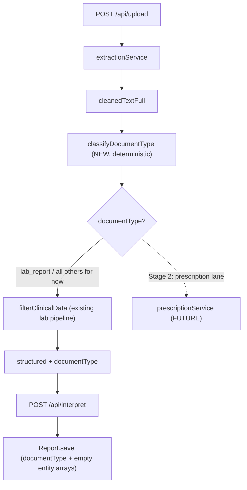

## Stage 1 - Data Model & Document Routing Foundation (I1 + I2)

Goal: unblock Stages 2-5 by giving the system a place to store all PDF Module 2/3 entities and a way to tell document types apart. No extraction of the new entities yet (that is Stage 2), no UI changes. Everything is additive and defaults so existing data and the lab pipeline are untouched.

### Key naming decision

- Keep existing `structured.reportType` / `Report.reportType` = lab panel sub-type (CBC/LIPID/...), unchanged.
- ADD a new orthogonal dimension `documentType` = `lab_report | prescription | scan_report | discharge_summary | typed_note | unknown`, which drives routing.

### I1 - Expand `Report` schema

File: [models/Report.js](models/Report.js)

- Add `documentType` field: enum of the 6 values above, `default: "lab_report"` (so all existing reports remain valid).
- Add new optional sub-schemas (all default empty arrays):
  - `medications`: `{ name, dosage, frequency, duration, route, confidence: Number, uncertain: Boolean }`
  - `diagnoses`: `{ condition, status: enum["active","resolved","unknown"], confidence, uncertain }`
  - `symptoms`: `{ description, confidence, uncertain }`
  - `doctorAdvice`: `[String]`
  - `testsAdvised`: `[String]`
  - `provenance`: `{ originalFilename, extractionMethod, confidence }` (optional, single object)
- Leave `measurements`, `aiInterpretation`, `reportType`, `createdAt`, and the `vitalityScore` virtual exactly as-is.
- Note: `aiInterpretation.summary` stays `required` for now since Stage 1 only ever saves lab reports (which always produce a summary). Revisit when the prescription save path lands in Stage 2.

### I2 - Deterministic document-type classifier

File: [services/reportClassifier.js](services/reportClassifier.js) (co-locate with existing classifier)

- Add `classifyDocumentType(text)` returning `{ documentType, scores }`, mirroring the existing `classifyReport` scoring style.
- Keyword rule sets (case-insensitive, tuned to be distinctive):
  - `prescription`: `rx`, `tab`, `tablet`, `cap`, `capsule`, `sig`, ` bd`, ` od`, ` tds`, `twice daily`, `after food`, `before food`, `refill`
  - `scan_report`: `x-ray`, `ultrasound`, `usg`, `ct scan`, `mri`, `impression`, `radiologist`
  - `discharge_summary`: `discharge summary`, `date of admission`, `date of discharge`, `hospital course`, `discharge medication`
  - `lab_report`: reuse the union of `REPORT_TYPE_RULES` tokens (hemoglobin, hba1c, creatinine, ...)
- Resolution: highest score wins; if lab tokens present and tie/zero elsewhere, prefer `lab_report`; if nothing matches, return `unknown`.

### I2 - Routing skeleton in the orchestrator

File: [services/extractionService.js](services/extractionService.js)

- After `filterClinicalData(...)` returns `structured`, compute `const { documentType } = classifyDocumentType(cleanedTextFull)` and set `structured.documentType = documentType`.
- Add a clearly-commented branch point (switch on `documentType`) that, for Stage 1, routes every type through the existing lab pipeline. This is the seam Stage 2's prescription lane plugs into - no behavior change now.

### Thread `documentType` through to persistence

- [routes/upload.js](routes/upload.js): `structured.documentType` already rides inside the returned `structured`; add it to the `logger.info("Extraction completed", ...)` payload for visibility.
- [routes/interpret.js](routes/interpret.js): in the `new Report({...})` construction, add `documentType: structured.documentType || "lab_report"` and `provenance: { originalFilename: structured.provenance?.originalFilename, extractionMethod: ... }` (only if readily available; otherwise defer provenance wiring - it is non-critical for Stage 1).

### Tests

- New [tests/documentClassifier.test.js](tests/documentClassifier.test.js): assert `classifyDocumentType` returns the correct `documentType` for representative prescription / scan / discharge / lab snippets, and `unknown` for empty/garbage.
- Extend [tests/interpretRoute.test.js](tests/interpretRoute.test.js): assert the constructed Report carries `documentType` (defaulting to `lab_report` when `structured.documentType` is absent).
- Run full suite (`npm test`) to confirm the existing 68 tests still pass; expect new count ~70-71.

### Docs (required by workspace rule)

- Update [PROJECT_CONTEXT.md](PROJECT_CONTEXT.md): Last Updated date, prepend a changelog bullet, note the expanded `Report` schema + `documentType` classifier in section 2/3, and bump the test count.

### Out of scope for Stage 1 (deferred)

- Actually extracting medications/diagnoses/etc. (Stage 2: I3-I6).
- The prescription Vision lane (Stage 2: I3).
- Any UI surfacing of `documentType` (deferred per decision).
