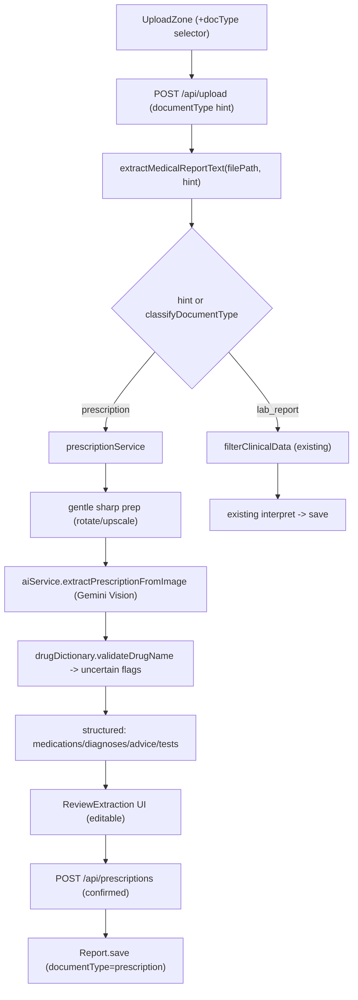

# Stage 2a - Prescription Vision Lane (I3 + I6 + prescription-scoped review/save)

## Decisions locked
- Scope: I3 (prescription Vision) + I6 (drug dictionary) + a prescription-only review-then-save step. Defer I4 (printed-report entities) and the generalized I5 UI to 2b.
- Flow: upload returns extracted entities -> user edits/confirms in a Review screen -> dedicated save endpoint persists. `aiInterpretation.summary` relaxed to optional.
- Trigger: upload UI gains an `Auto / Lab report / Prescription` selector that forces the lane; falls back to `classifyDocumentType()` on `Auto`.

## Flow

## Backend

### 1. Vision helper - [services/aiService.js](services/aiService.js)
- Add `extractPrescriptionFromImage(imageBase64, mimeType, deps = {})`.
- New multimodal model factory (reuse `gemini-flash-latest`, it is multimodal) with a strict `responseSchema`: `{ medications:[{name,dosage,frequency,duration,route,confidence,uncertain}], diagnoses:[{condition,status,confidence}], doctorAdvice:[string], testsAdvised:[string] }`.
- Send `contents: [{ role:"user", parts:[ {text: instruction + optional Tesseract hint}, {inlineData:{data:imageBase64, mimeType}} ] }]`.
- System instruction: read the prescription, return per-field `confidence` (0-1), set `uncertain:true` when unsure; never invent drugs. Keep DI shape (`deps.getModel`) so tests can inject a fake model, mirroring `generateInterpretation`.

### 2. Drug dictionary (I6) - new [utils/clinical/drugDictionary.js](utils/clinical/drugDictionary.js)
- Curated list of common Indian-brand + generic names (a few hundred; static array).
- Export `validateDrugName(name)` -> `{ matched:boolean, suggestion:string|null, score:number }` using normalized exact match + lightweight fuzzy (Levenshtein ratio). Unknown -> `matched:false`; close match -> suggestion.
- Coverage gaps flag (`uncertain`), never block.

### 3. Prescription orchestrator - new [services/prescriptionService.js](services/prescriptionService.js)
- `extractPrescription(filePath, extension, opts)`:
  - Image (`.jpg/.jpeg/.png`): gentle `sharp(filePath).rotate().resize(upscale).png().toBuffer()` (NO grayscale/sharpen - unlike lab `ocrService.preprocessImage`).
  - PDF: render first page via a `renderPdfPagesToImages` export added to [services/pdfService.js](services/pdfService.js) (currently private), take page 0 buffer.
  - base64 the buffer + mimeType -> `aiService.extractPrescriptionFromImage`.
  - Run `validateDrugName` over each med; OR the model `uncertain` with `!matched` and attach `suggestion`.
  - Return `structured` shape: `{ documentType:"prescription", reportType:"PRESCRIPTION", measurements:[], medications, diagnoses, doctorAdvice, testsAdvised, provenance:{originalFilename, extractionMethod:"gemini-vision"} }`.

### 4. Routing - [services/extractionService.js](services/extractionService.js)
- `extractMedicalReportText(filePath, opts = {})`: accept `opts.documentTypeHint`.
- Resolve `documentType = hint && hint !== "auto" ? hint : classifyDocumentType(cleanedTextFull).documentType`.
- Wire the existing `case "prescription"` seam to `await extractPrescription(filePath, extension, { textHint: cleanedTextFull })`; set `cleanedTextClinical = ""`. Default branch unchanged.

### 5. Upload route - [routes/upload.js](routes/upload.js)
- Read `req.body.documentType` (multer parses text fields) and pass `{ documentTypeHint }` to extraction. File cleanup stays in `finally` (prescriptionService reads bytes before return - safe).
- Guard the existing log (`structured.measurements.length`) for the prescription case (no measurements).

### 6. Save endpoint - new [routes/prescription.js](routes/prescription.js), mounted in [server.js](server.js)
- `POST /api/prescriptions` (`protect`), DI-style `savePrescriptionHandler(req,res,deps)` mirroring [routes/interpret.js](routes/interpret.js).
- Body: `{ medications, diagnoses, doctorAdvice, testsAdvised, reportDate, provenance }` (already user-confirmed).
- Build `Report` with `documentType:"prescription"`, `measurements:[]`, deterministic `aiInterpretation.summary` (e.g. "Prescription recorded: N medications, M diagnoses. Verify with your doctor."), no Gemini call on save. Return `{ success, reportId }`.

### 7. Schema relax - [models/Report.js](models/Report.js)
- Change `aiInterpretation.summary` from `required:true` to optional (prescriptions may carry only the deterministic summary). All else unchanged; fully backward compatible.

## Frontend

### 8. API - [client/src/lib/api.js](client/src/lib/api.js)
- `uploadReport(file, documentType = "auto")` -> append `documentType` to FormData.
- Add `savePrescription(payload)` -> `POST /api/prescriptions`.

### 9. Upload selector - [client/src/components/UploadZone.jsx](client/src/components/UploadZone.jsx)
- Add a small segmented control (Auto / Lab report / Prescription); pass selection up via `onFileSelected(file, documentType)`.

### 10. Review UI (focused I5) - new [client/src/components/ReviewExtraction.jsx](client/src/components/ReviewExtraction.jsx)
- Editable medication rows (name/dosage/frequency/duration/route) with `uncertain` rows visually highlighted + suggestion hint; editable diagnoses/advice/tests; Confirm & Save / Cancel.
- Vitality Core styling (`glass-card`, `shadow-ambient`).

### 11. Dashboard flow - [client/src/pages/Dashboard.jsx](client/src/pages/Dashboard.jsx) + [client/src/lib/structured.js](client/src/lib/structured.js)
- Add `APP_STATE.REVIEW`. In `handleFileSelected(file, documentType)`: if `uploadJson.structured.documentType === "prescription"` -> store extracted entities, go to `REVIEW`; on confirm call `savePrescription` -> `loadHistory` -> navigate. Lab path unchanged.
- Minimal saved-prescription display: extend `reportToDashboardPayload` to pass through `medications/diagnoses/doctorAdvice`; add a small `PrescriptionCard` rendered by [client/src/components/Dashboard/Dashboard.jsx](client/src/components/Dashboard/Dashboard.jsx) when `documentType==="prescription"` so saved scripts are not invisible in Vault/dashboard.

## Tests (Node test runner, DI style)
- `tests/drugDictionary.test.js`: known match, unknown flagged, fuzzy suggestion.
- `tests/prescriptionService.test.js`: inject fake vision extractor + dictionary -> medications carry `uncertain` correctly; empty/garbage handled.
- `tests/prescriptionRoute.test.js`: handler builds `Report` with `documentType:"prescription"`, medications, deterministic summary; 400 on missing body; 500 on save failure (mirror [tests/interpretRoute.test.js](tests/interpretRoute.test.js)).
- `tests/aiService.vision.test.js`: inject fake model, assert image part + schema wiring and parsed output.
- Run `npm test`; expect ~85-88 passing.

## Docs
- Update [PROJECT_CONTEXT.md](PROJECT_CONTEXT.md) per workspace rule: Last Updated date, changelog bullet, new `POST /api/prescriptions` endpoint, prescription lane in section 3 pipeline, schema relax note, new test count.

## Out of scope (2b)
- I4 printed-report entity extraction; generalized I5 confirmation across all doc types; rich prescription dashboard analytics; repository aggregation (Stage 3).