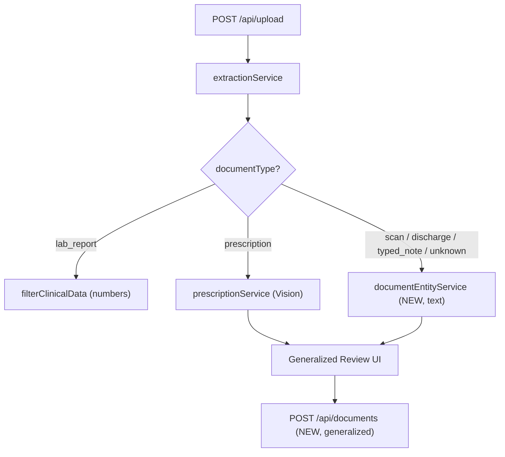

# Stage 2b - Printed-Report Entities (I4) + Generalized Review (I5)

Goal: route `scan_report | discharge_summary | typed_note | unknown` through a new **text-based** Gemini entity lane (catch-all), and generalize the prescription-only review/save/display flow to any entity document. Numbers are still NEVER extracted by the LLM. Multi-page PDF stays deferred.

## Routing change

Currently only `prescription` leaves the lab pipeline ([services/extractionService.js](services/extractionService.js) `switch`); the four other non-lab types fall through `default` to `filterClinicalData` and produce nothing.

## Backend - I4 (text entity extraction)

- **AI extractor** in [services/aiService.js](services/aiService.js): add `getEntityModel()` + `extractEntitiesFromText(text, deps)`. Strict JSON schema mirroring the prescription schema PLUS a `symptoms[]` array (`{ description, confidence, uncertain }`). New system instruction: transcribe entities from a printed/typed clinical document; never invent; do NOT extract numeric lab measurements. Returns `{ medications, diagnoses, symptoms, doctorAdvice, testsAdvised }`.
- **Entity service** new [services/documentEntityService.js](services/documentEntityService.js): `extractDocumentEntities(cleanedText, documentType, deps)` calls `extractEntitiesFromText`, reuses `annotateMedications` (export it from [services/prescriptionService.js](services/prescriptionService.js)), and returns a `structured`-shaped object: `measurements: []`, `medications/diagnoses/symptoms/doctorAdvice/testsAdvised`, `reportType` derived from documentType (e.g. `DISCHARGE_SUMMARY`), `provenance.extractionMethod: "gemini-text"`.
- **Routing** in [services/extractionService.js](services/extractionService.js): add `case "scan_report"/"discharge_summary"/"typed_note"/"unknown"` -> `extractDocumentEntities(cleanedTextFull, documentType)`. Keep `prescription` -> Vision, `lab_report`/`default` -> lab pipeline.

## Backend - I5 (generalized save)

- Generalize [routes/prescription.js](routes/prescription.js): rename core to `saveDocumentHandler`, add `sanitizeSymptoms`, read `documentType` + `symptoms` from body, derive `reportType`, generalize `buildPrescriptionSummary` -> `buildDocumentSummary` (counts meds/diagnoses/symptoms; deterministic, still no Gemini call on save). Relax the validation gate to also accept symptoms-only docs.
- Mount the generalized handler at `POST /api/documents` in [server.js](server.js); keep `POST /api/prescriptions` working (delegates with `documentType: "prescription"`) for backward compatibility and existing tests.

## Frontend - I5 (review, flow, display)

- [client/src/components/ReviewExtraction.jsx](client/src/components/ReviewExtraction.jsx): accept a `documentType` prop, add a **Symptoms** section (line/list editor like advice), adapt the header copy, and include `documentType` + `symptoms` in the confirm payload.
- [client/src/pages/Dashboard.jsx](client/src/pages/Dashboard.jsx): change the REVIEW trigger from `documentType === 'prescription'` to `documentType !== 'lab_report'` (covers prescriptions + all entity docs); rename `handleConfirmPrescription` -> `handleConfirmDocument`; pass `documentType` to the review screen.
- [client/src/lib/api.js](client/src/lib/api.js): add `saveReviewedDocument(payload)` -> `POST /api/documents` (keep `savePrescription` or have it delegate).
- Display: in [client/src/components/Dashboard/Dashboard.jsx](client/src/components/Dashboard/Dashboard.jsx) change `isPrescription` to `isEntityDocument = documentType !== 'lab_report'`; generalize [client/src/components/Dashboard/PrescriptionCard.jsx](client/src/components/Dashboard/PrescriptionCard.jsx) to add a Symptoms section (rename to `DocumentEntitiesCard`). Add `symptoms` to `reportToDashboardPayload` in [client/src/lib/structured.js](client/src/lib/structured.js).

## Tests

- New `tests/aiServiceEntities.test.js` (mock model -> assert schema parsing/defaults for `extractEntitiesFromText`).
- New `tests/documentEntityService.test.js` (entity shape + `annotateMedications` reuse + symptoms passthrough).
- Extend an extractionService routing test: the four new doc types route to the entity lane (inject a fake `extractDocumentEntities`).
- New/extended save-route test: `documentType` + `symptoms` persist; symptoms-only doc passes validation; `/api/prescriptions` still works.
- `npm test` green; bump count (currently 94).

## Docs

- Update [PROJECT_CONTEXT.md](PROJECT_CONTEXT.md) per the workspace rule: Last Updated date, prepend changelog bullet, update routing/pipeline (3 lanes), endpoints (`POST /api/documents`), schema note (symptoms now surfaced), test count, and move I4/generalized-review from "deferred" to done.

## Out of scope (still deferred)

- Multi-page PDF prescriptions/documents (page 0 only).
- Any second Gemini interpretation pass on entity-document save (kept deterministic).
