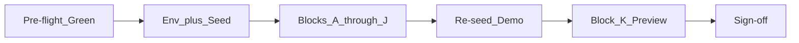

# Stage 3.1 — Full Technical QA Plan

## Pre-flight results (completed)

| Gate | Result | Notes |
|------|--------|-------|
| `npm test` | **189/189 pass** | 4.6s duration |
| `npm run build` (client) | **Green** | Built in 3.5s; chunk-size warning on `index-BPAMIVni.js` (717 kB) — **P2 only**, not a blocker |

**PowerShell note:** Use `;` not `&&` for command chaining on this machine.

---

## Environment setup (next step)

Before manual blocks, configure evaluation-like env in [`.env`](.env):

| Variable | Recommendation |
|----------|----------------|
| `MONGODB_URI` | Atlas (match evaluation) |
| `JWT_SECRET` | Set |
| `GEMINI_API_KEY` | Set only if testing Chat / live upload lanes |
| `LONGITUDINAL_AI_ENABLED` | **`false`** (or unset) — deterministic insights only; avoids Gemini stall risk |

Fresh seed + dev server:

```powershell
cd c:\Users\Work\Downloads\HealthLens
$env:RESET_DEMO_PASSWORD="true"; npm run seed:demo
npm run dev
```

Alternative for password reset: set `RESET_DEMO_PASSWORD=true` in `.env` temporarily, then run `npm run seed:demo`.

Open `http://localhost:5173` (5174 if port taken). Credentials: `demo@healthlens.ai` / `DemoHealth2026!` ([`docs/DEMO.md`](docs/DEMO.md)).

**QA log:** Track `# | Area | Step | Pass/Fail | Notes | Severity` — fix **P0 only** during 3.1. Log refinements 1–8 findings as you go (mobile nav, seed counts, etc.).

**Confirmed execution order:**

```
env-seed → A (+ A12 mobile) → B → C → D → E → F → G → H → J (skip J4 if tight) → re-seed → K (dev mode) → idempotency seed → sign-off
```

---

## Codebase anchors (what to verify against)

These are the implementation touchpoints behind your checklist — use them when a test fails to triage quickly.

### Demo narrative (Priya Sharma)

- 4 reports: Jan 15 baseline → Mar 20 worsening → Mar 22 prescription → **Jun 5 default** ([`scripts/demoPatientData.js`](scripts/demoPatientData.js))
- Jun report vitality score = **68** (asserted in [`tests/demoPatientData.test.js`](tests/demoPatientData.test.js))
- Trend Analytics keys on identical measurement names: HbA1c, Fasting Glucose, Hemoglobin, Total Cholesterol

### Dashboard intelligence

- Default report: latest in history when no `?reportId` ([`client/src/pages/Dashboard.jsx`](client/src/pages/Dashboard.jsx) lines 126–128)
- Upload mode: URL `?upload=1` skips auto-resolve ([`Dashboard.jsx`](client/src/pages/Dashboard.jsx) lines 117–118, 141+)
- Insights cache: `localStorage` + history signature; **no network call** on reload if signature unchanged ([`client/src/lib/api.js`](client/src/lib/api.js) + [`Dashboard.jsx`](client/src/pages/Dashboard.jsx) `loadInsights`)
- First login **will** hit `GET /api/repository/insights` once; F5 reload should **not** (B12/B13)

### Repository performance

- Single bundle: `GET /api/repository/overview` ([`client/src/lib/api.js`](client/src/lib/api.js) `fetchRepositoryOverview`)
- In-memory session cache (not localStorage) — revisit within same tab is instant
- [`VitalitySnapshotCard.jsx`](client/src/components/Dashboard/VitalitySnapshotCard.jsx) warms cache on dashboard load

### Upload entry points

- Navbar Upload → `/dashboard?upload=1` ([`client/src/components/Layout/Navbar.jsx`](client/src/components/Layout/Navbar.jsx))
- Dashboard "Upload Report" button in [`client/src/components/Dashboard/Dashboard.jsx`](client/src/components/Dashboard/Dashboard.jsx)

### Delete + cache invalidation

- `deleteReport()` clears overview + insights caches ([`client/src/lib/api.js`](client/src/lib/api.js) lines 306–315)
- Vault confirm dialog in [`client/src/pages/Vault.jsx`](client/src/pages/Vault.jsx)

### Error handling (expected behaviors)

| Scenario | Expected behavior | File |
|----------|-------------------|------|
| Invalid `?reportId` | Error banner "Report not found." — not white screen | [`Dashboard.jsx`](client/src/pages/Dashboard.jsx) lines 134–137 |
| Repository API down | Full-page error on Repository | [`Repository.jsx`](client/src/pages/Repository.jsx) |
| Chat Gemini down | Inline assistant message or friendly error | [`Chat.jsx`](client/src/pages/Chat.jsx) lines 64–79 |
| Chat >1500 chars | 400 from API | [`routes/chat.js`](routes/chat.js) |
| Interpret Gemini down | Amber `aiUnavailable` banner; report still saved | Dashboard upload flow |

---

## Execution flow



### Block A — Auth and routing (20 min)

All routes in [`client/src/App.jsx`](client/src/App.jsx): `/`, `/login`, `/register`, `/dashboard`, `/vault`, `/repository`, `/chat`, `/profile`, `/doctor-summary`.

| # | Test | Expected |
|---|------|----------|
| A1–A11 | Per original checklist | Routes load, auth gate, logout/login |
| **A12** | **Mobile nav (P1 risk)** | Resize to mobile width or DevTools device mode → open hamburger → tap Vault, Repository, Upload → no crash, links work |

- Lazy routes: Vault, Repository, DoctorSummary — watch for Suspense flash, not crash
- Logged-out `/dashboard` → redirect via `ProtectedRoute`
- Console: no uncaught errors per route (desktop **and** mobile)

**Known P2 (not P0):** Landing CTA goes to `/dashboard`, not `/dashboard?upload=1` — use Navbar Upload for demo upload entry.

### Block B — Dashboard intelligence (30 min)

Core evaluation story — match Priya narrative:

| Check | Expected |
|-------|----------|
| B1 | Jun 5, 2026 report |
| B2 | Vitality ~68; Metformin + Type 2 Diabetes pills (from repository overview on snapshot card) |
| B3 | Longitudinal card loads; **deterministic** badge when `LONGITUDINAL_AI_ENABLED` off; card shows **HbA1c improvement narrative** (Jun vs Mar — e.g. improved but still elevated). Empty or generic copy = **P1** even with badge |
| B4 | HbA1c: 3 points Jan → Mar → Jun |
| B5 | HbA1c/Glucose flagged; deltas vs March |
| B6 | Mini calendar lists all 4 reports |
| B7–B9 | Scrubber + prescription entity card on Mar 22 |
| B10–B11 | Print current report; Doctor Summary navigates to `/doctor-summary` |
| B12–B13 | DevTools Network: no second `/insights` on F5 or navigate away/back |

### Block C — Upload flows (25 min)

Priority: C1–C3 (recently fixed). C4 optional (temp register user). C5–C8 optional if PDF/Gemini available.

After destructive tests: `npm run seed:demo` to restore 4-report state.

### Block D — Repository (20 min)

- First visit: **one** `GET /api/repository/overview` in Network tab
- D5: Dashboard first → Repository should feel instant (warmed cache)

**Seed-backed counts (catch partial rollups):**

| Field | Expected (demo user) |
|-------|----------------------|
| `summary.totalReports` | 4 |
| `summary.medications` | 1 (Metformin) |
| `summary.diagnoses` | 1 (Type 2 Diabetes, `active`) |
| `summary.events` | 4 |

Verify the **6-stat strip** on [`Repository.jsx`](client/src/pages/Repository.jsx) matches these (reports / medications / diagnoses / symptoms / advice-tests / timeline events). Also confirm Metformin row, Type 2 Diabetes row, and advice/tests content from seed.

### Block E — Vault and delete (15 min)

- 4 cards; 2 Attention / 2 Stable
- Stat: **N Flagged** label
- **E5 — Delete Jan 15 baseline only** (oldest, least demo-critical). **Do not delete Jun 5** — that breaks the default demo story.
- After delete: list updates, overview + insights caches cleared
- **Re-seed immediately after E5/E6:** `npm run seed:demo`

### Block F — Doctor Summary (15 min)

[`client/src/pages/DoctorSummary.jsx`](client/src/pages/DoctorSummary.jsx) — print via `react-to-print`, action bar `print:hidden`.

Verify: patient block, snapshot, meds, diagnoses, Jun vitals, abnormal markers, timeline highlights (max 8), deterministic insights subset, disclaimer.

### Block G — Profile (15 min)

[`client/src/pages/Profile.jsx`](client/src/pages/Profile.jsx) — Account / Security / Health tabs.

After G2 password change: `$env:RESET_DEMO_PASSWORD="true"; npm run seed:demo`.

### Block H — Chat (15 min)

Requires `GEMINI_API_KEY` for H1/H2. Chat is **bonus** — full 3.1 sign-off requires H1 once **or** documented skip with fallback script memorized.

| # | Test | Expected |
|---|------|----------|
| H1 | "What medicines am I taking?" | Reply mentions Metformin |
| H2 | "What changed since my last lab report?" | References HbA1c trend / improvement |
| **H3** | Gemini failure procedure (below) | Inline assistant 503 message in [`Chat.jsx`](client/src/pages/Chat.jsx) — not stack trace |
| H4 | Message >1500 chars | Validation error, not crash |

**H3 procedure (env changes require server restart):**
1. Stop backend
2. Remove or blank `GEMINI_API_KEY` in `.env`
3. Restart `node server.js` or `npm run dev`
4. Send a chat message → expect inline assistant message: *"AI assistant is temporarily unavailable..."*

**Fallback script (if skipping live chat):**

> "The assistant uses live AI; the dashboard, repository, and vault are fully powered by structured seeded data."

### Block I — API smoke (10 min, optional)

```powershell
# Login, copy token
curl -s http://localhost:5000/api/reports/history -H "Authorization: Bearer TOKEN"
curl -s http://localhost:5000/api/repository/overview -H "Authorization: Bearer TOKEN"
curl -s http://localhost:5000/api/repository/insights -H "Authorization: Bearer TOKEN"
curl -s http://localhost:5000/api/repository/doctor-summary -H "Authorization: Bearer TOKEN"
```

All should return `success: true` with 4 reports for demo user.

### Block J — Edge behavior (15 min)

- J1: `/dashboard?reportId=bad` → error state
- J2: Stop backend → Repository full-page error
- J3: Logout in tab 2 → tab 1 fails gracefully on next API call
- **J4 (optional):** Rapid chat → 429 message in Chat UI. Chat limit is 25 req / 15 min — hard to trigger manually. Skip unless you have a quick script; do not burn 15 minutes hammering Chat.

### Block K — Production rehearsal (15 min)

**Important caveat:** [`client/vite.config.js`](client/vite.config.js) proxies `/api` only under `server` (dev), **not** `preview`. Running `npm run preview` alone will break API calls.

**Recommended approach for Block K:**
1. `npm run build --prefix client` (already green)
2. Run `node server.js` in one terminal
3. Either:
   - **Option A (full path):** Stay on `npm run dev` for rehearsal — validates real eval setup
   - **Option B (bundle only):** `npm run preview --prefix client` — confirms static assets load; API calls will 404 unless proxy added (out of scope for 3.1)

Critical path to repeat: Login → Dashboard → Repository → Vault → Doctor Summary print → Navbar Upload. Use **`npm run dev`** (not preview-only) for full-stack rehearsal.

---

### Seed idempotency check (before sign-off)

From [`docs/DEMO.md`](docs/DEMO.md) item 10 — run after full QA or immediately before sign-off:

```powershell
npm run seed:demo
npm run seed:demo
```

Login → still 4 reports, Jun 5 default, same narrative. Catches accidental double-seed corruption.

---

## Minimum viable QA (if time-tight)

```
Pre-flight → A (+ A12) → B → C1–C3 → D1–D4 → F → Re-seed
```

Covers evaluation story + upload fix regression.

**Label result:** `minimum viable QA passed` — **not** full Stage 3.1 complete (skips E, G, H).

---

## Stage 3.1 exit criteria

### Automated (done)

- [x] 189/189 tests pass
- [x] Client build green

### Full sign-off (required for "Stage 3.1 complete")

- [ ] Demo seed + Atlas login works
- [ ] Block A: all routes + **A12 mobile nav** — no crash
- [ ] Block B: Priya narrative matches + **B3 HbA1c insight narrative**
- [ ] Block C: upload reachable with existing history
- [ ] Block D: single overview call + **seed-backed counts**
- [ ] **Block E:** vault + delete Jan 15 + re-seed
- [ ] Block F: doctor summary prints cleanly
- [ ] **Block G:** profile tabs + password test + re-seed
- [ ] **Block H:** chat once **or** documented skip with fallback memorized
- [ ] Block J: J1–J3 (J4 optional)
- [ ] Block K: dev-mode rehearsal
- [ ] **Seed idempotency:** double-seed → same state
- [ ] No open P0 bugs
- [ ] QA log completed
- [ ] Demo data restored via seed

---

## Deliverable format (paste when done)

```
Sign-off level: full 3.1 | minimum viable QA passed
P0: [count] — list
P1: [count] — list
P2: [count] — list
Blocks passed: A? B? C? D? E? F? G? H? J? K? idempotency?
Production rehearsal: yes/no (dev mode)
Ready for 3.2: yes/no
```

---

## Explicitly out of scope (3.1)

| Item | Stage / Why |
|------|-------------|
| Rewrite `docs/DEMO.md` | 3.3 |
| Chat suggested prompts UI | 3.2 |
| Landing upload link fix | 3.2 (P2) |
| Fix Vite preview proxy | Out of scope — eval uses `npm run dev` |
| Fix chunk size warning | P2; not demo-blocking |
| Full OCR regression suite | Out of scope |
| New features | Frozen |
| OCR edge cases | Out of scope |

---

## Post-QA

- **P0 fixes:** Implement immediately, re-run affected blocks + automated gates
- **P1 triage:** User decides fixes for Stage 3.2
- **P2:** Defer unless trivial
- Update [`PROJECT_CONTEXT.md`](PROJECT_CONTEXT.md) only if bugs fixed or test count changes
