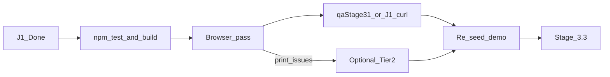

# Stage 3.2 — Tight UX Polish Plan

## Current state (do not redo)

| Item | Status |
|------|--------|
| **3.2.1 J1** — invalid report ID | **Done** — [`routes/reports.js`](routes/reports.js) returns `400` via `mongoose.isValidObjectId`; 2 tests in [`tests/reportsRoute.test.js`](tests/reportsRoute.test.js); **191/191** tests |
| **3.2.4 Landing upload CTA** | **Already fixed** — [`Landing.jsx`](client/src/pages/Landing.jsx) line 31: `uploadHref = getAuthToken() ? '/dashboard?upload=1' : '/register'` |
| Env | `LONGITUDINAL_AI_ENABLED=false`, Atlas, demo seed OK |
| QA runner | [`scripts/qaStage31.mjs`](scripts/qaStage31.mjs) — J1 expects 400 |

**Reject for 3.2:** new features, navbar redesign, OCR, preview proxy, chat architecture, new repository endpoints.

---

## Tier 1 — Do first (~30 min)

### 3.2.1 J1 — Skip (shipped)

P1 from 3.1 is closed. No more J1 work unless regression. Re-verify in step 4 (after browser pass).

### 3.2.2 Five-minute browser pass (manual) — run BEFORE destructive QA

Prereqs: `npm run dev`, login `demo@healthlens.ai` / `DemoHealth2026!`.

Use DevTools **Network** tab + **device mode** (375px width). Log Pass/Fail; fix only **demo-blocking** issues.

| # | Check | How | Pass criteria |
|---|-------|-----|---------------|
| B11-print | Doctor Summary print | `/doctor-summary` → Print preview | Action bar hidden; disclaimer visible; no clipped tables |
| B10-print | Export Current Report | Dashboard → Export Current Report | Navbar/footer hidden in print preview; biomarker grid not clipped across pages; document title **HealthLens_AI_Report** ([`Dashboard.jsx`](client/src/components/Dashboard/Dashboard.jsx) `@page { margin: 14mm }`) |
| A12-mobile | Hamburger nav | Device mode → Menu → Vault, Repository, Upload | No crash; correct routes |
| B12-cache | Insights cache | Dashboard load → note `/insights` call → F5 | **No second** `/insights` unless history changed |
| B13-cache | Navigate away/back | Dashboard → Repository → Dashboard | Same — cache reused |
| J2-optional | Repository error | Stop backend briefly → `/repository` | Full-page error, not partial tables |

**Decision gate after browser pass:**

- Print looks bad → do **3.2.5** only
- Everything else looks fine → skip Tier 2 polish entirely

### 3.2.3 Automated re-verification — split non-destructive vs destructive

**Step A — non-destructive (run first, safe before browser):**

```powershell
cd c:\Users\Work\Downloads\HealthLens
npm test
npm run build --prefix client
```

**Step B — browser pass (3.2.2)** — demo must stay intact: 4 reports, `DemoHealth2026!`.

**Step C — destructive regression check (run AFTER browser):**

[`scripts/qaStage31.mjs`](scripts/qaStage31.mjs) deletes Jan 15 and changes demo password to `TestPassQA2026!`. **Do not run before browser pass.**

```powershell
node scripts/qaStage31.mjs
$env:RESET_DEMO_PASSWORD="true"; npm run seed:demo
```

**J1 shortcut** (if 3.1 qa ran recently and you only need J1 proof):

```powershell
# After login — expect 400, not 500
curl -s -H "Authorization: Bearer TOKEN" http://localhost:5000/api/reports/notavalidid123
```

Full `qaStage31.mjs` once at end of 3.2 is sufficient.

**Pass criteria:** 191/191 tests, build green, qa script `P0: 0` (or J1 curl 400), demo re-seeded.

---

## Tier 2 — Pick at most 2 (only if browser pass finds issues)

Default recommendation: **skip all Tier 2** and go straight to 3.3 unless print or chat UX clearly hurts the demo.

| # | Task | When to do | Effort | Files |
|---|------|------------|--------|-------|
| ~~3.2.4~~ | Landing upload CTA | **Skip — already done** | — | [`Landing.jsx`](client/src/pages/Landing.jsx) |
| **3.2.5** | Doctor Summary print margins | **Only if B11 preview clips tables** — do not preemptively edit | ~20 min | [`DoctorSummary.jsx`](client/src/pages/DoctorSummary.jsx) — existing `print:` classes + `@media print` block (~line 141) |
| **3.2.6** | Chat suggested prompts | **Skip unless** eval script includes Assistant as Act 7 | ~30 min | [`Chat.jsx`](client/src/pages/Chat.jsx) — static chip row above input; prompts from Context.txt |
| **3.2.7** | Loading/empty copy | **Only** what breaks during browser pass | Ad hoc | Only the broken page |

**Default path: zero Tier 2 items → straight to 3.3.**

---

## Stage 3.2 exit criteria

- [x] J1 fixed (400 on malformed id)
- [x] [`PROJECT_CONTEXT.md`](PROJECT_CONTEXT.md) reflects 191 tests + J1 — verify only, do not re-edit unless regression
- [ ] Browser pass completed (print, mobile, insights cache; J2 optional)
- [ ] **Browser pass log pasted** (even ~6 lines Pass/Fail)
- [ ] `npm test` + build green (before browser)
- [ ] `qaStage31.mjs` or J1 curl after browser; demo re-seeded
- [ ] At most 0–2 Tier 2 items shipped (or explicitly deferred — default **0**)
- [ ] No open P0 bugs

---

## Stage 3.3 — Next (where effort should go)

Do **not** extend 3.2 past ~2 hours. Stage 3.3 is higher eval ROI:

### 3.3.1 Rewrite [`docs/DEMO.md`](docs/DEMO.md)

Update stale content (currently says local MongoDB only):

- Atlas `MONGODB_URI` prereq
- `LONGITUDINAL_AI_ENABLED=false` for eval
- Navbar **Upload** as upload entry (not Landing-only)
- New acts: **Repository** (`/repository`), **Doctor Summary** (`/doctor-summary`)
- `node scripts/qaStage31.mjs` smoke mention
- PowerShell seed: `$env:RESET_DEMO_PASSWORD="true"; npm run seed:demo`
- Chat = bonus; Gemini fallback script

### 3.3.2 Fixed 5-minute evaluation script

Memorize or print. Suggested flow (from Context.txt + current routes):

1. Problem statement (scattered records)
2. Login demo patient
3. Dashboard — vitality, trends, **What Changed** card, Needs Attention
4. **Navbar Upload (~10s)** — “Users with existing history can still add records” → `/dashboard?upload=1` (post-2.3 fix worth showing)
5. Repository — health memory rollups
6. Vault — 4-report journey
7. Doctor Summary — print/export
8. (Optional) Assistant one question
9. Close — insights not diagnosis; doctor communication

### 3.3.3 Freeze

After 3.3: bug fixes, copy, demo script only — no new modules.

---

## Execution order (corrected)

```text
1. npm test + npm run build          (non-destructive)
2. Browser pass (3.2.2)              (demo intact: 4 reports, DemoHealth2026!)
3. node scripts/qaStage31.mjs        (destructive — J1 regression; or J1 curl only)
4. RESET_DEMO_PASSWORD seed          (restore demo)
5. Tier 2 only if browser found issues (default: skip)
6. Stage 3.3
```



---

## Env — keep as-is

| Setting | Value |
|---------|-------|
| `LONGITUDINAL_AI_ENABLED` | `false` |
| `GEMINI_API_KEY` | Set (chat bonus) |
| Run mode | `npm run dev` |
| Demo | `demo@healthlens.ai` / `DemoHealth2026!` |
