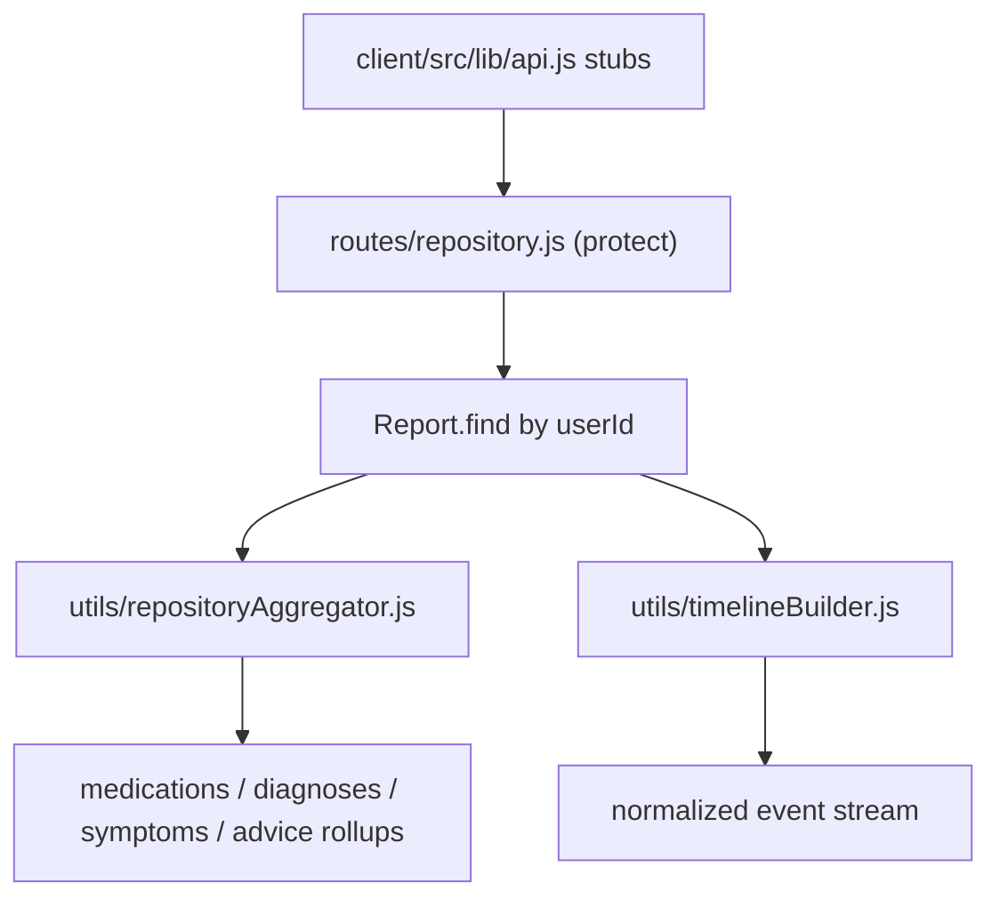

# Stage 3 — Personal Health Repository (I7 + I8)

## Goal

Aggregate cross-report data into the patient's "digital health memory": rollup endpoints (I7) and a unified chronological event stream (I8). Computed-on-read over the user's existing `Report` documents — no new collection. Backend + frontend API-client stubs (no new UI components).

## Architecture

## I7 — Aggregation core: new [utils/repositoryAggregator.js](utils/repositoryAggregator.js)

Pure, testable functions over an array of report objects (mirrors the deterministic, dependency-light style of existing utils). Each rollup returns the agreed "both" shape: a deduped group with per-occurrence detail.

- `aggregateMedications(reports)` -> groups keyed by normalized lowercased `name`; each group: `{ name, count, firstSeen, lastSeen, latest: {dosage, frequency, duration, route}, uncertain, occurrences: [{ reportId, reportDate, documentType, dosage, frequency, duration, route, confidence }] }`.
- `aggregateDiagnoses(reports)` -> keyed by normalized `condition`; group carries `latestStatus` (active/resolved/unknown from most recent occurrence) plus `occurrences`.
- `aggregateSymptoms(reports)` -> keyed by normalized `description`.
- `aggregateAdvice(reports)` -> rolls up `doctorAdvice[]` and `testsAdvised[]` (string lists) into deduped groups with `occurrences: [{ reportId, reportDate }]`.
- Shared helper: normalize key (trim + lowercase + collapse whitespace), sort occurrences by date, compute first/last seen.

## I7 — Routes: new [routes/repository.js](routes/repository.js)

Follow the `deps`-injection + named-handler-export convention from [routes/reports.js](routes/reports.js) so handlers are unit-testable without a live DB.

- Default dep: `findReports = () => Report.find({ userId: req.user.id }).sort({ reportDate: 1 })`.
- Handlers (all `protect`):
  - `GET /api/repository/medications` -> `aggregateMedications`
  - `GET /api/repository/diagnoses` -> `aggregateDiagnoses`
  - `GET /api/repository/symptoms` -> `aggregateSymptoms`
  - `GET /api/repository/advice` -> `aggregateAdvice`
  - `GET /api/repository/timeline` -> `buildTimeline` (I8)
  - `GET /api/repository/summary` -> counts of each rollup + total reports (lightweight dashboard payload)
- Each returns `{ success: true, <key>: [...] }`; 500 with logger on failure (same shape as reports route).
- Export router + each handler (e.g. `module.exports.medicationsHandler = ...`) for tests.

## I8 — Timeline: new [utils/timelineBuilder.js](utils/timelineBuilder.js)

`buildTimeline(reports)` -> normalized chronological event array (sorted by date desc by default). One event per report, typed by `documentType`:

- `lab_report` -> `type: "test"`; `scan_report` -> `"scan"`; `prescription` -> `"prescription"`; `discharge_summary` -> `"consultation"`; `typed_note` -> `"note"`; `unknown` -> `"document"`.
- Event shape: `{ id: reportId, type, date: reportDate, documentType, reportType, title, summary, counts: { medications, diagnoses, symptoms, advice, measurements }, vitalityScore? }`.
- `title`/`summary` derived deterministically (reuse `aiInterpretation.summary` when present, else a generated label). No AI calls.

## Server mount: [server.js](server.js)

Add `app.use("/api/repository", require("./routes/repository"));` alongside the existing route mounts (after `/api/reports`).

## Frontend stubs: [client/src/lib/api.js](client/src/lib/api.js)

Add helpers matching existing `authHeaders()` + `parseJsonResponse()` pattern (GET, no UI yet):

- `fetchMedicationHistory()`, `fetchDiagnosisHistory()`, `fetchSymptomHistory()`, `fetchAdviceHistory()`, `fetchHealthTimeline()`, `fetchRepositorySummary()` -> `GET /api/repository/...`.

## Tests (Node test runner, mirror existing style)

- `tests/repositoryAggregator.test.js` — dedupe, first/last seen, occurrence detail, latest status/dosage, empty input.
- `tests/timelineBuilder.test.js` — type mapping per documentType, chronological sort, counts.
- `tests/repositoryRoute.test.js` — each handler success path via injected `findReports`, plus 500 failure path (mirrors [tests/reportsRoute.test.js](tests/reportsRoute.test.js)).

## Docs

Update [PROJECT_CONTEXT.md](PROJECT_CONTEXT.md) per the maintenance rule: Last Updated date, changelog entry, new endpoints in section 2, milestone row, new test count, key-files map.

## Notes / decisions

- Computed-on-read (no `events` collection) per the iteration note — keeps it simple and always in sync.
- Rollup shape = deduped summary + per-occurrence detail (the "both" option).
- Backend + API-client stubs only; no new React components this stage.
