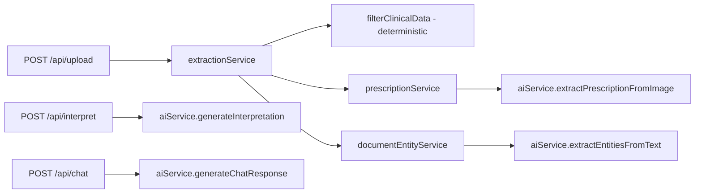

# Stage 4.1 + 4.2: Baseline Verification and AI Token Protection

## Stage 4.1 Baseline (verified, no code changes)

### Protected routes

| Route                     | `protect` middleware                                            | Calls Gemini                                     |
| ------------------------- | --------------------------------------------------------------- | ------------------------------------------------ |
| `POST /api/upload`        | **yes** ([routes/upload.js](routes/upload.js) L10)              | **conditional** — prescription/entity lanes only |
| `POST /api/interpret`     | **yes** ([routes/interpret.js](routes/interpret.js) L74)        | **always**                                       |
| `POST /api/chat`          | **yes** ([routes/chat.js](routes/chat.js) L67)                  | **always**                                       |
| `POST /api/prescriptions` | **yes** ([routes/prescription.js](routes/prescription.js) L157) | **no** — save reviewed data only                 |
| `POST /api/documents`     | **yes** ([routes/document.js](routes/document.js) L10)          | **no** — save reviewed data only                 |

### Upload limits (already implemented)

- MIME + extension filter in [middleware/upload.js](middleware/upload.js): PDF, JPG, JPEG, PNG
- File size: `10MB` default via `UPLOAD_MAX_SIZE_MB`
- Multer errors handled in [server.js](server.js) L35-48

### Gemini entry points



- [services/aiService.js](services/aiService.js): 4 Gemini functions — `generateInterpretation`, `extractPrescriptionFromImage`, `extractEntitiesFromText`, `generateChatResponse`
- [services/prescriptionService.js](services/prescriptionService.js): calls `extractPrescriptionFromImage` via `aiService`
- [services/documentEntityService.js](services/documentEntityService.js): calls `extractEntitiesFromText` via `aiService`
- **No rate limiting anywhere today** — `express-rate-limit` not in [package.json](package.json)
- **No Gemini timeouts or retries** — bare `model.generateContent()` calls
- **Test baseline**: 127/127 passing (`npm test`)

### Current risks (scope lock for 4.2)

1. **Interpret fails hard** — [routes/interpret.js](routes/interpret.js) L44-70: Gemini failure → 500, report **not saved** despite successful extraction
2. **Chat sends unbounded history** — [routes/chat.js](routes/chat.js) L48-52 loads **all** reports, serializes **all** measurements; `chatContextBuilder.js` exists but is **unused**
3. **No chat message length limit** — only empty-check today
4. **Upload AI lanes fail opaquely** — prescription/entity Gemini errors bubble as generic 500 from upload route
5. **No rate limiting** on any AI path
6. **Frontend upload not disabled during processing** — [UploadZone.jsx](client/src/components/UploadZone.jsx) has `disabled` prop but [Dashboard.jsx](client/src/pages/Dashboard.jsx) never passes it; state switches to `ProcessingView` which mitigates but is not a guard on the handler itself
7. **Chat duplicate guard exists** — `isTyping` check in [Chat.jsx](client/src/pages/Chat.jsx) L39 — good
8. **Review save guard exists** — `saving` prop disables buttons — good
9. **API client drops HTTP status** — [api.js](client/src/lib/api.js) `parseJsonResponse` only throws `Error(message)`, no `status` field for 429-specific UI copy

### Frozen boundary (do not touch)

- [services/clinicalFilterService.js](services/clinicalFilterService.js) and the `lab_report` branch in [services/extractionService.js](services/extractionService.js)
- Deterministic measurement extraction, OCR, row stitching, section extraction

---

## Stage 4.2 Implementation Plan

### 1. Rate limit middleware (new file)

Create [middleware/rateLimiters.js](middleware/rateLimiters.js):

```js
// Factory pattern for testability
function createRateLimiters(overrides = {}) { ... }
const limiters = createRateLimiters();
module.exports = { ...limiters, createRateLimiters };
```

**Production limits** (15 min window, user-keyed after auth):

| Limiter              | max | Applied to             |
| -------------------- | --- | ---------------------- |
| `standardApiLimiter` | 300 | `app.use("/api", ...)` |
| `authLimiter`        | 20  | `/api/auth`            |
| `uploadLimiter`      | 20  | `/api/upload`          |
| `aiInterpretLimiter` | 8   | `/api/interpret`       |
| `chatLimiter`        | 25  | `/api/chat`            |

- `keyGenerator: (req) => req.user?.id?.toString() || req.ip`
- Consistent JSON 429 body: `{ success: false, error: "..." }`
- Install `express-rate-limit` in [package.json](package.json)

**Wire in [server.js](server.js)**:

```js
app.use("/api", standardApiLimiter);
app.use("/api/auth", authLimiter, authRoutes);
app.use("/api/upload", uploadLimiter, uploadRoutes);
app.use("/api/interpret", aiInterpretLimiter, interpretRoutes);
app.use("/api/chat", chatLimiter, chatRoutes);
// prescriptions/documents/repository/reports: covered by standardApiLimiter only
```

Prescription/document **save** routes do not need AI limiters (no Gemini on save).

### 2. AI timeout + single retry (aiService.js only)

Add internal helpers in [services/aiService.js](services/aiService.js) — **do not change schemas or prompts**:

- `withTimeout(promise, ms, label)` — `finally { clearTimeout }`
- `isRetryableAiError(error)` — status in `[429, 500, 502, 503, 504]` or timeout message
- `callWithSingleRetry(fn, label)` — one 800ms delay retry on retryable only

**Timeouts**:

| Function                       | Timeout |
| ------------------------------ | ------- |
| `generateInterpretation`       | 20s     |
| `generateChatResponse`         | 15s     |
| `extractPrescriptionFromImage` | 30s     |
| `extractEntitiesFromText`      | 20s     |

Wrap each `model.generateContent()` call through `callWithSingleRetry(() => withTimeout(...))`.

Export `isRetryableAiError` and `callWithSingleRetry` for unit tests.

### 3. Route-level fallbacks

#### Interpret ([routes/interpret.js](routes/interpret.js))

On Gemini failure **after** valid structured body:

- Save report with deterministic `measurements` + fallback `aiInterpretation`:
  ```js
  { summary: "Structured report data was extracted successfully, but AI interpretation is temporarily unavailable.", findings: [], recommendations: ["Please review abnormal values with a qualified healthcare professional."] }
  ```
- Return `200` with `{ success: true, aiUnavailable: true, data: fallback, reportId }`
- Only return 500 if **save** itself fails

#### Chat ([routes/chat.js](routes/chat.js))

On Gemini failure:

- Return `503` with `{ success: false, message: "AI assistant is temporarily unavailable. Your health records are still saved safely." }`

#### Upload ([routes/upload.js](routes/upload.js))

Catch Gemini-specific errors from prescription/entity lanes (message contains "Failed to read prescription" / "Failed to read clinical document"):

- Return `503` with `{ success: false, message: "AI extraction is temporarily unavailable for this document type. Please try again shortly or upload a lab report." }`
- Do **not** return partial/hallucinated entity data

### 4. Bound chat context (your chosen approach)

Extend [utils/chatContextBuilder.js](utils/chatContextBuilder.js) with `buildBoundedChatHistory(reports, options)`:

- `maxReports: 10`, `maxMeasurementsPerReport: 8`
- Sort by `reportDate` descending, slice to 10
- Per report: abnormal measurements + up to 3 normal key metrics
- Cap medications (5), diagnoses (5), doctorAdvice (5), testsAdvised (5)
- Truncate `aiSummary` to 400 chars
- Export from module

Wire [routes/chat.js](routes/chat.js):

```js
const { buildBoundedChatHistory } = require("../utils/chatContextBuilder");
// DB optimization:
const reports = await Report.find({ userId: req.user.id })
  .sort({ reportDate: -1 })
  .limit(10);
const userHistory = buildBoundedChatHistory(reports);
// Keep signature unchanged:
const reply = await genChat(message.trim(), userProfile, userHistory);
```

Add message length guard in route:

```js
const MAX_CHAT_MESSAGE_LENGTH = 1500;
if (message.trim().length > MAX_CHAT_MESSAGE_LENGTH) { return 400 ... }
```

Remove or keep `serializeReportsForChat` — replace usage with `buildBoundedChatHistory`; export old helper only if tests still need it.

### 5. Frontend guards and error UX

#### [client/src/lib/api.js](client/src/lib/api.js)

Enhance `parseJsonResponse`:

```js
const err = new Error(
  json.message || json.error || `Request failed (${res.status})`,
);
err.status = res.status;
throw err;
```

#### [client/src/pages/Dashboard.jsx](client/src/pages/Dashboard.jsx)

- Add `isUploading` guard at top of `handleFileSelected` — early return if already processing
- Handle `aiUnavailable: true` from interpret response — show dashboard with fallback summary + non-blocking banner: "AI interpretation unavailable; structured data saved."
- Pass `disabled={appState === APP_STATE.PROCESSING}` to `UploadZone` when on idle view (belt-and-suspenders)

#### [client/src/pages/Chat.jsx](client/src/pages/Chat.jsx)

- On catch: if `err.status === 429`, show rate-limit copy; if `503`, show AI-unavailable assistant bubble (not just error banner)
- `maxLength={1500}` on input

#### [client/src/components/UploadZone.jsx](client/src/components/UploadZone.jsx)

- No structural change needed; `disabled` prop already exists

### 6. Tests

#### New: [tests/rateLimiters.test.js](tests/rateLimiters.test.js)

Direct middleware invocation (no supertest):

```js
const { createRateLimiters } = require("../middleware/rateLimiters");
const { chatLimiter } = createRateLimiters({
  chat: { windowMs: 60_000, max: 3 },
});
// loop 3 passes, 4th returns 429
```

- Use **unique `user.id` per test** to avoid counter bleed
- Separate test per limiter type (chat, interpret, upload)
- Wiring sanity test: assert `createRateLimiters()` exports all 5 named limiters

#### Extend: [tests/chatContextBuilder.test.js](tests/chatContextBuilder.test.js)

- 15 reports → returns 10
- 20 measurements → abnormal + capped normals only
- Long summary truncated to 400
- Medications/diagnoses capped at 5

#### Extend: [tests/chatRoute.test.js](tests/chatRoute.test.js)

- Message over 1500 chars → 400
- 12 stub reports → `generateChatResponse` receives history length 10
- History contains abnormal-only measurements (no full dump)
- Gemini failure → 503 with friendly message (update existing 500 test)

#### Extend: [tests/interpretRoute.test.js](tests/interpretRoute.test.js)

- Gemini failure → 200, `aiUnavailable: true`, report saved with fallback interpretation
- Existing save-failure test stays 500

#### Extend: [tests/aiService.test.js](tests/aiService.test.js)

- `isRetryableAiError` for 503 yes, 400 no
- `callWithSingleRetry` retries once on 503, does not retry on 400

#### Optional: upload route test for 503 on vision failure (mock `extractMedicalReportText` deps if route supports injection; otherwise test via extractionService error mapping)

### 7. Manual verification checklist (post-wiring)

- [ ] Login/register works under auth limiter
- [ ] Upload valid lab report → dashboard with AI interpretation
- [ ] Break `GEMINI_API_KEY` → lab upload still extracts; interpret returns `aiUnavailable` + saved report
- [ ] Upload prescription with bad key → 503 friendly error, no empty save
- [ ] Spam chat send → 429 after limit
- [ ] Send 2000-char message → 400
- [ ] `npm test` — all pass (expect ~135+ tests)
- [ ] `cd client && npm run build` — passes

### 8. PROJECT_CONTEXT.md update (definition of done)

After implementation, update changelog + affected sections: rate limiters, AI resilience, chat context bounds, test count.

---

## Implementation order

1. `middleware/rateLimiters.js` + wire `server.js`
2. `aiService.js` timeout/retry wrappers
3. `chatContextBuilder.js` + `routes/chat.js` bounds + message length
4. `routes/interpret.js` fallback save
5. `routes/upload.js` AI-lane 503 mapping
6. Frontend `api.js`, `Dashboard.jsx`, `Chat.jsx`
7. Tests (rateLimiters, chatContext, chatRoute, interpretRoute, aiService)
8. Full `npm test` + `client` build + manual checklist

## Out of scope (per Context.txt)

- Redis-backed distributed rate limiting
- Hash-based AI result reuse
- Changing deterministic extraction pipeline
- supertest / HTTP integration harness
