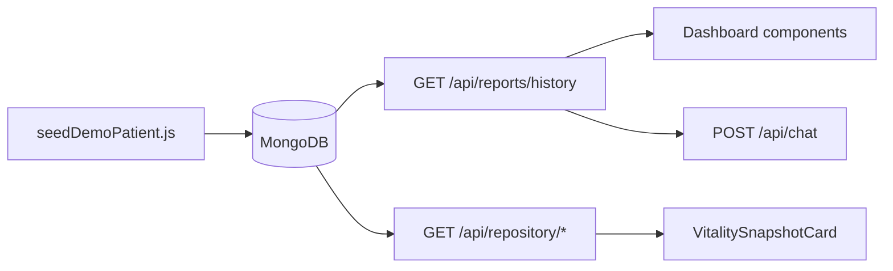

# Stage 4.3 — Demo Data + End-to-End Story

## Codebase validation (Stage 4.1 baseline)

Your spec matches the live codebase. Key confirmations:

| Area                                                                                             | Current behavior                                                  | Implication for seed                                                                                |
| ------------------------------------------------------------------------------------------------ | ----------------------------------------------------------------- | --------------------------------------------------------------------------------------------------- |
| [`models/Report.js`](models/Report.js)                                                           | `measurements[]`, entity arrays, `aiInterpretation`, `provenance` | Seed objects must match this schema exactly                                                         |
| [`models/User.js`](models/User.js)                                                               | Nested `profile` + bcrypt pre-save on `password`                  | Create user with plain password; only re-hash when `RESET_DEMO_PASSWORD=true`                       |
| [`client/src/lib/trends.js`](client/src/lib/trends.js)                                           | Series keyed by `measurement.name.toLowerCase()`                  | Identical strings across lab reports: `HbA1c`, `Fasting Glucose`, `Hemoglobin`, `Total Cholesterol` |
| [`client/src/pages/Dashboard.jsx`](client/src/pages/Dashboard.jsx)                               | Default report = `history[history.length - 1]` (ascending sort)   | Report 4 (2026-06-05) loads on login                                                                |
| [`client/src/pages/Vault.jsx`](client/src/pages/Vault.jsx)                                       | Attention = any `low`/`high` measurement                          | Reports 2 & 4 = Attention; Reports 1 & 3 (prescription, no measurements) = Stable → **2 + 2 cards** |
| [`utils/clinical/vitalityScore.js`](utils/clinical/vitalityScore.js)                             | Weighted deductions (HbA1c/Glucose/Hemoglobin = critical/12)      | Report 1 ≈ 100; Report 2 ≈ 56; Report 4 ≈ 68 — visible score progression                            |
| [`client/src/components/Dashboard/Dashboard.jsx`](client/src/components/Dashboard/Dashboard.jsx) | `documentType !== 'lab_report'` → `DocumentEntitiesCard`          | Prescription report (Mar 22) shows entities, hides trend row                                        |
| No `scripts/` folder yet                                                                         | Greenfield                                                        | Create `scripts/` + npm script                                                                      |

**No frontend or extraction changes required** — seeded data flows through existing APIs unchanged.



---

## Files to create

| File                                                             | Purpose                                                                      |
| ---------------------------------------------------------------- | ---------------------------------------------------------------------------- |
| [`scripts/demoPatientData.js`](scripts/demoPatientData.js)       | Pure data: `DEMO_USER`, `DEMO_REPORTS` (4 reports)                           |
| [`scripts/seedDemoPatient.js`](scripts/seedDemoPatient.js)       | Idempotent seeder (connect → upsert user → delete demo reports → insert)     |
| [`docs/DEMO.md`](docs/DEMO.md)                                   | Credentials, seed command, 3–4 min evaluation script, verification checklist |
| [`tests/demoPatientData.test.js`](tests/demoPatientData.test.js) | Fast schema/narrative validation (no MongoDB)                                |

**Modify:**

| File                                       | Change                                                  |
| ------------------------------------------ | ------------------------------------------------------- |
| [`package.json`](package.json)             | Add `"seed:demo": "node scripts/seedDemoPatient.js"`    |
| [`.env.example`](.env.example)             | Comment block with demo credentials                     |
| [`PROJECT_CONTEXT.md`](PROJECT_CONTEXT.md) | Changelog + demo seed instructions (per workspace rule) |

---

## 1. `demoPatientData.js` — exact report payloads

Export two constants used by both seeder and tests.

### `DEMO_USER`

```js
{
  name: "Priya Sharma",
  email: "demo@healthlens.ai",
  password: "DemoHealth2026!",
  profile: {
    dateOfBirth: new Date("1990-05-15"),
    gender: "Female",
    bloodGroup: "B+",
    heightCm: 162,
    weightKg: 68,
    chronicConditions: ["Prediabetes"],
    lifestyle: { smokingStatus: "Never", alcoholConsumption: "Occasional" },
  },
}
```

### `DEMO_REPORTS` — 4 records (skip optional Report 5)

Use fixed `Date` objects (not `Date.now()`). Each report includes `provenance: { originalFilename, extractionMethod: "seed_script", confidence: 1 }`.

| #   | Date       | documentType   | reportType     | Key content                                       |
| --- | ---------- | -------------- | -------------- | ------------------------------------------------- |
| 1   | 2026-01-15 | `lab_report`   | `GENERAL`      | All normal measurements (baseline)                |
| 2   | 2026-03-20 | `lab_report`   | `GENERAL`      | HbA1c 6.8, Glucose 128, Hgb 12.6 low, Chol 222    |
| 3   | 2026-03-22 | `prescription` | `PRESCRIPTION` | Metformin, Type 2 Diabetes, advice, tests         |
| 4   | 2026-06-05 | `lab_report`   | `GENERAL`      | Improved HbA1c 6.2 (delta vs Mar), still elevated |

**Measurement objects** (all lab reports):

```js
{ name, value: Number, unit, status: "normal"|"low"|"high", referenceRange }
```

**Entity objects** (Report 3) — match sub-schemas in [`models/Report.js`](models/Report.js):

- `medications[]`: `{ name, dosage, frequency, duration, route, confidence, uncertain }`
- `diagnoses[]`: `{ condition, status: "active", confidence, uncertain }`
- `symptoms[]`: `{ description, confidence, uncertain }`
- `doctorAdvice[]`, `testsAdvised[]`: string arrays

**`aiInterpretation`** — use the exact JSON from your spec for each report (summary, findings, recommendations).

**Skip Report 5** (discharge summary) — 4 reports satisfy all acceptance criteria.

---

## 2. `seedDemoPatient.js` — idempotent seeder

```text
1. require("dotenv").config()
2. connectDB() from config/db.js
3. findOne({ email: "demo@healthlens.ai" })
4. If missing → new User(DEMO_USER) + save()  // bcrypt via pre-save
   Else → merge name + profile; if RESET_DEMO_PASSWORD=true → set password + save()
5. Report.deleteMany({ userId: user._id })    // demo user ONLY
6. Report.insertMany(DEMO_REPORTS.map(r => ({ ...r, userId: user._id })))
7. Log summary (email, report count, date range, credentials)
8. mongoose.disconnect(); process.exit(0)
```

**Safety rules:**

- Never `deleteMany` without `userId` filter
- Never call Gemini or import `aiService`
- Do not touch other users' reports
- Re-running seed resets demo narrative (delete + reinsert)

**Password behavior:**

- First run: creates user with hashed password
- Subsequent runs: profile refreshed; password unchanged unless `RESET_DEMO_PASSWORD=true`

---

## 3. `demoPatientData.test.js` — minimal guardrails

Pure Node test (no MongoDB), imported alongside existing 142 tests:

- `DEMO_REPORTS.length === 4`
- Dates strictly ascending
- Lab reports (indices 0, 1, 3) share identical measurement `name` sets
- Report 3 has Metformin medication + Type 2 Diabetes diagnosis (`status: "active"`)
- Each report has `documentType`, `reportDate`, `aiInterpretation.summary`
- Lab measurements have `name`, numeric `value`, `unit`, `status`, `referenceRange`
- Optional: import `computeVitalityScore` and assert Report 1 = 100, Report 2 < Report 4 < Report 1

Skip integration seed test (Option B) — manual checklist is sufficient for evaluation.

---

## 4. `docs/DEMO.md` structure

1. **Prerequisites** — MongoDB running, `npm install`, no `GEMINI_API_KEY` needed for seeding
2. **Seed command** — `npm run seed:demo`
3. **Credentials table** — email/password + profile summary
4. **Reset** — re-run seed; optional `RESET_DEMO_PASSWORD=true`
5. **Post-seed API checks** — login → history (4) → repository endpoints (curl examples)
6. **Frontend checklist** — your 11-step manual table from the spec
7. **Evaluation script** — Acts 1–7 (problem → login → trends → prescription → vault → chat → optional live upload → safety close)
8. **Hybrid note** — seeded data is primary; one live upload is optional wow moment

Add a one-line pointer in [`README.md`](README.md) → `docs/DEMO.md` (minimal cross-link only).

---

## 5. Post-implementation verification (manual)

Run in order after implementation:

```bash
npm run seed:demo
npm test                    # 142 + new demoPatientData tests
npm run build --prefix client
npm run dev                 # login as demo@healthlens.ai
```

**API smoke (with JWT from login):**

- `GET /api/reports/history` → 4 reports, ascending dates
- `GET /api/repository/medications` → Metformin
- `GET /api/repository/diagnoses` → Type 2 Diabetes, `latestStatus: active`
- `GET /api/repository/timeline` → 4 mixed-type events
- `GET /api/repository/summary` → `totalReports: 4`

**UI money shots (latest report selected):**

- HbA1c trend: 3 points (Jan 5.4 → Mar 6.8 → Jun 6.2)
- Needs Attention: HbA1c high with **↓ 0.6** delta vs March
- Vitality Snapshot: Metformin + Type 2 Diabetes pills
- Mini calendar: dots on Jan 15, Mar 20, Mar 22, Jun 5
- Vault: 4 cards, 2 Attention / 2 Stable

**Chat** (requires Gemini at demo time): bounded context already includes medications from prescription report via [`buildBoundedChatHistory`](utils/chatContextBuilder.js). If Gemini fails, 4.2 returns friendly `503` — evaluator continues on seeded dashboard.

---

## 6. What we explicitly will NOT do

- Modify [`services/extractionService.js`](services/extractionService.js) or clinical pipeline
- Build Stage 5.1 longitudinal insights endpoint
- Add Report 5 unless you later request it
- Integration MongoDB seed test in CI
- Broad rate-limit or frontend changes

---

## Definition of done

- `npm run seed:demo` idempotently creates/resets demo user + 4 reports
- Login shows fully populated dashboard with 3-point HbA1c trend and delta attention items
- Repository APIs return Metformin + Type 2 Diabetes
- Vault shows 4 records with mixed attention states
- `docs/DEMO.md` documents credentials + evaluation script
- `demoPatientData.test.js` passes; total `npm test` green
- `PROJECT_CONTEXT.md` updated with seed instructions and changelog entry
- Extraction pipeline untouched

**Estimated effort:** 2–3 hours implementation + 30 min verification.
