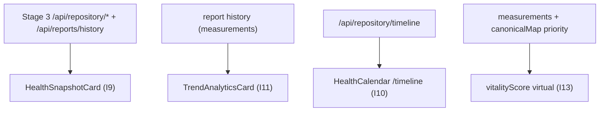

# Stage 4 — The Health Dashboard (I9 + I10 + I11 + I13)

## Scope and placement (confirmed)

- Health Snapshot (I9) + Trend Analytics (I11): global zone at the top of `/dashboard`.
- FullCalendar Timeline (I10): its own `/timeline` page + Navbar link.
- Vitality Score upgrade (I13): weighted backend formula.

## Data flow

## I13 — Weighted Vitality Score (backend first; small + improves trends)

- New [utils/clinical/vitalityScore.js](utils/clinical/vitalityScore.js): build a reverse name/alias -> priority index from [utils/canonicalMap.json](utils/canonicalMap.json); export `computeVitalityScore(measurements)`. Formula: start 100, subtract per abnormal (`low`/`high`) measurement by priority weight (critical 12, high 8, medium 5, low 3, unknown 5), clamp 0-100.
- Update the virtual in [models/Report.js](models/Report.js) to delegate to the helper (replacing the flat `-5`).
- Update [tests/vitalityScore.test.js](tests/vitalityScore.test.js) for the weighted formula and add a unit test file for the helper. Test count will change.

## I9 — Health Snapshot card

- New `client/src/components/Dashboard/HealthSnapshotCard.jsx`. Props: `history` (already loaded by the page); self-fetches aggregates via existing stubs `fetchDiagnosisHistory()` + `fetchMedicationHistory()` from [client/src/lib/api.js](client/src/lib/api.js).
- Sections: Active Conditions (diagnoses with `latestStatus === "active"`), Active Medications (recent by `lastSeen`), Alerts (abnormal `low`/`high` measurements from the latest report), Recent Recommendations (latest report `aiInterpretation.recommendations`). Vitality score chip from latest report.
- Style mirrors existing cards ([AIRecommendationCard.jsx](client/src/components/Dashboard/AIRecommendationCard.jsx) / [HealthTimelineCard.jsx](client/src/components/Dashboard/HealthTimelineCard.jsx)): `bg-surface-container-lowest rounded-2xl shadow-ambient`, lucide icons, loading/empty/error states.

## I11 — Trend Analytics (selectable per-biomarker chart)

- New `client/src/lib/trends.js`: pure `buildMetricSeries(history)` -> `{ [metricName]: [{ date, value, status, unit, referenceRange }] }`, keyed by measurement `name` (persisted measurements have no `category`), sorted by date; helper to list available metrics.
- New `client/src/components/Dashboard/TrendAnalyticsCard.jsx`: metric `<select>` dropdown (defaults to highest-priority metric with >=2 points), Recharts `LineChart` reused from [HealthTimelineCard.jsx](client/src/components/Dashboard/HealthTimelineCard.jsx). Graceful handling of sparse data (single-point metrics still render a dot); empty state when no measurements exist across history.
- No new backend endpoint: reuses report history already loaded on the page.

## Dashboard integration

- In [client/src/components/Dashboard/Dashboard.jsx](client/src/components/Dashboard/Dashboard.jsx), add a global header zone above `TimelineSelector` (and outside the per-report `componentRef` print grid): `<HealthSnapshotCard history={history} />` then `<TrendAnalyticsCard history={history} />`. Shown for both lab and entity documents. The existing per-report grid (vitality `HealthTimelineCard`, biomarkers, entities) is unchanged.

## I10 — FullCalendar Timeline page

- Add deps (in `client/`): `@fullcalendar/react`, `@fullcalendar/daygrid`, `@fullcalendar/list`, `@fullcalendar/interaction` (FullCalendar v6 auto-injects CSS).
- New `client/src/components/Dashboard/HealthCalendar.jsx`: consumes `fetchHealthTimeline()` (existing stub -> `/api/repository/timeline`), maps events to `{ title, date, extendedProps: { type, reportId } }`, color/class by event `type` (test/scan/prescription/consultation/note/document); `dayGridMonth` + `listWeek` views; `eventClick` navigates to `/dashboard?reportId=<id>`.
- New `client/src/pages/Timeline.jsx` page wrapper (header + `HealthCalendar`).
- Route `/timeline` (protected) in [client/src/App.jsx](client/src/App.jsx); add "Timeline" link to the authed nav in [client/src/components/Layout/Navbar.jsx](client/src/components/Layout/Navbar.jsx).

## Docs

- Update [PROJECT_CONTEXT.md](PROJECT_CONTEXT.md): Last Updated, changelog entry, milestone row, new test count, key-files map (new components/page/util + FullCalendar dep), and note the weighted vitality formula in section 6/4.

## Notes / decisions

- Split placement: Snapshot + Trends on `/dashboard`; Calendar on `/timeline`.
- Trends + Snapshot reuse already-loaded history / Stage 3 endpoints; no new backend routes.
- Only the vitality change touches backend tests; frontend has no test harness, so trend/snapshot logic is kept in pure utils where practical but not unit-tested this stage.
