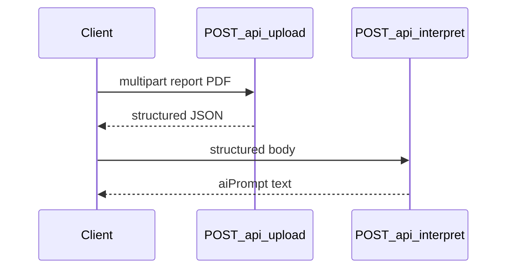

# Stripper Hotfix + Interpret Endpoint

## Problem (reports.pdf)

| Bug                          | Root cause                                                                                                     | Current bad value         |
| ---------------------------- | -------------------------------------------------------------------------------------------------------------- | ------------------------- |
| `Unknown Date` in `aiPrompt` | Date line uses `Customer Since: 25/Apr/2026` — keyword `customer since` missing; month-abbr pattern too strict | `null` → `"Unknown Date"` |
| Vitamin B12 = **2**          | Value extractor grabs digit from label `B12` after range strip                                                 | should be **515**         |
| Vitamin D = **25**           | Value extractor grabs `25` from `25-OH` alias text                                                             | should be **11.29**       |

Existing code already has partial date support in [`utils/clinical/metadataPrepass.js`](utils/clinical/metadataPrepass.js) (line 5 includes `\d{1,2}[/\-][a-zA-Z]{3}[/\-]\d{4}`), but reports.pdf likely uses **`Customer Since`** as the keyword prefix, which is not in the alternation list.

---

## Phase 1 — Date regex hotfix

**File:** [`utils/clinical/metadataPrepass.js`](utils/clinical/metadataPrepass.js)

Update the keyword-prefixed `dateMatch` regex:

- Add `customer since` to keyword list (per your snippet)
- Unify month-abbreviation capture to allow **slashes or spaces** around month: `\d{1,2}[/\-\s]+[a-zA-Z]{3}[/\-\s]+\d{4}`
- Keep `\d{1,2}` (not `\d{2}`) for single-digit days
- Keep existing numeric formats and **leading-line fallback** unchanged

```javascript
const dateMatch = cleanedTextFull.match(
  /(?:date|collected on|generated on|report generated on|sample collection date|reg\.?\s*date|customer since).*?(\d{1,2}[/\-]\d{1,2}[/\-]\d{2,4}|\d{4}[/\-]\d{1,2}[/\-]\d{1,2}|\d{1,2}[/\-\s]+[a-zA-Z]{3}[/\-\s]+\d{4})/i,
);
```

**Test:** add case in [`tests/metadataPrepass.test.js`](tests/metadataPrepass.test.js):

```javascript
extractMetadata("Customer Since: 25/Apr/2026\nVitamin B12 515");
// → reportDate: "25/Apr/2026"
```

---

## Phase 2 — Label masking before value extraction

**File:** [`utils/clinical/parameterRegexMap.js`](utils/clinical/parameterRegexMap.js)

After range strip, **mask matched parameter labels** so embedded digits (`B12`, `25-OH`) cannot become values.

Add helper (uses existing `escapeRegex`):

```javascript
function maskLabels(text, aliases = []) {
  let masked = text;
  const sorted = [...aliases].sort((a, b) => b.length - a.length);
  for (const alias of sorted) {
    if (!alias) continue;
    masked = masked.replace(new RegExp(escapeRegex(alias), "gi"), " [LABEL] ");
  }
  return masked;
}
```

Update `extractMeasurements` loop (after `textWithoutRange`, before `VALUE_PATTERN`):

```javascript
const textWithoutRange = lineText.replace(RANGE_STRIP_PATTERN, " [REF] ");
const safeText = maskLabels(textWithoutRange, bestDef.aliases);
const valueMatch = safeText.match(VALUE_PATTERN);
```

**Why longest-first:** ensures `25-oh vitamin d` masks before `vitamin d`, preventing partial `25` leakage.

**Canonical alias additions** in [`utils/canonicalMap.json`](utils/canonicalMap.json):

- `vitamin b12`: add `"b12"`, `"vit b12"`
- `vitamin d`: add `"25-oh"`, `"25 oh"` (belt-and-suspenders for short-line layouts)

**Tests** in [`tests/generalizedExtractor.test.js`](tests/generalizedExtractor.test.js):

| Fixture line                             | Expected value |
| ---------------------------------------- | -------------- |
| `Vitamin B12 pg/ml 200 - 900 : 515`      | **515**        |
| `25-OH Vitamin D ng/ml 30 - 100 : 11.29` | **11.29**      |

Regression: existing CBC/hemoglobin tests must still pass (9/9 CBC fixture unchanged).

---

## Phase 3 — Separate interpret endpoint (prompt-only, no LLM)

Per your choices: **no live LLM call yet**, expose interpretation prep via a **separate route**.

### 3a. New route

**Create:** [`routes/interpret.js`](routes/interpret.js)

```javascript
POST /api/interpret
Body: { "structured": { reportType, patient_info, measurements, ... } }
Response: { success: true, aiPrompt: "..." }
```

- Validate `req.body.structured` exists and `structured.measurements` is an array → else `400`
- Call existing [`utils/aiContextGenerator.js`](utils/aiContextGenerator.js) `generateClinicalSummaryPrompt(structured)`
- No API keys, no external HTTP calls

### 3b. Wire server

**File:** [`server.js`](server.js)

```javascript
app.use("/api/interpret", interpretRouter);
```

### 3c. Decouple upload response

**File:** [`routes/upload.js`](routes/upload.js)

- **Remove** inline `aiPrompt` from upload response (interpretation is now a separate step)
- Upload remains extraction-only: `structured` JSON out, client calls `/api/interpret` when ready

Flow:



### 3d. Tests

**Create:** [`tests/interpretRoute.test.js`](tests/interpretRoute.test.js) using Express `supertest` pattern **or** lightweight handler test (call route handler directly with mock req/res to avoid new dependency).

Preferred: **direct handler test** (no new npm package):

```javascript
// Invoke interpret handler with mock req/res objects
// Assert 200 + aiPrompt contains MEDICAL REPORT CONTEXT
// Assert 400 when structured missing
```

**Update:** [`tests/uploadAiPrompt.test.js`](tests/uploadAiPrompt.test.js) → rename/repurpose to test interpret endpoint instead of upload coupling.

---

## Phase 4 — README

Update [`README.md`](README.md):

- Document `POST /api/interpret` request/response
- Note upload no longer returns `aiPrompt`
- Document hotfix: label masking prevents B12 / 25-OH false values
- Document `Customer Since` date format support

---

## Verification checklist

1. `npm test` — all pass (target: 31+ tests with 3 new cases)
2. `Customer Since: 25/Apr/2026` → `patient_info.reportDate` populated; `aiPrompt` shows date not `Unknown Date`
3. Vitamin B12 line → `515`, not `2`
4. 25-OH Vitamin D line → `11.29`, not `25`
5. `POST /api/interpret` with upload `structured` body → valid `aiPrompt`
6. `POST /api/upload` → no `aiPrompt` field (interpret is separate)

---

## Files touched

| File                                                                         | Action                            |
| ---------------------------------------------------------------------------- | --------------------------------- |
| [`utils/clinical/metadataPrepass.js`](utils/clinical/metadataPrepass.js)     | Date regex + `customer since`     |
| [`utils/clinical/parameterRegexMap.js`](utils/clinical/parameterRegexMap.js) | `maskLabels()` + use in extractor |
| [`utils/canonicalMap.json`](utils/canonicalMap.json)                         | B12 / Vitamin D aliases           |
| [`routes/interpret.js`](routes/interpret.js)                                 | **Create**                        |
| [`server.js`](server.js)                                                     | Mount interpret route             |
| [`routes/upload.js`](routes/upload.js)                                       | Remove `aiPrompt`                 |
| Tests + README                                                               | Update/add                        |

**Out of scope (confirmed):** Gemini/OpenAI/Claude API integration — deferred until API keys and provider choice are finalized.
