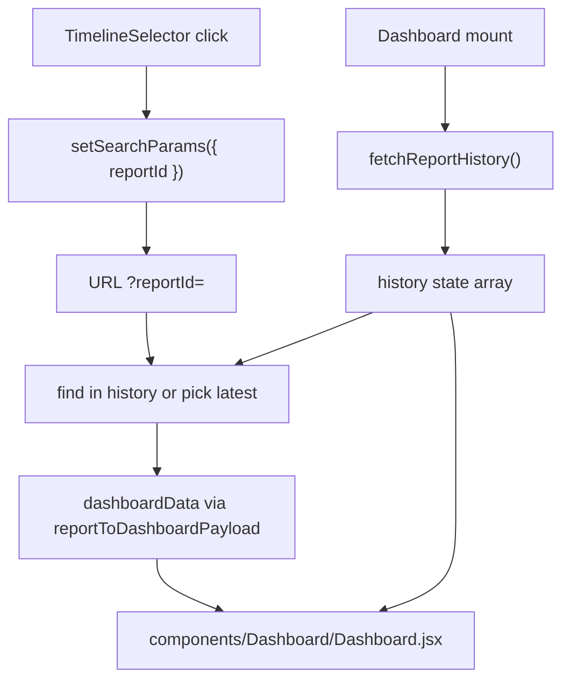

# Timeline Selector + Vault Simplification Plan

## Current state

- [`client/src/pages/Dashboard.jsx`](client/src/pages/Dashboard.jsx) fetches either `fetchReportById(reportId)` or `fetchReportHistory()` (latest only) — no shared `history` state.
- [`client/src/components/Dashboard/Dashboard.jsx`](client/src/components/Dashboard/Dashboard.jsx) renders the action bar + grid; no report scrubber.
- [`reportToDashboardPayload`](client/src/lib/structured.js) omits `_id`, so `dashboardData._id` is unavailable for active highlighting.
- [`client/src/pages/Vault.jsx`](client/src/pages/Vault.jsx) has list + FullCalendar toggle; FullCalendar deps can be removed after cleanup.
- `scrollbar-hide` utility does not exist yet in [`client/src/index.css`](client/src/index.css).

## Architecture



---

## Task 1 — Create `TimelineSelector.jsx`

**New file:** [`client/src/components/Dashboard/TimelineSelector.jsx`](client/src/components/Dashboard/TimelineSelector.jsx)

**Props:** `history`, `activeReportId`, `onSelectReport`

**Implementation:**

- Container: `flex overflow-x-auto gap-4 py-4 scrollbar-hide` (add utility in Task 1b)
- Map `history` (ascending by `reportDate` from API — oldest left, newest right)
- Each item: clickable pill/card with:
  - Formatted date: `toLocaleDateString('en-US', { month: 'short', day: 'numeric', year: 'numeric' })` (matches spec e.g. "Apr 25, 2026")
  - `reportType` (fallback `"Report"`)
  - Active: `bg-primary text-on-primary shadow-md` when `report._id === activeReportId`
  - Inactive: `bg-surface-container border border-outline-variant/30 text-on-surface hover:bg-surface-container-high`
  - `onClick={() => onSelectReport(report._id)}`
- Use `type="button"`; add `shrink-0` on pills so horizontal scroll works
- Hide when `history.length <= 1` (optional polish — scrubber only useful with 2+ reports)

**Task 1b — `scrollbar-hide` utility**

Add to [`client/src/index.css`](client/src/index.css) `@layer utilities`:

```css
.scrollbar-hide {
  -ms-overflow-style: none;
  scrollbar-width: none;
}
.scrollbar-hide::-webkit-scrollbar {
  display: none;
}
```

---

## Task 2 — Refactor [`pages/Dashboard.jsx`](client/src/pages/Dashboard.jsx)

**New state:**

```js
const [history, setHistory] = useState([]);
const [searchParams, setSearchParams] = useSearchParams();
```

**Split data loading into two concerns:**

1. **Fetch history (mount + after upload):**

```js
async function loadHistory() {
  const json = await fetchReportHistory();
  setHistory(json.reports ?? []);
}
useEffect(() => {
  loadHistory();
}, []);
```

2. **Derive selected report from `history` + URL `reportId`:**

```js
useEffect(() => {
  if (history.length === 0) {
    setDashboardData(null);
    setAppState(APP_STATE.IDLE);
    return;
  }
  const selected = reportId
    ? history.find((r) => String(r._id) === reportId)
    : history[history.length - 1];

  if (selected) {
    setDashboardData(reportToDashboardPayload(selected));
    setAppState(APP_STATE.RESOLVED);
  } else if (reportId) {
    setError("Report not found.");
    setAppState(APP_STATE.IDLE);
  }
}, [history, reportId]);
```

**Remove** `fetchReportById` import/usage from this page (history is the single source; `GET /api/reports/:id` stays in api.js for future/deep-link fallback if needed later).

**Handler:**

```js
function handleTimelineSelect(id) {
  setSearchParams({ reportId: id });
}
```

**Upload flow update** (required so timeline includes new report):

After successful `interpretStructured`, call `loadHistory()` again, then `setSearchParams({ reportId: interpretJson.reportId })` so the new report is selected and appears in the scrubber.

**Extend `reportToDashboardPayload`** in [`client/src/lib/structured.js`](client/src/lib/structured.js):

```js
return {
  _id: report._id,
  success: true,
  data: report.aiInterpretation,
  structured: { ... },
}
```

Fresh upload payload should also set `_id: interpretJson.reportId` when building inline upload result.

---

## Task 3 — Integrate timeline into layout

The action bar lives in [`components/Dashboard/Dashboard.jsx`](client/src/components/Dashboard/Dashboard.jsx), not the page shell. Pass props from page → component:

**[`pages/Dashboard.jsx`](client/src/pages/Dashboard.jsx):**

```jsx
<ReportDashboard
  payload={dashboardData}
  history={history}
  activeReportId={dashboardData._id}
  onSelectReport={handleTimelineSelect}
/>
```

**[`components/Dashboard/Dashboard.jsx`](client/src/components/Dashboard/Dashboard.jsx):**

- Accept optional `history`, `activeReportId`, `onSelectReport` props
- Below the action bar (`print:hidden`), above the printable grid ref:

```jsx
{
  history?.length > 1 && (
    <TimelineSelector
      history={history}
      activeReportId={activeReportId}
      onSelectReport={onSelectReport}
    />
  );
}
```

Wrap scrubber in `print:hidden` so PDF export stays clean.

---

## Task 4 — Simplify Vault

**[`client/src/pages/Vault.jsx`](client/src/pages/Vault.jsx):**

- Remove FullCalendar imports, `dayGridPlugin`, `calendarEvents` useMemo, `viewMode` state, List/Calendar toggle UI, calendar view block
- Keep: header "Health Vault", loading/error/empty states, existing table with Date / Type / Vitality Score / View Dashboard
- Remove unused `useMemo` import

**Dependencies cleanup** in [`client/package.json`](client/package.json):

```bash
npm uninstall @fullcalendar/react @fullcalendar/daygrid
```

(`@fullcalendar/core` is not a direct dep; it will be removed transitively.)

**Optional:** Revert Vault lazy-load in [`App.jsx`](client/src/App.jsx) to a static import now that FullCalendar is gone (smaller diff either way; lazy-load can stay for consistency).

---

## PROJECT_CONTEXT.md updates

Per workspace rule, after implementation:

- Changelog: TimelineSelector scrubber; Dashboard history-driven switching; Vault list-only
- §4 Done: add timeline scrubber; update Vault description (remove FullCalendar)
- §8 key files: add `TimelineSelector.jsx`

---

## Verification checklist

1. `npm test` — 58/58 still passing (no backend changes)
2. `npm run build` in `client/` — succeeds without FullCalendar
3. User with 2+ reports: Dashboard shows horizontal scrubber; clicking pills updates URL and dashboard content
4. `/dashboard?reportId=<id>` selects correct pill when id exists in history
5. Fresh upload: history refreshes, new report selected, appears in scrubber
6. `/vault` — table only, no calendar toggle, "View Dashboard" still works
