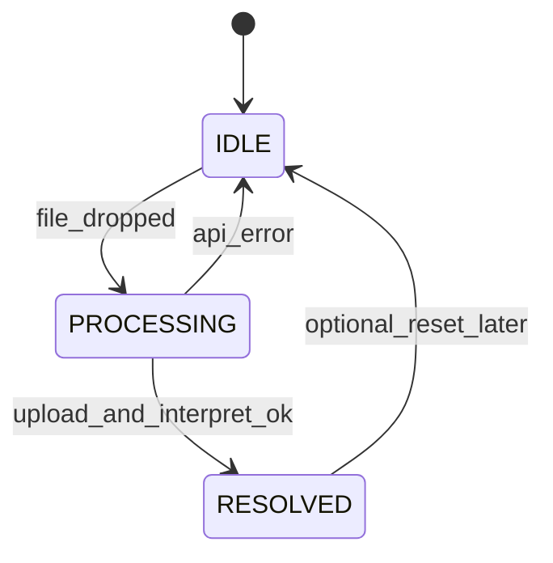
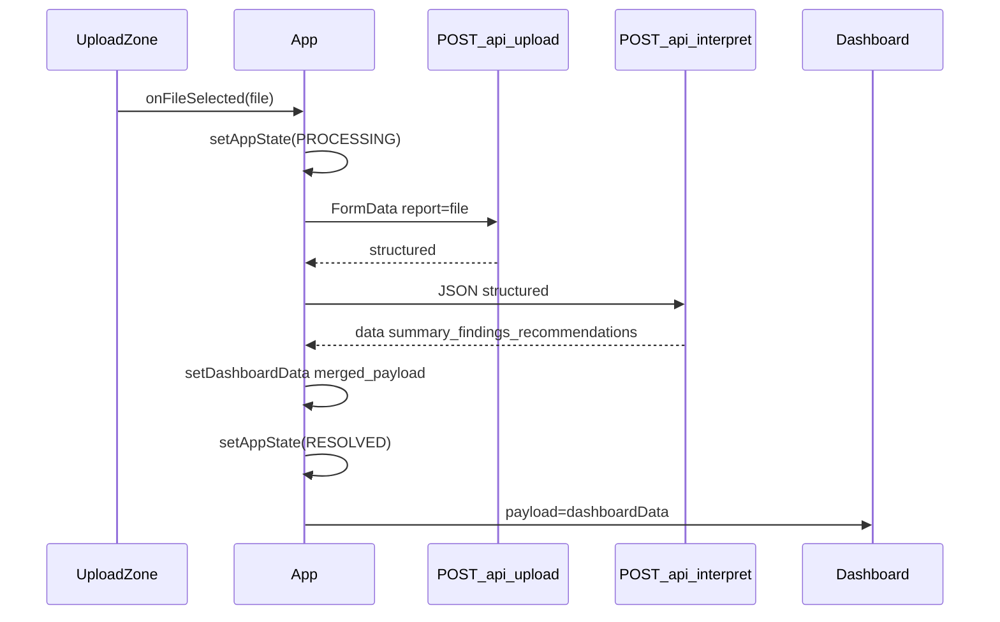

# Upload Zone + Dashboard UI

## Scope

Build the upload-to-insights user flow in [`client/src/`](client/src/) per your spec. Reuses existing Vite proxy ([`client/vite.config.js`](client/vite.config.js)) and Vitality Core tokens ([`client/tailwind.config.js`](client/tailwind.config.js)). No backend changes.

**Out of scope:** `data.findings` rendering (in payload but not assigned to a component), MongoDB, routing library, shadcn/MUI.

## Data flow





## Backend field mapping (important)

Upload returns measurements with **`normalizedValue`**, not `value` ([`services/clinicalFilterService.js`](services/clinicalFilterService.js) L206–209). When assembling `dashboardData` in `App.jsx`, normalize each measurement to your dashboard contract:

```js
{
  name: m.name,
  value: m.normalizedValue ?? Number(m.rawValue),
  unit: m.unit ?? m.normalizedUnit,
  status: m.status,           // "low" | "normal" | "high"
  referenceRange: m.referenceRange,
}
```

Interpret returns `{ success, aiPrompt, data }` ([`routes/interpret.js`](routes/interpret.js)). Final client state:

```js
{
  success: true,
  data: interpretJson.data,        // { summary, findings, recommendations }
  structured: uploadJson.structured // full structured; BiomarkerGrid reads .measurements
}
```

## Files to create / modify

| File                                                                                                     | Action                                                                                    |
| -------------------------------------------------------------------------------------------------------- | ----------------------------------------------------------------------------------------- |
| [`client/src/App.jsx`](client/src/App.jsx)                                                               | Replace placeholder with state machine + orchestration                                    |
| [`client/src/lib/api.js`](client/src/lib/api.js)                                                         | **New** — `uploadReport(file)`, `interpretStructured(structured)`                         |
| [`client/src/components/UploadZone.jsx`](client/src/components/UploadZone.jsx)                           | **New** — drag/drop + click upload                                                        |
| [`client/src/components/ProcessingView.jsx`](client/src/components/ProcessingView.jsx)                   | **New** — medical-themed loading (not in your file list but required by PROCESSING state) |
| [`client/src/components/Dashboard/Dashboard.jsx`](client/src/components/Dashboard/Dashboard.jsx)         | **New** — 12-col grid shell                                                               |
| [`client/src/components/Dashboard/AISummaryCard.jsx`](client/src/components/Dashboard/AISummaryCard.jsx) | **New** — summary + recommendations checklist                                             |
| [`client/src/components/Dashboard/BiomarkerGrid.jsx`](client/src/components/Dashboard/BiomarkerGrid.jsx) | **New** — measurement cards with status-driven styling                                    |

## 1. `src/lib/api.js`

Thin fetch helpers using relative `/api` paths (proxy-safe):

- **`uploadReport(file)`** — `POST /api/upload` with `FormData` field `report`; throws if `!res.ok` or `!json.success`
- **`interpretStructured(structured)`** — `POST /api/interpret` with `{ structured }`; same error handling

Extract shared `parseJsonResponse(res)` to surface backend `message` on failure.

## 2. `src/App.jsx` — state machine

Constants:

```js
const APP_STATE = {
  IDLE: "IDLE",
  PROCESSING: "PROCESSING",
  RESOLVED: "RESOLVED",
};
```

State:

- `appState` (default `IDLE`)
- `dashboardData` (null until resolved)
- `error` (string | null, shown on IDLE after failure)

**`handleFileSelected(file)`:**

1. Clear `error`, set `appState = PROCESSING`
2. `uploadJson = await uploadReport(file)`
3. `interpretJson = await interpretStructured(uploadJson.structured)`
4. `setDashboardData({ success: true, data: interpretJson.data, structured: uploadJson.structured })`
5. `setAppState(RESOLVED)`
6. On catch: `setError(message)`, `setAppState(IDLE)`

Render switch:

- `IDLE` → centered layout + `<UploadZone onFileSelected={...} error={error} />`
- `PROCESSING` → `<ProcessingView />` (full-screen, no UploadZone)
- `RESOLVED` → `<Dashboard payload={dashboardData} />` only (UploadZone unmounted)

Optional: lightweight top bar with `HeartPulse` + "HealthLens AI" on all states for brand continuity.

## 3. `UploadZone.jsx`

- Full-viewport centered card: `min-h-screen bg-background flex items-center justify-center p-6`
- Large dashed drop zone: `border-2 border-dashed border-outline-variant/40 rounded-2xl`
- Icons: `UploadCloud` (primary), `FileText` (secondary hint)
- Accept: `.pdf,.jpg,.jpeg,.png` (matches backend)
- **Drag-and-drop:** `onDragOver` preventDefault, `onDrop` extract first file
- **Click:** hidden `<input type="file">` triggered by zone click
- `disabled` prop when parent is processing (guard double-submit)
- Show `error` banner above zone when present (`bg-error-container text-error rounded-xl p-4`)

## 4. `ProcessingView.jsx`

Medical-themed, calm loading UI:

- Centered `glass-card shadow-ambient rounded-2xl p-10 max-w-lg`
- Animated `HeartPulse` or `Activity` icon (`text-primary`, subtle pulse via `animate-pulse`)
- Staged status text (static or timed swap): "Reading your report…" → "Extracting biomarkers…" → "Generating AI insights…"
- Optional thin progress bar: `bg-primary/20` track, `bg-primary` fill with indeterminate animation

## 5. `Dashboard/Dashboard.jsx`

```jsx
<div className="min-h-screen bg-background">
  <div className="max-w-[1440px] mx-auto p-6 md:p-10">
    <div className="grid grid-cols-1 md:grid-cols-12 gap-6">
      <AISummaryCard data={payload.data} className="md:col-span-8" />
      {/* col-span-4 left empty or minimal "Analysis complete" meta card */}
      <BiomarkerGrid
        measurements={payload.structured?.measurements ?? []}
        className="md:col-span-12"
      />
    </div>
  </div>
</div>
```

Pass `payload` prop; guard null measurements with `?? []`.

## 6. `AISummaryCard.jsx`

- Card: `bg-surface-container-lowest rounded-2xl border border-outline-variant/20 shadow-ambient p-6 md:p-8`
- AI gradient: `bg-gradient-to-br from-primary/5 to-secondary/5` on card or inner panel
- Header: `Sparkles` icon + "AI Health Summary"
- Body: `data.summary` as `text-body-md text-on-surface`
- Recommendations: map `data.recommendations` as checklist rows with `CheckCircle2` (`text-primary`) + text
- Empty states: graceful fallback strings if arrays missing

## 7. `BiomarkerGrid.jsx`

- Section title: "Biomarkers" with `FlaskConical` or `TestTube2` icon
- Responsive grid: `grid grid-cols-1 sm:grid-cols-2 lg:grid-cols-3 xl:grid-cols-4 gap-4`
- Each card maps over normalized measurements

**Status styling** (case-insensitive `status`):

| Status         | Card accent                                                                  |
| -------------- | ---------------------------------------------------------------------------- |
| `normal`       | `bg-primary/10 border-primary/20 text-primary` badge                         |
| `low` / `high` | `bg-amber-50 border-amber-200 text-amber-700` badge (abnormal)               |
| unknown        | `bg-surface-container-low border-outline-variant/20 text-on-surface-variant` |

Display per card:

- **Name:** capitalize `name` (e.g. `hemoglobin` → `Hemoglobin`)
- **Value:** `{value} {unit}` large semibold
- **Reference:** small label `Ref: {referenceRange}`

Use `normalizedValue ?? rawValue` at render time as belt-and-suspenders even after App normalization.

## Design tokens (apply consistently)

- Page: `bg-background`
- Cards: `bg-surface-container-lowest`
- Radius: `rounded-xl` / `rounded-2xl`
- Depth: `shadow-ambient`
- Borders: `border border-outline-variant/20`
- No external UI libs; raw Tailwind + lucide-react only

## Verification

1. Start backend (`npm run dev` :5000) + client (`cd client && npm run dev` :5173)
2. Drop a PDF (e.g. `CBC.pdf`) → PROCESSING screen → Dashboard with summary + biomarker cards
3. Confirm abnormal markers (e.g. low hemoglobin) show amber styling; normal markers show teal
4. Simulate API failure (backend stopped) → returns to IDLE with error message
5. `npm test` from root still **37/37** (no backend test changes expected)

## Docs

Update [`PROJECT_CONTEXT.md`](PROJECT_CONTEXT.md): Day 4 upload UI + dashboard marked done/in-progress; changelog entry; key files map adds new components.
