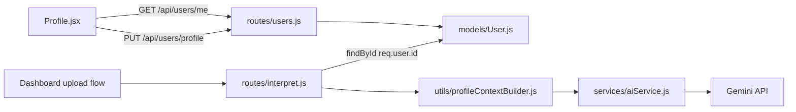

# User Profile + AI Context Plan

## Architecture



---

## Task 1 — Expand User schema

**File:** [`models/User.js`](models/User.js)

Add a nested `profile` subdocument (all fields optional — existing users remain valid):

```js
profile: {
  dateOfBirth: Date,
  gender: { type: String, enum: ['Male', 'Female', 'Other', 'Prefer not to say'] },
  bloodGroup: { type: String, enum: ['A+', 'A-', 'B+', 'B-', 'AB+', 'AB-', 'O+', 'O-', 'Unknown'] },
  heightCm: Number,
  weightKg: Number,
  chronicConditions: [String],
  lifestyle: {
    smokingStatus: { type: String, enum: ['Never', 'Former', 'Current'] },
    alcoholConsumption: { type: String, enum: ['None', 'Occasional', 'Regular'] },
  },
}
```

No migration script needed — Mongoose defaults missing `profile` to `{}`.

---

## Task 2 — Profile API routes

**New file:** [`routes/users.js`](routes/users.js) (keep auth register/login in [`routes/auth.js`](routes/auth.js))

Follow the existing handler-export pattern used in [`routes/reports.js`](routes/reports.js) for testability.

### Shared helper — `formatUser(user)`

Extract or duplicate from auth's `formatUser` to return `{ _id, name, email, profile }` — **never** include `password`. Optionally move to [`utils/formatUser.js`](utils/formatUser.js) and reuse in auth + users routes.

### `GET /api/users/me` (protected)

- `protect` middleware
- `User.findById(req.user.id).select('-password')`
- 404 if user missing; else `{ success: true, user: formatUser(user) }`

### `PUT /api/users/profile` (protected)

- Accept profile fields from `req.body` (flat or nested under `profile` — pick **flat body** matching form fields for simplicity):
  - `dateOfBirth`, `gender`, `bloodGroup`, `heightCm`, `weightKg`, `chronicConditions`, `lifestyle`
- Validate enums server-side; reject invalid values with 400
- Merge into `user.profile` via dot-path `$set` or field assignment, then `user.save()`
- Return `{ success: true, user: formatUser(user) }`

### Mount in [`server.js`](server.js)

```js
app.use("/api/users", require("./routes/users"));
```

| Endpoint                 | Auth       | Purpose                      |
| ------------------------ | ---------- | ---------------------------- |
| `GET /api/users/me`      | Bearer JWT | Fetch current user + profile |
| `PUT /api/users/profile` | Bearer JWT | Update profile subdocument   |

---

## Task 3 — Profile page (React)

**File:** [`client/src/pages/Profile.jsx`](client/src/pages/Profile.jsx) — replace placeholder

**API client additions** in [`client/src/lib/api.js`](client/src/lib/api.js):

- `fetchCurrentUser()` → `GET /api/users/me`
- `updateUserProfile(profile)` → `PUT /api/users/profile`

### Layout

- Page wrapper: `min-h-[calc(100vh-4rem)] bg-background p-6`
- Card: `bg-surface-container-lowest shadow-ambient rounded-2xl p-8 max-w-3xl mx-auto border border-outline-variant/20`

### Form sections

**1. Basic Demographics**

- Date of birth — `<input type="date">`
- Gender — `<select>` with enum options
- Blood group — `<select>` with enum options

**2. Biometrics**

- Height (cm) — number input
- Weight (kg) — number input
- BMI display — computed client-side when both present:

```js
const bmi = weightKg / (heightCm / 100) ** 2;
// Show rounded to 1 decimal + category label (Underweight/Normal/Overweight/Obese) as optional UX polish
```

**3. Lifestyle & Conditions**

- Smoking status — `<select>`: Never / Former / Current
- Alcohol consumption — `<select>`: None / Occasional / Regular
- Chronic conditions — checkbox group for fixed list:
  - Type 1 Diabetes, Type 2 Diabetes, Hypertension, Hypothyroidism, Hyperthyroidism, Asthma, Chronic Kidney Disease, Cardiovascular Disease

### State & UX

- `useEffect` on mount: call `fetchCurrentUser()`, populate form from `user.profile`
- Loading skeleton/spinner while fetching
- Submit: `updateUserProfile(formData)` with saving spinner on button (`disabled` + "Saving…")
- Success: inline green banner/toast at top of card ("Profile saved successfully") — auto-dismiss after ~3s
- Error banner on failure (reuse error-container styling from Login page)

Match existing Vitality Core input classes from [`client/src/pages/Login.jsx`](client/src/pages/Login.jsx).

---

## Task 4 — AI context injector

### New utility: [`utils/profileContextBuilder.js`](utils/profileContextBuilder.js)

Pure functions (unit-testable):

- `calculateAge(dateOfBirth)` — whole years from DOB to today; return `"Unknown"` if missing/invalid
- `calculateBmi(heightCm, weightKg)` — return rounded BMI string or `"Unknown"` if inputs missing
- `buildProfileContext(user)` — returns the exact template string:

```
You are HealthLens AI, a clinical analysis assistant. You are analyzing a medical report for a patient with the following profile: Age: [Age], Gender: [gender], BMI: [BMI], Chronic Conditions: [joined list or "None"], Lifestyle: [Smoking: X, Alcohol: Y]. Tailor your summary, biomarker analysis, and recommendations specifically to this patient's baseline context.
```

Use fallbacks for empty fields: `"Unknown"` / `"None"` as appropriate.

### Update [`routes/interpret.js`](routes/interpret.js)

Inside `interpretHandler`, before calling Gemini:

1. `const user = await User.findById(req.user.id)` (injectable via deps for tests)
2. `const profileContext = buildProfileContext(user)`
3. Pass to AI layer alongside existing clinical prompt

```js
const aiPrompt = generateClinicalSummaryPrompt(structured);
const interpretation = await genInterpret(aiPrompt, { profileContext });
```

### Update [`services/aiService.js`](services/aiService.js)

Extend `generateInterpretation(aiPrompt, deps)`:

- When `deps.profileContext` is provided, **prepend** it to the user message sent to Gemini (before the existing `"Here is the structured medical data..."` block)
- Keep existing static `systemInstruction` unchanged — profile context goes in the prompt body per spec ("prepend to the AI prompt")
- Existing calls without `profileContext` behave identically (backward compatible)

---

## Tests

Add [`tests/usersRoute.test.js`](tests/usersRoute.test.js):

- GET `/me` returns user without password
- PUT `/profile` merges profile fields and validates enums

Add [`tests/profileContextBuilder.test.js`](tests/profileContextBuilder.test.js):

- Age calculation from fixed date
- BMI calculation
- Context string formatting with partial/missing profile

Update [`tests/interpretRoute.test.js`](tests/interpretRoute.test.js):

- Mock `findUserById` returning a user with profile
- Assert `generateInterpretation` receives `profileContext` containing Age/Gender

Update [`tests/aiService.test.js`](tests/aiService.test.js):

- Assert prepended profile text appears in `generateContent` call when `profileContext` passed

**Expected test count:** 43 → ~50+ (exact count after implementation)

---

## Documentation

Update [`PROJECT_CONTEXT.md`](PROJECT_CONTEXT.md):

- New endpoints in section 2
- Profile page in Done/In Progress
- Changelog entry
- Key files map (`routes/users.js`, `profileContextBuilder.js`)

---

## Verification checklist

1. Register/login → `/profile` loads empty form
2. Save profile → reload page → fields persist
3. Upload + interpret with profile filled → inspect `aiPrompt` in response (or server logs) for profile prefix
4. Upload + interpret with empty profile → graceful `"Unknown"` / `"None"` fallbacks
5. `npm test` — all tests pass

---

## Out of scope

- Profile required before upload (optional enrichment only)
- Custom chronic conditions beyond the fixed checkbox list
- Persisting user object in localStorage on login (token-only auth unchanged)
