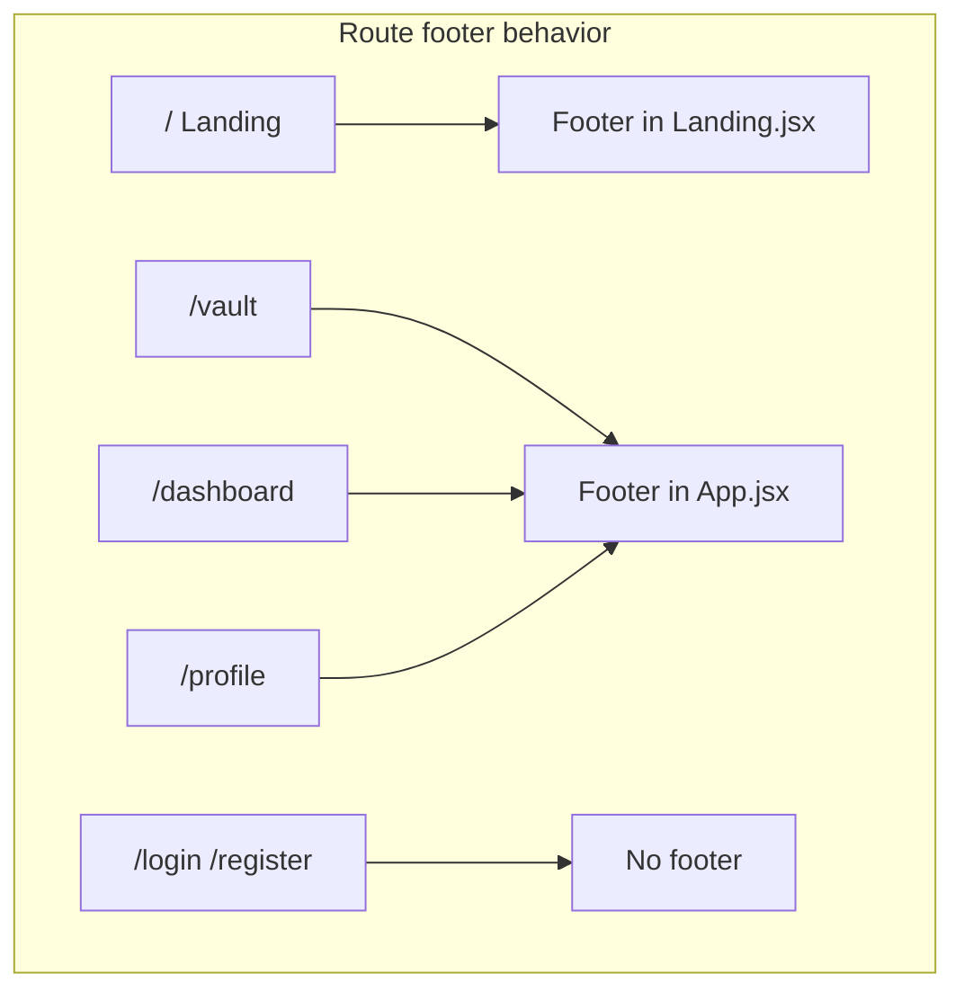

# Vault Prototype Conversion + Footer Extraction

## Task 1 — Abstract `Footer`

### Source

Extract the full `<footer className="mt-auto">…</footer>` block from [`client/src/pages/Landing.jsx`](client/src/pages/Landing.jsx) (lines 428–490).

### New file: [`client/src/components/Layout/Footer.jsx`](client/src/components/Layout/Footer.jsx)

- Move the `LOGO_SRC` constant from `Landing.jsx` into this file (only used in the footer).
- Export a default `Footer` component with the extracted markup unchanged.
- Keep `new Date().getFullYear()` for the copyright line.

### Update [`client/src/pages/Landing.jsx`](client/src/pages/Landing.jsx)

- Remove inline footer + `LOGO_SRC`.
- Add `import Footer from '../components/Layout/Footer'` and render `<Footer />` in the same position (after `</main>`, inside the outer flex column).

### Update [`client/src/App.jsx`](client/src/App.jsx)

Avoid double footers on `/` while ensuring Vault (and other app pages) get one:

```jsx
import { useLocation } from "react-router-dom";
import Footer from "./components/Layout/Footer";

function AppContent() {
  const { pathname } = useLocation();
  const hideGlobalFooter = ["/", "/login", "/register"].includes(pathname);

  return (
    <>
      <Navbar />
      <Routes>…</Routes>
      {!hideGlobalFooter && <Footer />}
    </>
  );
}

export default function App() {
  return (
    <BrowserRouter>
      <AppContent />
    </BrowserRouter>
  );
}
```

- Landing keeps its own `<Footer />` (page-level `mt-auto` flex layout).
- Vault, Dashboard, Profile get the global footer below route content.
- Login/Register stay footer-free (current behavior).



---

## Task 2 — Rebuild `Vault.jsx` from prototype `<main>`

### Shell stripping

- **Ignore** prototype `<header>`, `<aside>`, `<footer>`, FAB, and inline `<script>`.
- Root wrapper: `<main className="min-h-screen">` — drop `md:pl-64` and `pt-20` only.
- Inner container: preserve `max-w-[1280px] mx-auto px-margin-desktop pb-20` exactly.

### Icon mapping (lucide-react)

| Prototype symbol | Lucide component | Usage                                      |
| ---------------- | ---------------- | ------------------------------------------ |
| `description`    | `FileText`       | Stats card 1                               |
| `update`         | `CalendarClock`  | Stats card 2                               |
| `monitoring`     | `Activity`       | Stats card 3                               |
| `search`         | `Search`         | Search input                               |
| `filter_list`    | `ListFilter`     | Filter button                              |
| `sort`           | `ArrowUpDown`    | Sort button                                |
| `verified`       | `BadgeCheck`     | Normal report subtitle                     |
| `warning`        | `AlertTriangle`  | Attention report subtitle                  |
| `medication`     | `Pill`           | _(unused unless prescription data exists)_ |
| `chevron_right`  | `ChevronRight`   | Card trailing icon                         |

Replace each `<span class="material-symbols-outlined …">` with the matching Lucide icon, keeping surrounding Tailwind classes on the parent/wrapper. Use `size={16|20}` or `className="w-4 h-4"` to match prototype dimensions.

### Preserve prototype markup exactly

All non-shell Tailwind classes inside `<main>` stay as written — including arbitrary colors `text-[#0b1c30]`, `text-[#3d4947]`, card borders, bento stats, controls bar, and card hover states. No Tailwind config changes required; existing tokens (`shadow-ambient`, `px-margin-desktop`, design colors) already exist in [`client/tailwind.config.js`](client/tailwind.config.js).

### API wiring (per your choice)

Keep existing [`fetchReportHistory`](client/src/lib/api.js) logic and map real data into the prototype card template:

**Stats row (computed from `reports`):**

- Card 1: `{reports.length} Total Records`
- Card 2: latest `reportDate` formatted as `Apr 25, 2026` style (`en-US`, `{ month: 'short', day: 'numeric', year: 'numeric' }`)
- Card 3: count of reports that have at least one `low`/`high` measurement (label: `"{n} Conditions"` / `"Chronic vitals tracked"`)

**Archive cards (map `reports`, newest first):**

- Date pill: day number + uppercase month abbreviation from `report.reportDate`
- Title: `report.reportType || 'Report'`
- Subtitle: `Analyzed by HealthLens AI • {measurements.length} Biomarker(s)`
- **Stable** variant (default): `border-outline-variant/10`, `BadgeCheck` icon, green `Stable` badge
- **Attention Needed** variant: when any measurement has `status === 'low' || status === 'high'` — use prototype error styling (`border-error/10`, `AlertTriangle`, `Attention Needed` badge, error date pill colors)
- `onClick` / `onKeyDown`: `navigate(\`/dashboard?reportId=${report.\_id}\`)`
- `role="button"` + `tabIndex={0}` for accessibility

**States layered into prototype layout:**

- `loading`: centered `Loader2` inside the archive `space-y-4` region (or overlay the list area)
- `error`: message in archive region
- `empty`: replace card list with a centered message + link to `/dashboard` (styled to fit the page, minimal deviation)

**Client-side search** (port prototype script behavior):

- `useState` for query string
- Filter mapped cards by title/date text match (case-insensitive)
- Filter/Sort buttons: render as in prototype; Sort can toggle date asc/desc (small additive behavior, no class changes)

**Omit static-only prototype content:**

- Drop the hardcoded prescription card (no API field for prescriptions)
- "View Older Records" button: hide when all reports are shown; optional slice for initial display if list grows large (defer unless needed)

### File structure

Single file change for Vault — no new subcomponents unless the JSX exceeds ~250 lines; if so, extract a `VaultReportCard` in the same folder with identical classes passed via props.

---

## Verification

1. `npm run dev` — visit `/` (footer once, at page bottom), `/vault` (footer below vault content), `/login` (no footer).
2. Vault with real data: stats populate, cards navigate to dashboard deep-link.
3. Vault empty state: upload CTA still works.
4. Search filters visible cards.
5. `npm test` — no backend changes expected; 58/58 should remain green.

---

## PROJECT_CONTEXT.md

After implementation, prepend changelog entry and note Vault UI prototype conversion + shared Footer component.
