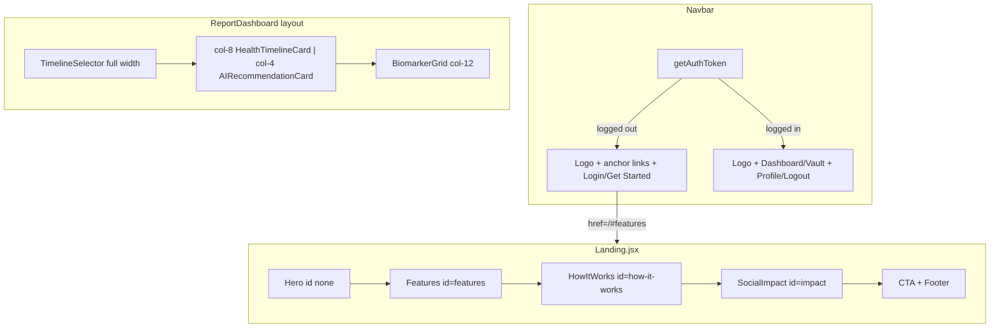

# Vitality Core UI Polish Plan

## Current baseline

| Area                                                                                  | Today                                                                     | Gap vs mockup                                                                                            |
| ------------------------------------------------------------------------------------- | ------------------------------------------------------------------------- | -------------------------------------------------------------------------------------------------------- |
| [`Navbar.jsx`](client/src/components/Layout/Navbar.jsx)                               | Sticky bar, `getAuthToken()` auth split, links right-aligned only         | Missing 3-column layout (logo / center nav / actions); logged-out center anchors; logged-in Profile icon |
| [`Landing.jsx`](client/src/pages/Landing.jsx)                                         | Single centered placeholder card                                          | Full marketing page (Hero, Bento, How It Works, Impact, CTA, Footer)                                     |
| [`components/Dashboard/Dashboard.jsx`](client/src/components/Dashboard/Dashboard.jsx) | Scrubber above 12-col chart + 8/4 summary/placeholder + 12-col biomarkers | Mockup hierarchy: scrubber on top, 8/4 chart + AI recommendation, biomarkers below                       |

Auth stays on existing [`getAuthToken()` / `clearAuthToken()`](client/src/lib/api.js) — no new context provider needed. Layout work for Task 3 lives in **`components/Dashboard/Dashboard.jsx`** (page shell [`pages/Dashboard.jsx`](client/src/pages/Dashboard.jsx) already wires history + `TimelineSelector` correctly).

Use existing tokens from [`tailwind.config.js`](client/tailwind.config.js): `bg-surface`, `bg-surface-container-lowest`, `text-primary`, `shadow-ambient` (note: config defines `shadow-ambient`, not `ambient-shadow`).

---

## Architecture



---

## Task 1 — Smart Navbar

**File:** [`client/src/components/Layout/Navbar.jsx`](client/src/components/Layout/Navbar.jsx)

**Layout:** `sticky top-0 w-full z-50 bg-surface/90 backdrop-blur-md border-b border-outline-variant/20` with inner `max-w-[1440px] mx-auto px-6 py-4 grid grid-cols-3 items-center`.

**Logged out (center):** Anchor links using `href="/#features"`, `/#how-it-works`, `/#impact` so they work from `/login` and `/register` too. Style: `text-sm text-on-surface-variant hover:text-primary transition-colors`.

**Logged out (right):** `Link` to `/login` ("Log In") + primary `Link` to `/register` ("Get Started").

**Logged in (center):** `Link` to `/dashboard` and `/vault`.

**Logged in (right):** `Link` to `/profile` with `User` lucide icon (icon-only on mobile, optional "Profile" label on `md+`) + `Logout` button (keep existing `clearAuthToken` + `navigate('/login')`).

**Smooth scroll:** Add `scroll-behavior: smooth` on `html` in [`client/src/index.css`](client/src/index.css) so `/#section` anchors animate on the landing page.

**Responsive:** Hide center nav on small screens (`hidden md:flex`) or collapse to a minimal set; keep logo + right actions always visible.

---

## Task 2 — Landing Page

**File:** [`client/src/pages/Landing.jsx`](client/src/pages/Landing.jsx) — full rewrite (no separate HTML source in repo; content derived from mockup).

**Section structure** (each wrapped in `max-w-[1440px] mx-auto px-6`):

### 1. Hero

- Left: pill badge ("AI-Powered Precision" + `Sparkles`), headline **"Understand Medical Reports Instantly with AI"**, subcopy, primary CTA `Link` to `/register` ("Upload Report" + `Upload` icon), secondary `Link` to `/dashboard` or `/#how-it-works` ("View Demo").
- Right: placeholder mockup container per spec:

```jsx
<div className="w-full aspect-video bg-surface-container-high rounded-xl shadow-ambient border border-white/40 flex items-center justify-center">
  <LayoutDashboard className="text-primary/40" size={64} />
</div>
```

- Layout: `grid lg:grid-cols-2 gap-12 items-center py-16 md:py-24`.

### 2. Features Bento — `id="features"`

- Header: "Smarter Insights, Better Care" + subtext.
- CSS grid bento (2 rows):
  - **Large (span 2 cols):** "AI Report Analysis" — description + pill tags ("OCR Extraction", "Named Entity Recognition").
  - **Medium dark:** `bg-primary text-on-primary` — "Smart Health Timeline" + "Explore timeline" link to `/register`.
  - **Small:** "Trend Analytics" + `LineChart` icon.
  - **Medium:** "AI Recommendations" + nested insight card (hydration tip styling).
- Cards: `bg-surface-container-lowest rounded-2xl border border-outline-variant/10 shadow-ambient p-6`.

### 3. How It Works — `id="how-it-works"`

- 4 horizontal steps (stack on mobile): Upload → OCR Extraction → AI Analysis → Get Insights.
- Each step: numbered circle, lucide icon (`Upload`, `FileText`, `Brain`, `LayoutGrid`), title, short description.

### 4. Social Impact — `id="impact"`

- Full-width dark card: `bg-primary rounded-3xl` with radial gradient overlay.
- Left: "SOCIAL IMPACT" badge, headline, paragraph, stats ("50k+ Reports Analyzed", "85% Improved Literacy").
- Right: decorative placeholder (heart/hand graphic via `Heart` + gradient circle — no image asset required).

### 5. CTA + Footer

- CTA: "Ready to take control of your health?" + `Get Started for Free` (primary) + `Learn More` (secondary → `/#features`).
- Footer: HealthLens logo, copyright, links (Privacy / Terms / Support / Contact as `href="#"` placeholders).

**Icons:** lucide-react only (no Material Symbols CDN).

**Logged-in visitors:** Landing remains public at `/`; navbar already switches to app links when token exists. Hero "Upload Report" can still route to `/register` or `/dashboard` — prefer `/dashboard` when logged in (small conditional using `getAuthToken()`).

---

## Task 3 — Dashboard layout alignment

**Primary file:** [`client/src/components/Dashboard/Dashboard.jsx`](client/src/components/Dashboard/Dashboard.jsx)

### New component: `AIRecommendationCard.jsx`

**File:** [`client/src/components/Dashboard/AIRecommendationCard.jsx`](client/src/components/Dashboard/AIRecommendationCard.jsx)

- Props: `data` (AI payload `{ summary, recommendations }`), `className`.
- Styling: `glass-card` outer + `bg-gradient-to-br from-primary/10 to-primary/5 rounded-2xl border border-primary/20 shadow-ambient` with left teal accent bar (`border-l-4 border-primary`).
- Content:
  - Header: `Sparkles` + **"AI Recommendation"**
  - Primary text: `recommendations[0]` if present, else fall back to `summary`
  - If multiple recommendations, render remaining items as compact list below
- Replaces the current "Analysis Complete" placeholder (`md:col-span-4` block lines 47–60).

### Layout restructure in `Dashboard.jsx`

```
[Action bar: title + Download PDF]  print:hidden
[TimelineSelector — full width, card-wrapped]  print:hidden
[printable grid ref]
  HealthTimelineCard        md:col-span-8
  AIRecommendationCard      md:col-span-4
  BiomarkerGrid               md:col-span-12
```

- **Remove** `AISummaryCard` import/usage from this layout (component file can remain for future use or be deprecated).
- Keep PDF print ref wrapping chart + recommendation + biomarkers; scrubber/action bar stay `print:hidden`.

### `TimelineSelector.jsx` polish

Wrap scrubber in a card shell to match mockup "Time Machine":

```jsx
<div className="bg-surface-container-lowest rounded-2xl border border-outline-variant/10 shadow-ambient p-4 mb-6 print:hidden">
  <h3 className="text-sm font-semibold text-on-surface mb-3">
    Report Timeline
  </h3>
  {/* existing horizontal pill row */}
</div>
```

Keep `history.length > 1` guard (existing behavior). Optional: add `Activity` icon on active pill.

### `HealthTimelineCard.jsx` copy + styling

- Rename heading to **"30-Day Health Trend"** (or "Health Vitality Trend" if fewer than 30 days — subtitle clarifies).
- Subtitle: `"Vitality score across your uploaded reports"`.
- Ensure card uses `rounded-2xl border border-outline-variant/10 shadow-ambient` (already close).

### `BiomarkerGrid.jsx` card tokens

Update `MeasurementCard` classes to match spec:

`bg-surface-container-lowest rounded-[16px] border border-outline-variant/10 shadow-ambient`

---

## Files touched (summary)

| File                                                                                   | Action                            |
| -------------------------------------------------------------------------------------- | --------------------------------- |
| [`Navbar.jsx`](client/src/components/Layout/Navbar.jsx)                                | Refactor 3-column state-aware nav |
| [`Landing.jsx`](client/src/pages/Landing.jsx)                                          | Full marketing page               |
| [`index.css`](client/src/index.css)                                                    | `scroll-behavior: smooth`         |
| [`Dashboard.jsx`](client/src/components/Dashboard/Dashboard.jsx)                       | Grid hierarchy + swap cards       |
| [`AIRecommendationCard.jsx`](client/src/components/Dashboard/AIRecommendationCard.jsx) | **New**                           |
| [`TimelineSelector.jsx`](client/src/components/Dashboard/TimelineSelector.jsx)         | Card wrapper + label              |
| [`HealthTimelineCard.jsx`](client/src/components/Dashboard/HealthTimelineCard.jsx)     | Title/subtitle copy               |
| [`BiomarkerGrid.jsx`](client/src/components/Dashboard/BiomarkerGrid.jsx)               | Card radius/border tokens         |
| [`PROJECT_CONTEXT.md`](PROJECT_CONTEXT.md)                                             | Changelog + Day 4 polish status   |

**No changes:** backend, tests, [`pages/Dashboard.jsx`](client/src/pages/Dashboard.jsx) data flow (unless minor import cleanup).

---

## Verification checklist

1. `npm test` — 58/58 still passing (UI-only)
2. `npm run build` in `client/` — succeeds
3. **Logged out:** `/` shows full landing; navbar center anchors scroll to sections; Login + Get Started work
4. **Logged in:** navbar shows Dashboard / Vault / Profile icon / Logout; landing CTAs route sensibly
5. **Dashboard (2+ reports):** scrubber card on top; 8/4 chart + AI recommendation row; biomarker cards below with updated styling
6. **PDF export:** scrubber and action bar hidden; printable content intact
