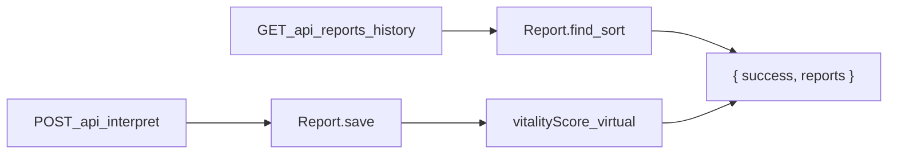

# Vitality Score + Report History API

## Context

MongoDB persistence is already live from the prior milestone:

- [`models/Report.js`](models/Report.js) — `Report` model with `measurements[]` (`status` enum: `low` | `normal` | `high` | `unknown`)
- [`server.js`](server.js) — connects via [`config/db.js`](config/db.js), mounts `/api/upload` and `/api/interpret`
- No `routes/reports.js` exists yet; no `vitalityScore` virtual exists



---

## Task 1 — `vitalityScore` virtual on Report

Edit [`models/Report.js`](models/Report.js):

### 1a. Add schema options

Pass options as the third argument to `mongoose.Schema`:

```js
const ReportSchema = new mongoose.Schema(
  {
    /* existing fields */
  },
  { toJSON: { virtuals: true }, toObject: { virtuals: true } },
);
```

### 1b. Define the virtual

After schema field definitions, before `mongoose.model`:

```js
ReportSchema.virtual("vitalityScore").get(function () {
  let score = 100;
  for (const m of this.measurements || []) {
    if (m.status === "low" || m.status === "high") {
      score -= 5;
    }
  }
  return score;
});
```

- Only exact `'low'` / `'high'` deduct points (not `'normal'` or `'unknown'`).
- No floor clamp unless you want one later; with many abnormal markers the score can go below 0.
- Virtual appears automatically in `res.json()` responses because Mongoose documents use `toJSON` with `virtuals: true`. Avoid `.lean()` on the history query unless you add a separate transform.

---

## Task 2 — History endpoint

Create [`routes/reports.js`](routes/reports.js) following existing route conventions ([`routes/upload.js`](routes/upload.js) uses `express.Router()` + `logger`):

```js
const express = require("express");
const Report = require("../models/Report");
const logger = require("../utils/logger");

const router = express.Router();

router.get("/history", async (req, res) => {
  try {
    const reports = await Report.find().sort({ reportDate: 1 });
    return res.json({ success: true, reports });
  } catch (error) {
    logger.error("Report history fetch failed", { error: error.message });
    return res.status(500).json({
      success: false,
      message: "Failed to fetch report history.",
    });
  }
});

module.exports = router;
```

- Full path: `GET /api/reports/history` (after mount in Task 3).
- Returns all reports, oldest `reportDate` first.
- Each report object includes `vitalityScore` via the virtual.

**Optional testability hook (recommended):** export `historyHandler` with injectable `findReports` dep (same pattern as [`routes/interpret.js`](routes/interpret.js)) so unit tests do not require live Mongo. Low-cost addition if we add a test file.

---

## Task 3 — Mount router in server

Edit [`server.js`](server.js):

```js
const reportsRoute = require("./routes/reports");
// ...
app.use("/api/reports", reportsRoute);
```

Place after existing `/api/upload` and `/api/interpret` mounts (before error middleware).

Restart backend after changes: `npm run dev` (requires local MongoDB on `27017`).

---

## Tests (recommended)

Add [`tests/vitalityScore.test.js`](tests/vitalityScore.test.js) — instantiate a `Report` document in memory (no save) and assert:

- 100 when all `normal` / `unknown`
- 95 for one `low`, 90 for two `high`, etc.

Add [`tests/reportsRoute.test.js`](tests/reportsRoute.test.js) — mock `Report.find().sort()` chain, assert `{ success: true, reports }` and 500 on throw.

Expected test count: **38 → 40** (or 41 if save-failure-style error test added for history).

---

## Docs

Update [`PROJECT_CONTEXT.md`](PROJECT_CONTEXT.md):

- New endpoint row: `GET /api/reports/history`
- Note `vitalityScore` virtual on Report model
- Changelog entry + test count
- Day 5 health-score item partially addressed (deterministic score engine on model)

---

## Verification

1. `npm test` — all tests pass
2. `npm run dev` — server starts with Mongo connected
3. `curl http://localhost:5000/api/reports/history` — returns `{ success: true, reports: [...] }` with `vitalityScore` on each report
4. Upload + interpret a report, then hit history again — new report appears with computed score
