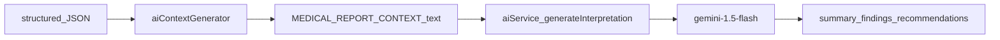

# Wire Gemini AI Interpretation Layer

## Current state

- [`routes/interpret.js`](routes/interpret.js) is **prompt-only**: sync `interpretHandler` calls `generateClinicalSummaryPrompt` from [`utils/aiContextGenerator.js`](utils/aiContextGenerator.js) and returns `{ success, aiPrompt }`.
- [`services/aiService.js`](services/aiService.js) **does not exist** yet.
- `@google/generative-ai` **is already installed** (`^0.24.1` in [`package.json`](package.json)); `dotenv` loads env in [`server.js`](server.js).
- [`tests/interpretRoute.test.js`](tests/interpretRoute.test.js) asserts `aiPrompt` on the happy path (3 tests, sync).
- `.env.example` has no `GEMINI_API_KEY` yet.

## Architecture (unchanged isolation principle)



Deterministic extraction stays upstream; `aiService.js` is a **pure intelligence layer** — it never sees raw OCR text, only the token-optimized prompt string.

## Implementation

### 1. Create [`services/aiService.js`](services/aiService.js)

Add the production-ready module you provided, with two minor repo-aligned tweaks:

- Keep `getAiModel()` private inside the file (not exported).
- Export only `generateInterpretation`.

Key behavior:

| Concern            | Implementation                                                                                   |
| ------------------ | ------------------------------------------------------------------------------------------------ |
| Model              | `gemini-1.5-flash`                                                                               |
| Auth               | `process.env.GEMINI_API_KEY` — throw early if missing                                            |
| Output enforcement | `responseMimeType: "application/json"` + `responseSchema` via `SchemaType`                       |
| Schema             | `{ summary: string, findings: [{ parameter, status, explanation }], recommendations: string[] }` |
| System instruction | Empathetic assistant; no diagnosis/prescription; explain numbers and lifestyle tips              |
| Errors             | Log message, rethrow generic `"Failed to generate AI interpretation."`                           |

### 2. Update [`routes/interpret.js`](routes/interpret.js)

Adapt your route code to match **existing repo conventions**:

```javascript
// Use existing export name — NOT generateContextText
const {
  generateClinicalSummaryPrompt,
} = require("../utils/aiContextGenerator");
const { generateInterpretation } = require("../services/aiService");
```

Changes from your snippet:

- Convert `interpretHandler` to **async** and keep it **exported** (`module.exports.interpretHandler`) so existing test pattern continues to work.
- Call `generateClinicalSummaryPrompt(structured)` (step 1), then `await generateInterpretation(aiPrompt)` (step 2).
- Response shape per your preference:

```json
{
  "success": true,
  "aiPrompt": "MEDICAL REPORT CONTEXT:\n...",
  "data": {
    "summary": "...",
    "findings": [{ "parameter": "...", "status": "...", "explanation": "..." }],
    "recommendations": ["..."]
  }
}
```

- Validation: keep array check on `structured.measurements` (current message is more specific than your generic one — preserve it).
- 500 handler: `res.status(500).json({ success: false, message: error.message })`.

**Testability hook (minimal):** Add an optional third argument `deps = {}` to `interpretHandler` so tests can inject a stub `generateInterpretation` without mocking the Gemini SDK or requiring `mock.module` cache hacks:

```javascript
async function interpretHandler(req, res, deps = {}) {
  const genInterpret = deps.generateInterpretation ?? generateInterpretation;
  // ...
}
```

This is a ~3-line addition and avoids flaky CJS module mocking.

### 3. Environment config

Update [`.env.example`](.env.example):

```
GEMINI_API_KEY=your_gemini_api_key_here
```

Your local [`.env`](.env) already exists — verify `GEMINI_API_KEY` is set there (do not commit `.env`).

### 4. Tests

**Update [`tests/interpretRoute.test.js`](tests/interpretRoute.test.js):**

- Make all handler invocations `await interpretHandler(...)`.
- Happy-path test: inject stub `generateInterpretation` returning a fixed payload; assert:
  - `res.body.success === true`
  - `res.body.aiPrompt` contains `MEDICAL REPORT CONTEXT`
  - `res.body.data.summary`, `.findings`, `.recommendations` match stub
- Keep existing 400 validation tests (unchanged assertions).

**Add [`tests/aiService.test.js`](tests/aiService.test.js):**

- Test `generateInterpretation` throws when `GEMINI_API_KEY` is unset (save/restore env in test).
- Test successful path by stubbing `@google/generative-ai` at the module boundary (mock `GoogleGenerativeAI` constructor chain → `generateContent` → `response.text()` returning valid JSON string).
- Assert parsed object has required keys.

No live Gemini calls in `npm test` — keeps CI/local runs deterministic and free.

[`tests/uploadAiPrompt.test.js`](tests/uploadAiPrompt.test.js) and [`tests/aiContextGenerator.test.js`](tests/aiContextGenerator.test.js) stay unchanged (context generator is still used unchanged).

### 5. Docs and project context

- **[`README.md`](README.md):** Update "Generate AI prompt (interpret)" section — endpoint now calls Gemini; document new response with `data` + `aiPrompt`; note `GEMINI_API_KEY` requirement.
- **[`PROJECT_CONTEXT.md`](PROJECT_CONTEXT.md):** Per maintenance rule — update Last Updated, changelog, endpoint table (`POST /api/interpret` → Live with Gemini), move Day 3 AI layer to Done, add `aiService.js` to file map, bump test count.

### 6. Manual verification (post-implementation)

```bash
npm test
npm run dev
```

Then with a real key in `.env`:

1. `POST /api/upload` with a sample PDF
2. Copy `structured` from response
3. `POST /api/interpret` with `{ "structured": ... }`
4. Confirm `data.summary`, `data.findings[]`, `data.recommendations[]` are populated and `aiPrompt` is present

[`index.html`](index.html) is upload-only today — no change required for Day 3 (React UI is Day 4).

## Files touched

| File                                                           | Action                                   |
| -------------------------------------------------------------- | ---------------------------------------- |
| [`services/aiService.js`](services/aiService.js)               | **Create**                               |
| [`routes/interpret.js`](routes/interpret.js)                   | **Update** — async handler + Gemini call |
| [`tests/interpretRoute.test.js`](tests/interpretRoute.test.js) | **Update** — async + stubbed AI          |
| [`tests/aiService.test.js`](tests/aiService.test.js)           | **Create**                               |
| [`.env.example`](.env.example)                                 | **Update** — add `GEMINI_API_KEY`        |
| [`README.md`](README.md)                                       | **Update** — interpret endpoint docs     |
| [`PROJECT_CONTEXT.md`](PROJECT_CONTEXT.md)                     | **Update** — status/changelog/tests      |

## Risk notes

- **Latency:** `/api/interpret` becomes a network-bound call (1–5s typical). Acceptable for Day 3; no timeout wrapper needed yet.
- **Schema vs. prompt instructions:** `aiContextGenerator` still appends its own `INSTRUCTIONS FOR AI` block; the model also gets `systemInstruction` in `aiService`. Both reinforce the same guardrails — no conflict.
- **Status casing:** Structured data uses lowercase `high`/`low`/`normal`; schema asks Gemini to output `"Normal"`, `"High"`, `"Low"` in findings — intentional for patient-facing UI.
