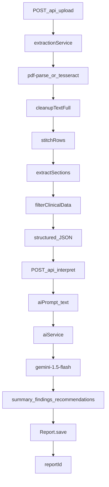

# HealthLens AI — Project Context

**Last Updated:** Wednesday, June 10, 2026  
**Status:** Day 6 (Stage 1.2 shipped — longitudinal insights endpoint + flagship dashboard card; Stage 4.3 demo seed + evaluation docs done; Doctor Summary Export next)

---

## 1. Project Vision & Identity

**HealthLens AI** is an AI-Powered Personal Health Intelligence System.  
*Do not describe it as a simple "medical report summarizer".*

It is a web-based platform that helps patients understand, organize, and analyze their medical records by extracting structured data, tracking longitudinal trends over time, identifying anomalies, and generating actionable, practical health insights.

**Core Objectives:**
1. Extract structured information (vitals/dates) deterministically.
2. Simplify medical terminology via AI.
3. Detect abnormal values and risk indicators.
4. Maintain a visual health timeline and trend analytics.
5. Generate explainable AI-powered recommendations.

---

## 2. Tech Stack & Infrastructure

### Target platform (full product)

| Layer | Stack |
|-------|-------|
| Frontend | React.js, Tailwind CSS, Recharts, FullCalendar |
| Backend | Node.js, Express.js |
| Database | MongoDB |
| Authentication | JWT, bcrypt |
| OCR & Extraction | PDF.js (`pdf-parse`), Tesseract.js, `sharp` |
| AI | Google Gemini API (`gemini-1.5-flash`) |

### Currently in repo (MVP — Day 1–4)

- **Backend:** Node.js + Express 5 (CommonJS) on port 5000
- **React frontend:** [`client/`](client/) — Vite + React, Tailwind CSS v3 (Vitality Core tokens), lucide-react, recharts, **react-router-dom**; page routes (`/`, `/login`, `/register`, `/dashboard`, `/vault`, `/chat`, `/profile`); dev proxy `/api` → `localhost:5000`
- **MongoDB:** Mongoose + [`models/Report.js`](models/Report.js) — connection string from `process.env.MONGODB_URI` (MongoDB Atlas in shared/prod), falling back to `mongodb://localhost:27017/healthlens` when unset, via [`config/db.js`](config/db.js); server connects before listen. Report schema holds `measurements` + `aiInterpretation` plus **Stage 1 entity scaffolding** (`documentType` enum, `medications[]`, `diagnoses[]`, `symptoms[]`, `doctorAdvice[]`, `testsAdvised[]`, `provenance`) — all optional/defaulted, populated starting Stage 2
- **JWT auth:** [`models/User.js`](models/User.js) (nested `profile` subdocument: DOB, gender, blood group, biometrics, chronic conditions, lifestyle), [`routes/auth.js`](routes/auth.js), [`routes/users.js`](routes/users.js), [`middleware/authMiddleware.js`](middleware/authMiddleware.js) — `bcryptjs` password hashing, `jsonwebtoken` (30d expiry); `protect` on upload/interpret/history/users routes; reports scoped by `userId` ObjectId ref
- **Local extraction:** `pdf-parse`, `pdfjs-dist`, `@napi-rs/canvas`, `tesseract.js`, `sharp`
- **Manual UI:** [`index.html`](index.html) — browser upload tester (fetch → `POST /api/upload`)
- **Workspace:** `c:\Users\aryan\Downloads\College\Projects\HealthLens AI`
- **Commands:** `npm install` · `npm run dev` (backend port 5000 + frontend port 5173) · `npm test` · `npm run seed:demo` (demo patient — see [`docs/DEMO.md`](docs/DEMO.md))

### Core endpoints (current)

| Endpoint | Status | Purpose |
|----------|--------|---------|
| `GET /health` | Live | System health check |
| `POST /api/upload` | Live (auth + rate limit) | Bearer JWT required. Multer upload (`report` field, 10MB max, PDF/JPG/JPEG/PNG) + optional `documentType` hint (`auto`/`lab_report`/`prescription`/...). Routes to the deterministic lab pipeline or the prescription Vision lane; returns `structured` JSON (lab measurements OR prescription entities) + cleaned text fields; `503` with friendly message when AI extraction lanes fail |
| `POST /api/interpret` | Live (auth + rate limit) | Bearer JWT required. Accepts `{ structured }`. Fetches user profile, builds profile-aware prompt via [`utils/profileContextBuilder.js`](utils/profileContextBuilder.js), calls Gemini via [`services/aiService.js`](services/aiService.js) (timeout + single retry). Persists [`models/Report.js`](models/Report.js) with `userId` even when Gemini fails (fallback `aiInterpretation`). Returns `{ success, aiPrompt, data, reportId, aiUnavailable? }` where `data` is `{ summary, findings, recommendations }` |
| `GET /api/reports/history` | Live (auth) | Bearer JWT required. Returns authenticated user's reports sorted by `reportDate` ascending. Each report includes `vitalityScore` virtual (100 minus 5 per low/high measurement) |
| `GET /api/reports/:id` | Live (auth) | Bearer JWT required. Returns `{ success, report }` for the authenticated owner; 403 if `userId` mismatch; 404 if not found |
| `POST /api/auth/register` | Live | Accepts `{ name, email, password }`. Creates user (bcrypt-hashed password), returns `{ success, user, token }` |
| `POST /api/auth/login` | Live | Accepts `{ email, password }`. Validates credentials via `matchPassword`, returns `{ success, user, token }` |
| `GET /api/users/me` | Live (auth) | Bearer JWT required. Returns `{ success, user }` with nested `profile` (password excluded) |
| `PUT /api/users/profile` | Live (auth) | Bearer JWT required. Accepts profile fields (`dateOfBirth`, `gender`, `bloodGroup`, `heightCm`, `weightKg`, `chronicConditions`, `lifestyle`). Updates logged-in user's profile, returns updated user |
| `POST /api/chat` | Live (auth + rate limit) | Bearer JWT required. Accepts `{ message }` (max 1500 chars). Loads `user.profile` + latest 10 reports via [`utils/chatContextBuilder.js`](utils/chatContextBuilder.js) `buildBoundedChatHistory()`, passes to [`services/aiService.js`](services/aiService.js) `generateChatResponse(message, profile, history)` with JSON-stringified bounded context in system prompt. Returns `{ success, reply }` or `503` with friendly message on AI failure |
| `POST /api/prescriptions` | Live (auth) | Bearer JWT required. Backward-compatible prescription save; delegates to the generalized handler with `documentType: "prescription"`. Saves a `Report` with empty `measurements` and a deterministic `aiInterpretation.summary` (no Gemini call on save). Returns `{ success, reportId }` |
| `POST /api/documents` | Live (auth) | Bearer JWT required. Generalized reviewed-document save (Stage 2b). Accepts user-confirmed `{ documentType, medications, diagnoses, symptoms, doctorAdvice, testsAdvised, reportDate, provenance }` for any entity-bearing type (`prescription`/`scan_report`/`discharge_summary`/`typed_note`/`unknown`); derives `reportType`, builds a deterministic summary (no Gemini call on save). Returns `{ success, reportId }` |
| `GET /api/repository/medications` | Live (auth) | Bearer JWT required. Stage 3 (I7). Rolls up `medications[]` across all of the user's reports; deduped by normalized name with per-occurrence detail (`count`, `firstSeen`, `lastSeen`, `latest` dosage/frequency, `occurrences[]`). Returns `{ success, medications }` |
| `GET /api/repository/diagnoses` | Live (auth) | Bearer JWT required. Stage 3 (I7). Deduped diagnosis history with `latestStatus` + `occurrences[]`. Returns `{ success, diagnoses }` |
| `GET /api/repository/symptoms` | Live (auth) | Bearer JWT required. Stage 3 (I7). Deduped symptom history with `occurrences[]`. Returns `{ success, symptoms }` |
| `GET /api/repository/advice` | Live (auth) | Bearer JWT required. Stage 3 (I7). Rolls up `doctorAdvice[]` + `testsAdvised[]` into deduped groups tagged `kind` (`advice`/`test`) with `occurrences[]`. Returns `{ success, advice }` |
| `GET /api/repository/timeline` | Live (auth) | Bearer JWT required. Stage 3 (I8). Computed-on-read normalized event stream (one typed event per report: `test`/`scan`/`prescription`/`consultation`/`note`/`document`), sorted newest-first, with per-event `counts`. Returns `{ success, timeline }` |
| `GET /api/repository/summary` | Live (auth) | Bearer JWT required. Stage 3 (I7). Lightweight counts (`totalReports`, distinct medications/diagnoses/symptoms/advice, `events`). Returns `{ success, summary }` |
| `GET /api/repository/insights` | Live (auth) | Bearer JWT required. Stage 1.2. Longitudinal health-intelligence brief computed-on-read. Loads user profile + full report history; [`utils/longitudinalInsights.js`](utils/longitudinalInsights.js) builds deterministic metric series + latest-vs-previous lab comparison (`improving_but_still_high`/`resolved_to_normal`/etc.), then [`services/aiService.js`](services/aiService.js) `generateLongitudinalInsights()` rewords it (strict JSON, safety language, **8s timeout, no retry**). AI wording is gated by `LONGITUDINAL_AI_ENABLED="true"`; deterministic brief is computed first and used whenever AI is disabled, `<2` lab reports exist, or the call fails/times out/returns malformed JSON — always `success:true` (never 503). `404` if user missing, `500` on DB failure. Returns `{ success, insights: { summary, whatChanged[], improvingSignals[], needsAttention[], riskFlags[], doctorQuestions[], followUpSuggestions[], disclaimer, generatedBy: "ai"\|"deterministic" }, generatedAt }` |

**Typical flow:** Marketing landing (`/`) → register/login → `/dashboard` upload report (`POST /api/upload`) → interpret (`POST /api/interpret`) → results dashboard with timeline scrubber, vitality chart, AI recommendation, and categorized biomarkers. Browse past reports via `/vault` (list table) → open `/dashboard?reportId=<id>`. Manual/debug: obtain token via `/api/auth/login`, then pass `Authorization: Bearer <token>` on protected routes.

**Env:** `MONGODB_URI` selects the database (MongoDB Atlas SRV URI; falls back to local `mongodb://localhost:27017/healthlens` if unset — see [`config/db.js`](config/db.js)); `GEMINI_API_KEY` required for interpret + prescription Vision + document entity lane; optional `GEMINI_VISION_MODEL` pins the Vision model and optional `GEMINI_TEXT_MODEL` pins the text entity model (both default `gemini-flash-latest`; set e.g. `gemini-2.5-flash` if the alias returns 503); optional `LONGITUDINAL_AI_ENABLED="true"` enables Gemini wording for `/api/repository/insights` (deterministic-only otherwise); `JWT_SECRET` required for auth (documented in `.env.example`).

---

## 3. Current Architecture & Pipeline

The backend strictly isolates **deterministic extraction** from **AI interpretation**. LLMs are **NEVER** used to extract numbers from raw OCR text.

**Pipeline steps:**
1. **Upload:** [`routes/upload.js`](routes/upload.js) — PDF/JPG/JPEG/PNG via Multer
2. **Raw extraction:** [`services/extractionService.js`](services/extractionService.js) → [`pdfService.js`](services/pdfService.js) (digital) or [`ocrService.js`](services/ocrService.js) (scanned/images)
3. **Full cleanup:** [`utils/textCleanup.js`](utils/textCleanup.js)
4. **Row stitching:** [`utils/rowStitcher.js`](utils/rowStitcher.js) — multi-line table rows
5. **Section scoping:** [`services/sectionExtractor.js`](services/sectionExtractor.js) — CBC, LIPID, KIDNEY, etc.
6. **Clinical extraction:** [`utils/clinical/parameterRegexMap.js`](utils/clinical/parameterRegexMap.js) — **Universal Range-Stripping Pattern** + **label masking** (`maskLabels`) on 38 canonical parameters from [`utils/canonicalMap.json`](utils/canonicalMap.json)
7. **Enrichment:** [`services/clinicalFilterService.js`](services/clinicalFilterService.js) — units, status (low/normal/high), validation, dedupe, flags, OCR traceability
8. **Metadata:** [`utils/clinical/metadataPrepass.js`](utils/clinical/metadataPrepass.js) — **date only** (`patient_info.reportDate`); name/age/gender deferred to future auth profile
9. **AI prompt:** [`utils/aiContextGenerator.js`](utils/aiContextGenerator.js) — `MEDICAL REPORT CONTEXT` string (token-efficient for LLM)
10. **AI interpretation:** [`services/aiService.js`](services/aiService.js) — Gemini 1.5 Flash with strict `responseSchema` JSON output
11. **Persistence:** [`routes/interpret.js`](routes/interpret.js) — maps measurements, saves Report document, returns `reportId`

**Extraction method on measurements:** `generalized_stripper`

**Document routing (Stage 1 + 2a + 2b):** [`services/extractionService.js`](services/extractionService.js) resolves `documentType` from an explicit upload hint (the UI selector) or, on `auto`, from `classifyDocumentType()` ([`services/reportClassifier.js`](services/reportClassifier.js)) over the cleaned text (`lab_report` | `prescription` | `scan_report` | `discharge_summary` | `typed_note` | `unknown`; deterministic keyword scoring with word-boundary guards). The `switch` now has **three lanes**: `prescription` → **Gemini Vision lane**; `scan_report`/`discharge_summary`/`typed_note`/`unknown` → **text entity lane** (Stage 2b catch-all); `lab_report` (and default) → deterministic lab pipeline. `documentType` is orthogonal to the lab-panel `reportType` (CBC/LIPID/...).

**Document entity lane (Stage 2b — I4):** [`services/documentEntityService.js`](services/documentEntityService.js) sends the already-extracted cleaned text (no image, no re-OCR) to `extractEntitiesFromText()` in [`services/aiService.js`](services/aiService.js) — a Gemini **text** model with a strict JSON schema (`medications[]`, `diagnoses[]`, `symptoms[]`, `doctorAdvice[]`, `testsAdvised[]`, per-field `confidence`/`uncertain`). Numbers/vitals are NEVER extracted here (deterministic lane only). Medications are validated against the drug dictionary (`annotateMedications`, reused from the prescription lane), `reportType` is derived from `documentType`, and the user reviews/edits in the same mandatory confirmation screen before `POST /api/documents` persists the record.

**Prescription Vision lane (Stage 2a — I3/I6):** [`services/prescriptionService.js`](services/prescriptionService.js) loads the image (or PDF page 0), applies gentle `sharp` prep (rotate/upscale only — no grayscale/sharpen), and sends it directly to Gemini Vision via `extractPrescriptionFromImage()` in [`services/aiService.js`](services/aiService.js) (strict JSON schema: `medications[]`, `diagnoses[]`, `doctorAdvice[]`, `testsAdvised[]`, per-field `confidence`/`uncertain`). Extracted drug names are validated against [`utils/clinical/drugDictionary.js`](utils/clinical/drugDictionary.js) (`validateDrugName`, Levenshtein fuzzy match) which flags (never blocks) unknowns as `uncertain` with a suggestion. The user reviews/edits in a mandatory confirmation screen before `POST /api/prescriptions` persists the record. Numbers are NEVER extracted via the LLM. Multi-page PDF prescriptions are a known 2a constraint (page 0 only).

---

## 4. What's Done vs. In Progress

### DONE (Day 1 & Day 2)

- **Plans 1–4:** Extraction MVP, clinical filtering, enrichment delta, section stitching
- **Plan 5:** Parser precision hardening — **rolled back**
- **CBC.pdf fixes:** Full lines into stitcher; haemogram header; Indian ref-before-value tables
- **Universal parser:** Range-stripping + longest-alias-wins + exclusion guards (Hb/HbA1c, RBC/RDW, bilirubin direct)
- **Stripper hotfix:** Label masking for B12 / 25-OH Vitamin D; `Customer Since: 25/Apr/2026` date support
- **Interpret endpoint (prompt-only):** [`routes/interpret.js`](routes/interpret.js) mounted in [`server.js`](server.js)
- **Metadata:** Date-only extraction (no name/age/gender in API)
- **AI context generator:** Structured JSON → optimized prompt text
- **Testing UI:** [`index.html`](index.html) — visual upload tester
- **AI Interpretation Layer:** [`services/aiService.js`](services/aiService.js) — Gemini 1.5 Flash, strict JSON schema (`summary`, `findings`, `recommendations`)
- **Interpret endpoint (live):** `/api/interpret` returns `{ success, aiPrompt, data, reportId }`
- **MongoDB persistence:** [`config/db.js`](config/db.js) + [`models/Report.js`](models/Report.js); measurements + `aiInterpretation` saved on each interpret
- **Env:** `GEMINI_API_KEY` in `.env.example`; local MongoDB required for `npm run dev`
- **Vitality score:** `vitalityScore` virtual on [`models/Report.js`](models/Report.js) — base 100, −5 per `low`/`high` measurement
- **Report history:** [`routes/reports.js`](routes/reports.js) — `GET /api/reports/history`
- **JWT auth backend:** [`models/User.js`](models/User.js) (bcrypt pre-save hook, `matchPassword`); [`routes/auth.js`](routes/auth.js) — register/login; [`middleware/authMiddleware.js`](middleware/authMiddleware.js) — `protect` on upload/interpret/history; Report `userId` ObjectId ref to User
- **React auth UI:** separate [`pages/Login.jsx`](client/src/pages/Login.jsx) and [`pages/Register.jsx`](client/src/pages/Register.jsx); JWT helpers + Bearer headers in [`client/src/lib/api.js`](client/src/lib/api.js); `ProtectedRoute` in [`client/src/App.jsx`](client/src/App.jsx) checks localStorage token
- **React Router:** [`client/src/App.jsx`](client/src/App.jsx) — `BrowserRouter`, routes `/`, `/login`, `/register`, `/dashboard`, `/vault`, `/profile`; sticky [`Navbar`](client/src/components/Layout/Navbar.jsx) with auth-aware links
- **Tests:** **43/43 passing**

### DONE (Day 4 — core UI)

- **React scaffold:** [`client/`](client/) Vitality Core design system (Tailwind v3, Inter, `glass-card`, `shadow-ambient`)
- **Upload flow:** [`pages/Dashboard.jsx`](client/src/pages/Dashboard.jsx) — `UploadZone` → `ProcessingView` → `components/Dashboard/Dashboard` state machine; loads full report history on mount; selects report via `?reportId=` or latest; horizontal `TimelineSelector` scrubber for switching reports
- **API wiring:** login/register pages + chained `/api/upload` + `/api/interpret` with Bearer JWT via [`client/src/lib/api.js`](client/src/lib/api.js)
- **Dashboard:** `TimelineSelector` card-wrapped scrubber, `HealthTimelineCard` (8-col vitality trend), `AIRecommendationCard` (4-col glass/gradient), `BiomarkerGrid`, **Download PDF** via `react-to-print` on [`Dashboard.jsx`](client/src/components/Dashboard/Dashboard.jsx)
- **Landing:** [`pages/Landing.jsx`](client/src/pages/Landing.jsx) — high-fidelity Vitality Core prototype (Hero + dashboard preview, Bento features, How It Works, Social Impact, Footer); scroll-reveal animations; Manrope + extended design tokens
- **Navbar:** [`Navbar.jsx`](client/src/components/Layout/Navbar.jsx) — 3-column state-aware nav (public anchor links vs Dashboard/Vault/Assistant; Profile icon + Logout)
- **Profile:** [`pages/Profile.jsx`](client/src/pages/Profile.jsx) — medical intake form (demographics, biometrics/BMI, lifestyle, chronic conditions); `GET /api/users/me` + `PUT /api/users/profile`
- **AI profile context:** [`utils/profileContextBuilder.js`](utils/profileContextBuilder.js) — age/BMI calculation; profile string prepended to Gemini prompt at interpret time

### DONE (Day 5 — Health Vault + Timeline)

- **Report by ID API:** [`routes/reports.js`](routes/reports.js) — `GET /api/reports/:id` with owner check (403 Forbidden on mismatch)
- **Health Vault:** [`pages/Vault.jsx`](client/src/pages/Vault.jsx) — prototype card archive (bento stats, search/sort, Stable vs Attention Needed cards); live `fetchReportHistory()`; links to `/dashboard?reportId=<id>`
- **Shared Footer:** [`components/Layout/Footer.jsx`](client/src/components/Layout/Footer.jsx) — extracted from Landing; rendered on Landing + globally on authenticated routes via [`App.jsx`](client/src/App.jsx)
- **Timeline selector:** [`TimelineSelector.jsx`](client/src/components/Dashboard/TimelineSelector.jsx) — horizontal report scrubber on Dashboard; URL-synced via `?reportId=`; history-driven selection from `fetchReportHistory()`
- **Dashboard deep-link:** [`pages/Dashboard.jsx`](client/src/pages/Dashboard.jsx) + [`client/src/lib/structured.js`](client/src/lib/structured.js) `reportToDashboardPayload()` (includes `_id`)
- **AI Assistant:** [`pages/Chat.jsx`](client/src/pages/Chat.jsx) — live chat UI wired to `POST /api/chat`; static welcome message; `messages` state + `isTyping` indicator; `sendChatMessage(message)`; protected `/chat` route; Navbar **Assistant** link; Footer hidden on `/chat`
- **Auth UI prototype:** [`pages/Login.jsx`](client/src/pages/Login.jsx) + [`pages/Register.jsx`](client/src/pages/Register.jsx) — split-screen layout; [`AuthBrandPanel.jsx`](client/src/components/Auth/AuthBrandPanel.jsx) with brand `Link to="/"`; [`AuthBackHome.jsx`](client/src/components/Auth/AuthBackHome.jsx); Navbar hidden on `/login`/`/register`; `bg-medical-gradient` in [`index.css`](client/src/index.css)
- **Chat backend:** [`routes/chat.js`](routes/chat.js) + `generateChatResponse(userMessage, userProfile, userHistory)` in [`services/aiService.js`](services/aiService.js) — profile + bounded report history JSON in Gemini system prompt (last 10 reports, abnormal measurements + capped normals)
- **AI token protection (Stage 4.2):** [`middleware/rateLimiters.js`](middleware/rateLimiters.js) — `express-rate-limit` on `/api` (standard), `/api/auth`, `/api/upload`, `/api/interpret`, `/api/chat`; user-keyed after auth. [`services/aiService.js`](services/aiService.js) — timeout wrapper + single retry on transient Gemini errors. Interpret saves deterministic data with fallback when AI unavailable; chat/upload return friendly `503`/`429` messages; frontend duplicate-upload guards + `aiUnavailable` banner
- **Demo patient seed (Stage 4.3):** [`scripts/seedDemoPatient.js`](scripts/seedDemoPatient.js) + [`scripts/demoPatientData.js`](scripts/demoPatientData.js) — idempotent `npm run seed:demo` creates **Priya Sharma** (`demo@healthlens.ai` / `DemoHealth2026!`) with 4 reports (Jan baseline → Mar worsening → Mar prescription → Jun improvement); no Gemini; scoped `deleteMany` + reinsert. Evaluation guide: [`docs/DEMO.md`](docs/DEMO.md)

### TO DO (Day 4 polish + Days 5–6)

- **Day 4 remaining:** Findings display, reset/new-report action (demo dataset done via seed)
- **Day 5 remaining:** Risk detection, per-biomarker trend lines
- **Day 6:** Production polish — error handling, branding (PDF export: dashboard print-to-PDF done)

---

## 5. Milestone history (backend plans)

| Plan | Status | Summary |
|------|--------|---------|
| Plan 1 — Extraction MVP | Done | Upload → PDF/OCR → cleanup → JSON |
| Plan 2 — Clinical filtering | Done | cleanedTextClinical, structured.measurements |
| Plan 3 — Enrichment delta | Done | Canonical IDs, units, validation, flags, traceability |
| Plan 4 — Section stitching | Done | Row stitcher, section blocks, scoped regex |
| Plan 5 — Parser precision | Rolled back | Too complex / new bugs |
| CBC parsing fixes | Done | Orchestration order, haemogram, ref-before-value |
| Range-stripping universal parser | Done | canonicalMap-driven extractor |
| Stripper hotfix + interpret API | Done | B12/25-OH/date fixes; separate interpret route |
| Gemini AI interpretation | Done | aiService + live `/api/interpret` with schema-enforced JSON |
| MongoDB report persistence | Done | Mongoose Report model; interpret saves measurements + AI payload; returns `reportId` |
| Vitality score + history API | Done | `vitalityScore` virtual; `GET /api/reports/history` sorted by reportDate |
| JWT auth backend | Done | User model, register/login routes, `protect` middleware; `JWT_SECRET` in `.env.example` |
| Secure user-scoped routes | Done | `protect` on upload/interpret/history; Report `userId` ObjectId ref; React auth gate + JWT headers |
| Dashboard PDF export | Done | `react-to-print` action bar on Dashboard; print grid to browser PDF (`HealthLens_AI_Report`) |
| React Router + pages | Done | `react-router-dom`; Landing/Login/Register/Dashboard/Profile pages; `ProtectedRoute`; global Navbar; BiomarkerGrid category grouping |
| User profile + AI context | Done | User `profile` schema; `GET /api/users/me` + `PUT /api/users/profile`; Profile intake form; profile injected into Gemini interpret prompt |
| Health Vault + report deep-link | Done | `GET /api/reports/:id`; Vault list archive; Dashboard `?reportId=` load; Navbar Vault link |
| Timeline selector scrubber | Done | `TimelineSelector` horizontal pills; history state on Dashboard; URL sync via `setSearchParams` |
| Vitality Core UI polish | Done | Smart Navbar; full Landing page; Dashboard 8/4 grid with `AIRecommendationCard`; design token alignment |
| Vault prototype UI + shared Footer | Done | `Vault.jsx` card archive from HTML mockup; lucide icons; `Footer.jsx` shared; `App.jsx` global footer on auth routes |
| Chat Assistant UI prototype | Done | `Chat.jsx` from HTML mockup; `/chat` protected route; Navbar Assistant link; `chat-scroll` CSS |
| Auth UI prototype + chat API | Done | Split Login/Register; back-to-home links; `POST /api/chat` with vault context; live Chat UI |
| Stage 1 — Data model + routing | Done | `documentType` enum + entity sub-schemas; `classifyDocumentType()`; routing seam |
| Stage 2a — Prescription Vision lane | Done | Gemini Vision `extractPrescriptionFromImage`; `prescriptionService`; drug dictionary; upload doc-type hint; review-then-save; `POST /api/prescriptions` |
| Stage 2b — Entity lane + generalized review | Done | Text-based `extractEntitiesFromText`; `documentEntityService` catch-all lane (scan/discharge/typed/unknown); generalized review UI (symptoms) + `DocumentEntitiesCard`; `POST /api/documents` generalized save |
| Stage 3 — Personal Health Repository (I7 + I8) | Done | `repositoryAggregator` cross-report rollups (deduped + occurrences); `timelineBuilder` computed-on-read event stream; `GET /api/repository/*` endpoints; frontend api stubs |
| Stage 4 — Health Dashboard (I9 + I10 + I11 + I13) | Done | Premium slate/teal Dashboard: `VitalitySnapshotCard` (radial ring + stats), `MiniCalendarCard` (custom month + recent records), `NeedsAttentionCard` (abnormal + delta vs prior), `TrendAnalyticsCard`, `AIInsightsBanner`, panel-categorized `BiomarkerGrid`; `lib/trends.js`/`canonicalCategories.js`; weighted `vitalityScore`. Standalone FullCalendar `/timeline` page retired in refinement pass |
| Stage 4.1–4.2 — AI token protection | Done | Baseline verification; `express-rate-limit` middleware; Gemini timeout + single retry; interpret fallback save; bounded chat context (`buildBoundedChatHistory`); upload/chat/interpret graceful failures; frontend error guards |
| Stage 4.3 — Demo patient seed | Done | `scripts/demoPatientData.js` + `seedDemoPatient.js`; `npm run seed:demo`; 4-report Priya Sharma narrative; `tests/demoPatientData.test.js`; [`docs/DEMO.md`](docs/DEMO.md) evaluation script |

---

## 6. Known bugs & quirks

- **Legacy reports:** Pre-auth documents with `userId: "anonymous_patient"` string will not appear in scoped history queries; drop or migrate local `reports` collection if needed
- **Manual upload tester:** [`index.html`](index.html) does not send Bearer token — use React client or curl with auth header
- **OCR label overlap:** Labels blend with values (e.g. "Vitamin B12 515", "25-OH Vitamin D 11")
  - *Mitigation:* `maskLabels()` masks canonical aliases before value extraction
- **Missing minor decimals:** OCR may parse `1.18` as `118` in dense tables
  - *Status:* Accepted quirk; AI layer expected to contextualize via reference ranges
- **Digital traceability:** `pdf-parse` has no bounding boxes — `sourceBBox`/`sourcePage` null; `confidenceSource: "text_only"`
- **Footer false CBC section:** `"CBC DONE ON..."` can spawn duplicate short CBC block
- **Lakh/cumm:** Value extracts; unit not in normalizer
- **Plan 4 edge cases (open):** Bilirubin total/direct, platelets/MPV, eGFR ref leakage, T3/T4 false positives

---

## 7. Test status

- **Unit tests:** **149/149 passing** (`npm test`)
- **Coverage includes:** row stitcher, section extractor, generalized stripper, metadata prepass, interpret handler (incl. AI fallback save), profileContextBuilder, users route handlers, **weighted vitalityScore virtual + vitalityScore helper**, reports history handler, reports getById handler, aiContextGenerator, aiService (interpret + chat + **prescription Vision** + **text entity extraction** + timeout/retry helpers), chatContextBuilder (incl. `buildBoundedChatHistory`), chat route handler (incl. message length + bounded history), **rate limiters**, **demo patient data validation (`demoPatientData.test.js`)**, **drug dictionary, prescription service annotation, prescription save route, document entity service, generalized document save route, repository aggregator, timeline builder, repository route handlers**, CBC PDF fixture, integration extraction, validation, traceability, unit normalizer
- **Frontend:** no test harness yet; Trend Analytics logic kept in pure `client/src/lib/trends.js`; verified via `npm run build` (Stage 4)
- **Golden layouts:** `CBC.pdf` (9/9 core CBC measurements), `reports.pdf` (vitamins, lipids, etc.)

---

## 8. Key files map

| Area | Files |
|------|-------|
| Entry | `server.js`, `routes/upload.js`, `routes/interpret.js`, `routes/prescription.js`, `routes/document.js`, `routes/reports.js`, `routes/repository.js`, `routes/chat.js`, `routes/auth.js`, `routes/users.js` |
| Health repository (Stage 3) | `routes/repository.js`, `utils/repositoryAggregator.js`, `utils/timelineBuilder.js` |
| Health dashboard (Stage 4) | `client/src/components/Dashboard/VitalitySnapshotCard.jsx`, `VitalityRing.jsx`, `MiniCalendarCard.jsx`, `NeedsAttentionCard.jsx`, `AIInsightsBanner.jsx`, `TrendAnalyticsCard.jsx`, `client/src/lib/trends.js`, `client/src/lib/biomarkerIntelligence.js`, `client/src/lib/canonicalCategories.js`, `utils/clinical/vitalityScore.js` |
| Database | `config/db.js`, `models/Report.js`, `models/User.js` |
| Demo seed (Stage 4.3) | `scripts/seedDemoPatient.js`, `scripts/demoPatientData.js`, `docs/DEMO.md` |
| Auth | `middleware/authMiddleware.js` (`protect`), `middleware/rateLimiters.js`, `utils/formatUser.js` |
| Profile / AI context | `utils/profileContextBuilder.js`, `utils/chatContextBuilder.js`, `routes/users.js`, `routes/chat.js` |
| Orchestration | `services/extractionService.js` |
| Clinical pipeline | `services/clinicalFilterService.js` |
| Prescription lane | `services/prescriptionService.js`, `utils/clinical/drugDictionary.js`, `services/aiService.js` (`extractPrescriptionFromImage`) |
| Document entity lane | `services/documentEntityService.js`, `services/aiService.js` (`extractEntitiesFromText`), `routes/document.js` |
| Sectioning | `services/sectionExtractor.js`, `utils/rowStitcher.js` |
| Extractor | `utils/clinical/parameterRegexMap.js`, `utils/canonicalMap.json` |
| Metadata | `utils/clinical/metadataPrepass.js` |
| AI prep | `utils/aiContextGenerator.js` |
| AI interpretation | `services/aiService.js` |
| Enrichment | `unitNormalizer.js`, `validationSanityEngine.js`, `reportClassifier.js`, `clinicalFlags.js`, `traceability.js` |
| Manual UI | `index.html` |
| React frontend | `client/src/App.jsx` (router shell + conditional Navbar/Footer), `client/src/pages/` (Landing, Login, Register, Dashboard, Vault, Chat, Profile), `client/src/components/Auth/` (`AuthBrandPanel`, `AuthBackHome`), `client/src/lib/api.js`, `client/src/lib/structured.js`, `client/src/lib/trends.js`, `client/src/components/Layout/Navbar.jsx`, `client/src/components/Layout/Footer.jsx`, `client/src/components/UploadZone.jsx` (doc-type selector), `client/src/components/ProcessingView.jsx`, `client/src/components/ReviewExtraction.jsx` (generalized document confirmation incl. symptoms), `client/src/components/Dashboard/` (`VitalitySnapshotCard`, `VitalityRing`, `MiniCalendarCard`, `NeedsAttentionCard`, `AIInsightsBanner`, `TimelineSelector`, `HealthTimelineCard`, `AIRecommendationCard`, `AISummaryCard`, `BiomarkerGrid`, `DocumentEntitiesCard`, `TrendAnalyticsCard`) |

---

## 9. Changelog (recent)

- **2026-06-10:** Stage 1.2 — insights now cached client-side to stop wasting API tokens. `/api/repository/insights` was being hit on every dashboard open/reload; [`client/src/lib/api.js`](client/src/lib/api.js) now caches the response in `localStorage` (`getCachedInsights`/`setCachedInsights`/`clearCachedInsights`, cleared on `setAuthToken`/`clearAuthToken`). [`Dashboard.jsx`](client/src/pages/Dashboard.jsx) `loadInsights(reports, { force })` reuses the cache on mount/reload and only re-fetches on login (cache reset), after a new upload/reviewed save (`force: true`), or when the cache is stale. The cache is keyed by a history signature (`_id:reportDate:measurements#:medications#` per report), so a re-seed / cross-tab Atlas edit / new report invalidates it even while the auth token persists.
- **2026-06-10:** Stage 1.2 hardening — fast, fail-soft AI. Longitudinal AI timeout cut to 8s and retry removed (single `withTimeout`, no `callWithSingleRetry`) so a slow/down Gemini can no longer stall the card (~40s worst case eliminated). Route now builds the deterministic brief first and treats it as the explicit fallback. New `LONGITUDINAL_AI_ENABLED` env flag (must equal `"true"`; missing/other = deterministic only) gating the Gemini call, injectable as `deps.aiEnabled`. Old `AIInsightsBanner` repurposed into an "Ask HealthLens Assistant" chat CTA (the new card is the flagship). 167 tests; client build green.
- **2026-06-10:** Stage 1.2 — Longitudinal Insights. New [`utils/longitudinalInsights.js`](utils/longitudinalInsights.js) (deterministic `buildMetricSeries`, `compareLatestToPrevious` lab-only with interpretation categories, compact `buildInsightsContext`, `buildDeterministicInsights` fallback/educational state). New `generateLongitudinalInsights()` + `getLongitudinalModel()` (strict JSON schema, safety system instruction, output normalizer) in [`services/aiService.js`](services/aiService.js). New `GET /api/repository/insights` ([`routes/repository.js`](routes/repository.js)) — loads user+reports, short-circuits AI when `<2` labs, deterministic fallback on AI failure, `404`/`500` guards, `generatedAt`. Frontend: `fetchRepositoryInsights()` in [`client/src/lib/api.js`](client/src/lib/api.js), flagship [`LongitudinalInsightsCard.jsx`](client/src/components/Dashboard/LongitudinalInsightsCard.jsx) ("What Changed Since Your Last Report?", loading/empty/error states + AI/deterministic badge) rendered whole-history (outside lab/entity branch); [`Dashboard.jsx`](client/src/pages/Dashboard.jsx) `loadInsights()` refreshes after init + upload + reviewed save. 166 tests (was 149); client build green.
- **2026-06-10:** DB config now environment-driven (MongoDB Atlas migration). [`config/db.js`](config/db.js) reads `process.env.MONGODB_URI` with a local fallback (previously hardcoded `mongodb://localhost:27017/healthlens`); connection log now reports the live `mongoose.connection.name`. `MONGODB_URI` documented in `.env.example`. Verified end-to-end against Atlas: demo login + `/api/repository/*` return the seeded Priya Sharma journey (4 reports, Metformin, Type 2 Diabetes). Note: `npm run seed:demo` against an existing user keeps the old password unless `RESET_DEMO_PASSWORD=true`. 149 tests still passing.
- **2026-06-10:** Stage 4.3 — Demo patient seed + evaluation docs. New [`scripts/demoPatientData.js`](scripts/demoPatientData.js) (Priya Sharma, 4 reports Jan–Jun 2026) + [`scripts/seedDemoPatient.js`](scripts/seedDemoPatient.js) (`npm run seed:demo`, idempotent upsert, scoped report reset, optional `RESET_DEMO_PASSWORD=true`). [`tests/demoPatientData.test.js`](tests/demoPatientData.test.js) — chronology, strict lab metric name equality, vitality scores, schema fields. [`docs/DEMO.md`](docs/DEMO.md) — credentials, verification checklist, 3–4 min evaluation script (calendar navigation + chat Gemini fallback notes). README pointer added. No extraction or frontend changes. 149 tests.
- **2026-06-10:** Stage 4.1–4.2 — AI token protection + graceful failure handling. New [`middleware/rateLimiters.js`](middleware/rateLimiters.js) (`express-rate-limit`: standard 300/15m, auth 20, upload 20, interpret 8, chat 25; user-keyed after auth). [`services/aiService.js`](services/aiService.js) — `withTimeout` + `callWithSingleRetry` on all four Gemini entry points. [`routes/interpret.js`](routes/interpret.js) saves report with fallback `aiInterpretation` when Gemini fails (`aiUnavailable: true`). [`routes/chat.js`](routes/chat.js) — 1500-char message limit, latest-10 bounded history via `buildBoundedChatHistory`, `503` on AI failure. [`routes/upload.js`](routes/upload.js) — `503` for prescription/entity AI lane failures. Frontend: `api.js` preserves HTTP status; Dashboard upload guard + `aiUnavailable` banner; Chat `429`/`503` handling. 142 tests; client build green.
- **2026-06-09:** Stage 4 — Dashboard refinement pass. Retired the standalone `/timeline` page + `HealthCalendar` + Navbar link and uninstalled FullCalendar (mini calendar [`MiniCalendarCard.jsx`](client/src/components/Dashboard/MiniCalendarCard.jsx) now carries a "Recent Records" list). Replaced the organ-system "Biomarker Intelligence" with a higher-value [`NeedsAttentionCard.jsx`](client/src/components/Dashboard/NeedsAttentionCard.jsx) (abnormal markers + delta vs the previous report or "New finding"; `buildAttentionItems` in [`client/src/lib/biomarkerIntelligence.js`](client/src/lib/biomarkerIntelligence.js)). Categorized the Full Report Breakdown by clinical panel via new [`client/src/lib/canonicalCategories.js`](client/src/lib/canonicalCategories.js) `resolveCategory()` (CBC/Vitamins/Lipid/...). Halved Trend Analytics (now sharing a row with Needs Attention; chart 300->200). Rebalanced [`VitalitySnapshotCard.jsx`](client/src/components/Dashboard/VitalitySnapshotCard.jsx) with a bottom stats strip (reports / biomarkers tracked / out-of-range) + multi-alert hint. Build green.
- **2026-06-09:** Stage 4 — Dashboard premium redesign ("Vitality Core" slate/teal). Recomposed [`Dashboard.jsx`](client/src/components/Dashboard/Dashboard.jsx) into a SaaS-grade layout: overline + dynamic greeting header, top row = [`VitalitySnapshotCard.jsx`](client/src/components/Dashboard/VitalitySnapshotCard.jsx) (SVG radial [`VitalityRing.jsx`](client/src/components/Dashboard/VitalityRing.jsx) + condition/medication pills + alert box) over a custom [`MiniCalendarCard.jsx`](client/src/components/Dashboard/MiniCalendarCard.jsx) (no library, event-ringed days), then [`BiomarkerIntelligenceCard.jsx`](client/src/components/Dashboard/BiomarkerIntelligenceCard.jsx) (Cardiovascular/Metabolic/Renal cards with Recharts sparklines + status pills via new [`client/src/lib/biomarkerIntelligence.js`](client/src/lib/biomarkerIntelligence.js)), Trend Analytics, full-width teal [`AIInsightsBanner.jsx`](client/src/components/Dashboard/AIInsightsBanner.jsx), and the full report breakdown. Restyled `BiomarkerGrid`/`TrendAnalyticsCard`/`TimelineSelector`/`DocumentEntitiesCard` to white/slate/teal; replaced `HealthSnapshotCard` (removed). Redesigned [`Timeline.jsx`](client/src/pages/Timeline.jsx) page (stat chips, type legend, recent-activity rail, white calendar card) and retuned the FullCalendar CSS overrides to teal-700/slate. All wired to real data (repository aggregates + report history); build green.
- **2026-06-09:** Stage 4 — Health Dashboard (I9 + I10 + I11 + I13). **I9:** new [`HealthSnapshotCard.jsx`](client/src/components/Dashboard/HealthSnapshotCard.jsx) (active conditions, active medications, latest alerts, recent recommendations, vitality chip) fed by Stage 3 repository aggregates + latest report. **I11:** new [`client/src/lib/trends.js`](client/src/lib/trends.js) `buildMetricSeries()` + [`TrendAnalyticsCard.jsx`](client/src/components/Dashboard/TrendAnalyticsCard.jsx) selectable per-biomarker Recharts chart (reuses already-loaded history; no new endpoint). Both mounted in a global top zone of [`Dashboard.jsx`](client/src/components/Dashboard/Dashboard.jsx) (outside the print grid). **I10:** added `@fullcalendar/react` (daygrid/list/interaction); new [`HealthCalendar.jsx`](client/src/components/Dashboard/HealthCalendar.jsx) consuming `/api/repository/timeline`, event click → `/dashboard?reportId=`, on its own [`/timeline`](client/src/pages/Timeline.jsx) page + Navbar link; Vitality Core CSS overrides in [`index.css`](client/src/index.css). **I13:** weighted [`utils/clinical/vitalityScore.js`](utils/clinical/vitalityScore.js) (priority-weighted deductions: critical 12 / high 8 / medium 5 / low 3, clamp 0–100) now backs the [`Report`](models/Report.js) `vitalityScore` virtual. 127 tests
- **2026-06-09:** Stage 3 — Personal Health Repository (I7 + I8). New [`utils/repositoryAggregator.js`](utils/repositoryAggregator.js) rolls up `medications`/`diagnoses`/`symptoms`/`doctorAdvice`+`testsAdvised` across all of a user's reports, deduped by normalized key with per-occurrence detail (`count`, `firstSeen`/`lastSeen`, `latest`, `occurrences[]`). New [`utils/timelineBuilder.js`](utils/timelineBuilder.js) `buildTimeline()` derives a computed-on-read normalized event stream (one typed event per report: test/scan/prescription/consultation/note/document) with per-event counts. New [`routes/repository.js`](routes/repository.js) exposes `GET /api/repository/{medications,diagnoses,symptoms,advice,timeline,summary}` (all `protect`, deps-injected handlers), mounted in [`server.js`](server.js). Frontend api stubs added to [`client/src/lib/api.js`](client/src/lib/api.js) (`fetchMedicationHistory`, `fetchDiagnosisHistory`, `fetchSymptomHistory`, `fetchAdviceHistory`, `fetchHealthTimeline`, `fetchRepositorySummary`) — no UI yet. No new collection (computed-on-read). 122 tests
- **2026-06-09:** Stage 2b — Text Entity Lane (I4) + Generalized Review (I5). New `extractEntitiesFromText()` in [`services/aiService.js`](services/aiService.js) (Gemini text model, strict schema incl. `symptoms[]`, no numeric extraction) and [`services/documentEntityService.js`](services/documentEntityService.js) catch-all lane that routes `scan_report`/`discharge_summary`/`typed_note`/`unknown` through text extraction (reusing `annotateMedications`); [`services/extractionService.js`](services/extractionService.js) `switch` now has three lanes. Save generalized: [`routes/prescription.js`](routes/prescription.js) `saveDocumentHandler` (documentType + symptoms aware, derived `reportType`, deterministic summary, symptoms-only allowed) mounted at new `POST /api/documents` ([`routes/document.js`](routes/document.js)); `POST /api/prescriptions` kept as back-compat delegate. Frontend: generalized [`ReviewExtraction.jsx`](client/src/components/ReviewExtraction.jsx) (documentType-aware copy + Symptoms section), [`Dashboard.jsx`](client/src/pages/Dashboard.jsx) routes any non-`lab_report` doc to review and saves via `saveReviewedDocument()`, `PrescriptionCard` → [`DocumentEntitiesCard.jsx`](client/src/components/Dashboard/DocumentEntitiesCard.jsx) (adds Symptoms), `symptoms` added to `reportToDashboardPayload`. Optional `GEMINI_TEXT_MODEL` env pin. Deferred to later: multi-page PDF documents. 104 tests
- **2026-06-09:** Stage 2a — Prescription Vision Lane (I3 + I6 + prescription-scoped review/save). New [`services/prescriptionService.js`](services/prescriptionService.js) (gentle `sharp` prep + Gemini Vision) and `extractPrescriptionFromImage()` in [`services/aiService.js`](services/aiService.js) (strict entity schema); [`utils/clinical/drugDictionary.js`](utils/clinical/drugDictionary.js) `validateDrugName()` fuzzy flagging; `prescription` case wired in [`services/extractionService.js`](services/extractionService.js) with an upload `documentType` hint override; new `POST /api/prescriptions` ([`routes/prescription.js`](routes/prescription.js)) save endpoint; `aiInterpretation.summary` relaxed to optional in [`models/Report.js`](models/Report.js). Frontend: upload doc-type selector ([`UploadZone.jsx`](client/src/components/UploadZone.jsx)), mandatory editable review screen ([`ReviewExtraction.jsx`](client/src/components/ReviewExtraction.jsx)) via new `APP_STATE.REVIEW`, and [`PrescriptionCard.jsx`](client/src/components/Dashboard/PrescriptionCard.jsx) dashboard display. Deferred to 2b: I4 printed-entity extraction, generalized I5 confirmation, multi-page PDF prescriptions. Smoke-tested end-to-end on a real handwritten dermatology OPD script (correctly read Acne grade 3 + scars and 3 topical meds); follow-ups from that run: added dermatology drugs to the dictionary, suppressed low-similarity (<0.6) "did you mean" suggestions, and added `GEMINI_VISION_MODEL` env pin (`gemini-flash-latest` alias was returning 503). 94 tests
- **2026-06-08:** Stage 1 — Data Model & Document Routing Foundation. Expanded [`models/Report.js`](models/Report.js) with `documentType` enum + `medications`/`diagnoses`/`symptoms`/`doctorAdvice`/`testsAdvised`/`provenance` scaffolding (optional, defaulted, backward compatible). Added deterministic `classifyDocumentType()` to [`services/reportClassifier.js`](services/reportClassifier.js); routing seam in [`services/extractionService.js`](services/extractionService.js) (all types → lab pipeline for now); `documentType` threaded into upload log + persisted in [`routes/interpret.js`](routes/interpret.js). 76 tests
- **2026-06-08:** Chat API alignment — `generateChatResponse(message, profile, reports)` with JSON system prompt; simplified `POST /api/chat` body; `sendChatMessage(message)`; Chat.jsx static welcome + `isTyping`; 68 tests
- **2026-06-08:** Auth UI + Chat backend — split-screen [`Login.jsx`](client/src/pages/Login.jsx)/[`Register.jsx`](client/src/pages/Register.jsx) prototype; [`AuthBrandPanel`](client/src/components/Auth/AuthBrandPanel.jsx) + back-to-home links; Navbar hidden on auth routes; `POST /api/chat` with [`chatContextBuilder`](utils/chatContextBuilder.js) + `generateChatResponse`; live [`Chat.jsx`](client/src/pages/Chat.jsx); 68 tests
- **2026-06-08:** Chat Assistant UI — [`Chat.jsx`](client/src/pages/Chat.jsx) from HTML mockup (static messages, controlled input, `handleSend` stub); protected `/chat` route; Navbar **Assistant** link; Footer hidden on `/chat`; `chat-scroll` utility in [`index.css`](client/src/index.css); 58 tests unchanged
- **2026-06-08:** Vault prototype UI — [`Vault.jsx`](client/src/pages/Vault.jsx) rebuilt from HTML mockup `<main>` (bento stats, search/sort, card archive with Stable/Attention variants); lucide-react icons; API wiring preserved; shared [`Footer.jsx`](client/src/components/Layout/Footer.jsx) extracted from Landing; conditional global footer in [`App.jsx`](client/src/App.jsx); 58 tests unchanged
- **2026-06-07:** Landing page prototype conversion — [`Landing.jsx`](client/src/pages/Landing.jsx) rebuilt from HTML mockup (body + footer); lucide-react icons; extended Tailwind tokens + `ambient-shadow`/`glass-panel`/reveal CSS; HealthLens AI branding
- **2026-06-07:** Vitality Core UI polish — state-aware 3-column [`Navbar.jsx`](client/src/components/Layout/Navbar.jsx); Dashboard 8/4 grid with new [`AIRecommendationCard.jsx`](client/src/components/Dashboard/AIRecommendationCard.jsx); `TimelineSelector` card wrapper; smooth-scroll anchors; 58 tests unchanged
- **2026-06-07:** Timeline selector scrubber — [`TimelineSelector.jsx`](client/src/components/Dashboard/TimelineSelector.jsx) horizontal report pills on Dashboard; history-driven selection + URL sync; Vault simplified to list-only (FullCalendar removed); 58 tests unchanged
- **2026-06-07:** Health Vault + report deep-link — `GET /api/reports/:id` with 403 owner check; [`pages/Vault.jsx`](client/src/pages/Vault.jsx) list archive; Dashboard `?reportId=` + `reportToDashboardPayload`; Navbar Vault link; 58 tests
- **2026-06-07:** User profile + AI context — nested `profile` on [`models/User.js`](models/User.js); `GET /api/users/me` + `PUT /api/users/profile` via [`routes/users.js`](routes/users.js); full Profile intake form; [`utils/profileContextBuilder.js`](utils/profileContextBuilder.js) prepends age/BMI/conditions/lifestyle to Gemini prompt; 54 tests
- **2026-06-07:** React Router scaffold — `react-router-dom`; [`App.jsx`](client/src/App.jsx) routing shell with `ProtectedRoute`; pages (`Landing`, `Login`, `Register`, `Dashboard`, `Profile`); sticky [`Navbar`](client/src/components/Layout/Navbar.jsx); `BiomarkerGrid` grouped by measurement `category` with lucide icons; 43 tests unchanged
- **2026-06-07:** Dashboard PDF export — `react-to-print` on [`Dashboard.jsx`](client/src/components/Dashboard/Dashboard.jsx); action bar with Download PDF; printable grid ref; `print:hidden` on controls
- **2026-06-07:** Secure user-scoped routes — Report `userId` ObjectId ref to User; `protect` on upload/interpret/history; React login/register gate + JWT Bearer headers in api client; 43 tests unchanged
- **2026-06-07:** JWT auth backend — `models/User.js` (bcrypt hash + `matchPassword`), `POST /api/auth/register` + `/login`, `protect` middleware in [`middleware/authMiddleware.js`](middleware/authMiddleware.js); `JWT_SECRET` in `.env.example`; 43 tests unchanged
- **2026-06-07:** `HealthTimelineCard` — recharts line chart for `vitalityScore` over `reportDate`; `fetchReportHistory()` in [`client/src/lib/api.js`](client/src/lib/api.js); full-width chart atop dashboard grid
- **2026-06-07:** Vitality score virtual on Report model; `GET /api/reports/history` via [`routes/reports.js`](routes/reports.js); 43 tests
- **2026-06-07:** MongoDB persistence — Mongoose `Report` model, `config/db.js`, interpret route saves measurements + `aiInterpretation`, returns `reportId`; 38 tests (save mock + failure case)
- **2026-06-07:** Upload-to-dashboard UI (`UploadZone`, `ProcessingView`, `Dashboard`, `AISummaryCard`, `BiomarkerGrid`); IDLE/PROCESSING/RESOLVED state machine; chained upload + interpret APIs; 37 backend tests unchanged
- **2026-06-07:** React frontend scaffolded in `client/` (Vite, React, Tailwind v3 Vitality Core tokens, lucide-react, recharts); Vite `/api` proxy to port 5000
- **2026-06-06:** Gemini AI layer wired (`services/aiService.js`); `/api/interpret` returns `{ success, aiPrompt, data }`; `GEMINI_API_KEY` in `.env.example`; 37 tests
- **2026-06-06:** Stripper hotfix (B12, 25-OH, Customer Since date); `POST /api/interpret` prompt-only; upload decoupled from aiPrompt; 35 tests
- **2026-06-06:** Universal range-stripping parser; date-only metadata; aiContextGenerator
- **Earlier:** CBC.pdf fixes; Plans 1–4; section stitching; enrichment

---

## 10. Maintenance

This file **must be updated** after every plan implementation or meaningful code change.  
See [`.cursor/rules/project-context-maintenance.mdc`](.cursor/rules/project-context-maintenance.mdc).

**Update checklist:** Last Updated date · Changelog prepend · affected sections (endpoints, test count, Done/In Progress, known issues).
