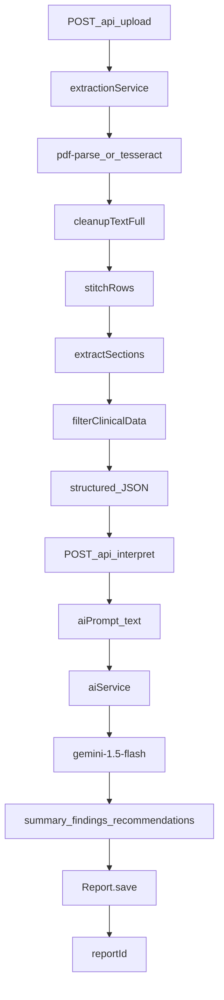

# HealthLens AI — Project Context

**Last Updated:** Monday, June 8, 2026  
**Status:** Day 6 (Auth UI + Live Chat Assistant — Findings & Risk Detection Next)

---

## 1. Project Vision & Identity

**HealthLens AI** is an AI-Powered Personal Health Intelligence System.  
*Do not describe it as a simple "medical report summarizer".*

It is a web-based platform that helps patients understand, organize, and analyze their medical records by extracting structured data, tracking longitudinal trends over time, identifying anomalies, and generating actionable, practical health insights.

**Core Objectives:**
1. Extract structured information (vitals/dates) deterministically.
2. Simplify medical terminology via AI.
3. Detect abnormal values and risk indicators.
4. Maintain a visual health timeline and trend analytics.
5. Generate explainable AI-powered recommendations.

---

## 2. Tech Stack & Infrastructure

### Target platform (full product)

| Layer | Stack |
|-------|-------|
| Frontend | React.js, Tailwind CSS, Recharts, FullCalendar |
| Backend | Node.js, Express.js |
| Database | MongoDB |
| Authentication | JWT, bcrypt |
| OCR & Extraction | PDF.js (`pdf-parse`), Tesseract.js, `sharp` |
| AI | Google Gemini API (`gemini-1.5-flash`) |

### Currently in repo (MVP — Day 1–4)

- **Backend:** Node.js + Express 5 (CommonJS) on port 5000
- **React frontend:** [`client/`](client/) — Vite + React, Tailwind CSS v3 (Vitality Core tokens), lucide-react, recharts, **react-router-dom**; page routes (`/`, `/login`, `/register`, `/dashboard`, `/vault`, `/chat`, `/profile`); dev proxy `/api` → `localhost:5000`
- **MongoDB:** Mongoose + [`models/Report.js`](models/Report.js) — `mongodb://localhost:27017/healthlens` via [`config/db.js`](config/db.js); server connects before listen
- **JWT auth:** [`models/User.js`](models/User.js) (nested `profile` subdocument: DOB, gender, blood group, biometrics, chronic conditions, lifestyle), [`routes/auth.js`](routes/auth.js), [`routes/users.js`](routes/users.js), [`middleware/authMiddleware.js`](middleware/authMiddleware.js) — `bcryptjs` password hashing, `jsonwebtoken` (30d expiry); `protect` on upload/interpret/history/users routes; reports scoped by `userId` ObjectId ref
- **Local extraction:** `pdf-parse`, `pdfjs-dist`, `@napi-rs/canvas`, `tesseract.js`, `sharp`
- **Manual UI:** [`index.html`](index.html) — browser upload tester (fetch → `POST /api/upload`)
- **Workspace:** `c:\Users\aryan\Downloads\College\Projects\HealthLens AI`
- **Commands:** `npm install` · `npm run dev` (backend port 5000 + frontend port 5173) · `npm test`

### Core endpoints (current)

| Endpoint | Status | Purpose |
|----------|--------|---------|
| `GET /health` | Live | System health check |
| `POST /api/upload` | Live (auth) | Bearer JWT required. Multer upload (`report` field). Deterministic OCR/extraction. Returns `structured` JSON + cleaned text fields |
| `POST /api/interpret` | Live (auth) | Bearer JWT required. Accepts `{ structured }`. Fetches user profile, builds profile-aware prompt via [`utils/profileContextBuilder.js`](utils/profileContextBuilder.js), calls Gemini via [`services/aiService.js`](services/aiService.js), persists [`models/Report.js`](models/Report.js) with `userId`. Returns `{ success, aiPrompt, data, reportId }` where `data` is `{ summary, findings, recommendations }` |
| `GET /api/reports/history` | Live (auth) | Bearer JWT required. Returns authenticated user's reports sorted by `reportDate` ascending. Each report includes `vitalityScore` virtual (100 minus 5 per low/high measurement) |
| `GET /api/reports/:id` | Live (auth) | Bearer JWT required. Returns `{ success, report }` for the authenticated owner; 403 if `userId` mismatch; 404 if not found |
| `POST /api/auth/register` | Live | Accepts `{ name, email, password }`. Creates user (bcrypt-hashed password), returns `{ success, user, token }` |
| `POST /api/auth/login` | Live | Accepts `{ email, password }`. Validates credentials via `matchPassword`, returns `{ success, user, token }` |
| `GET /api/users/me` | Live (auth) | Bearer JWT required. Returns `{ success, user }` with nested `profile` (password excluded) |
| `PUT /api/users/profile` | Live (auth) | Bearer JWT required. Accepts profile fields (`dateOfBirth`, `gender`, `bloodGroup`, `heightCm`, `weightKg`, `chronicConditions`, `lifestyle`). Updates logged-in user's profile, returns updated user |
| `POST /api/chat` | Live (auth) | Bearer JWT required. Accepts `{ message }`. Loads `user.profile` + chronological reports, passes to [`services/aiService.js`](services/aiService.js) `generateChatResponse(message, profile, reports)` with JSON-stringified vault context in system prompt. Returns `{ success, reply }` |

**Typical flow:** Marketing landing (`/`) → register/login → `/dashboard` upload report (`POST /api/upload`) → interpret (`POST /api/interpret`) → results dashboard with timeline scrubber, vitality chart, AI recommendation, and categorized biomarkers. Browse past reports via `/vault` (list table) → open `/dashboard?reportId=<id>`. Manual/debug: obtain token via `/api/auth/login`, then pass `Authorization: Bearer <token>` on protected routes.

**Env:** `GEMINI_API_KEY` required for interpret; `JWT_SECRET` required for auth (documented in `.env.example`).

---

## 3. Current Architecture & Pipeline

The backend strictly isolates **deterministic extraction** from **AI interpretation**. LLMs are **NEVER** used to extract numbers from raw OCR text.

**Pipeline steps:**
1. **Upload:** [`routes/upload.js`](routes/upload.js) — PDF/JPG/JPEG/PNG via Multer
2. **Raw extraction:** [`services/extractionService.js`](services/extractionService.js) → [`pdfService.js`](services/pdfService.js) (digital) or [`ocrService.js`](services/ocrService.js) (scanned/images)
3. **Full cleanup:** [`utils/textCleanup.js`](utils/textCleanup.js)
4. **Row stitching:** [`utils/rowStitcher.js`](utils/rowStitcher.js) — multi-line table rows
5. **Section scoping:** [`services/sectionExtractor.js`](services/sectionExtractor.js) — CBC, LIPID, KIDNEY, etc.
6. **Clinical extraction:** [`utils/clinical/parameterRegexMap.js`](utils/clinical/parameterRegexMap.js) — **Universal Range-Stripping Pattern** + **label masking** (`maskLabels`) on 38 canonical parameters from [`utils/canonicalMap.json`](utils/canonicalMap.json)
7. **Enrichment:** [`services/clinicalFilterService.js`](services/clinicalFilterService.js) — units, status (low/normal/high), validation, dedupe, flags, OCR traceability
8. **Metadata:** [`utils/clinical/metadataPrepass.js`](utils/clinical/metadataPrepass.js) — **date only** (`patient_info.reportDate`); name/age/gender deferred to future auth profile
9. **AI prompt:** [`utils/aiContextGenerator.js`](utils/aiContextGenerator.js) — `MEDICAL REPORT CONTEXT` string (token-efficient for LLM)
10. **AI interpretation:** [`services/aiService.js`](services/aiService.js) — Gemini 1.5 Flash with strict `responseSchema` JSON output
11. **Persistence:** [`routes/interpret.js`](routes/interpret.js) — maps measurements, saves Report document, returns `reportId`

**Extraction method on measurements:** `generalized_stripper`

---

## 4. What's Done vs. In Progress

### DONE (Day 1 & Day 2)

- **Plans 1–4:** Extraction MVP, clinical filtering, enrichment delta, section stitching
- **Plan 5:** Parser precision hardening — **rolled back**
- **CBC.pdf fixes:** Full lines into stitcher; haemogram header; Indian ref-before-value tables
- **Universal parser:** Range-stripping + longest-alias-wins + exclusion guards (Hb/HbA1c, RBC/RDW, bilirubin direct)
- **Stripper hotfix:** Label masking for B12 / 25-OH Vitamin D; `Customer Since: 25/Apr/2026` date support
- **Interpret endpoint (prompt-only):** [`routes/interpret.js`](routes/interpret.js) mounted in [`server.js`](server.js)
- **Metadata:** Date-only extraction (no name/age/gender in API)
- **AI context generator:** Structured JSON → optimized prompt text
- **Testing UI:** [`index.html`](index.html) — visual upload tester
- **AI Interpretation Layer:** [`services/aiService.js`](services/aiService.js) — Gemini 1.5 Flash, strict JSON schema (`summary`, `findings`, `recommendations`)
- **Interpret endpoint (live):** `/api/interpret` returns `{ success, aiPrompt, data, reportId }`
- **MongoDB persistence:** [`config/db.js`](config/db.js) + [`models/Report.js`](models/Report.js); measurements + `aiInterpretation` saved on each interpret
- **Env:** `GEMINI_API_KEY` in `.env.example`; local MongoDB required for `npm run dev`
- **Vitality score:** `vitalityScore` virtual on [`models/Report.js`](models/Report.js) — base 100, −5 per `low`/`high` measurement
- **Report history:** [`routes/reports.js`](routes/reports.js) — `GET /api/reports/history`
- **JWT auth backend:** [`models/User.js`](models/User.js) (bcrypt pre-save hook, `matchPassword`); [`routes/auth.js`](routes/auth.js) — register/login; [`middleware/authMiddleware.js`](middleware/authMiddleware.js) — `protect` on upload/interpret/history; Report `userId` ObjectId ref to User
- **React auth UI:** separate [`pages/Login.jsx`](client/src/pages/Login.jsx) and [`pages/Register.jsx`](client/src/pages/Register.jsx); JWT helpers + Bearer headers in [`client/src/lib/api.js`](client/src/lib/api.js); `ProtectedRoute` in [`client/src/App.jsx`](client/src/App.jsx) checks localStorage token
- **React Router:** [`client/src/App.jsx`](client/src/App.jsx) — `BrowserRouter`, routes `/`, `/login`, `/register`, `/dashboard`, `/vault`, `/profile`; sticky [`Navbar`](client/src/components/Layout/Navbar.jsx) with auth-aware links
- **Tests:** **43/43 passing**

### DONE (Day 4 — core UI)

- **React scaffold:** [`client/`](client/) Vitality Core design system (Tailwind v3, Inter, `glass-card`, `shadow-ambient`)
- **Upload flow:** [`pages/Dashboard.jsx`](client/src/pages/Dashboard.jsx) — `UploadZone` → `ProcessingView` → `components/Dashboard/Dashboard` state machine; loads full report history on mount; selects report via `?reportId=` or latest; horizontal `TimelineSelector` scrubber for switching reports
- **API wiring:** login/register pages + chained `/api/upload` + `/api/interpret` with Bearer JWT via [`client/src/lib/api.js`](client/src/lib/api.js)
- **Dashboard:** `TimelineSelector` card-wrapped scrubber, `HealthTimelineCard` (8-col vitality trend), `AIRecommendationCard` (4-col glass/gradient), `BiomarkerGrid`, **Download PDF** via `react-to-print` on [`Dashboard.jsx`](client/src/components/Dashboard/Dashboard.jsx)
- **Landing:** [`pages/Landing.jsx`](client/src/pages/Landing.jsx) — high-fidelity Vitality Core prototype (Hero + dashboard preview, Bento features, How It Works, Social Impact, Footer); scroll-reveal animations; Manrope + extended design tokens
- **Navbar:** [`Navbar.jsx`](client/src/components/Layout/Navbar.jsx) — 3-column state-aware nav (public anchor links vs Dashboard/Vault/Assistant; Profile icon + Logout)
- **Profile:** [`pages/Profile.jsx`](client/src/pages/Profile.jsx) — medical intake form (demographics, biometrics/BMI, lifestyle, chronic conditions); `GET /api/users/me` + `PUT /api/users/profile`
- **AI profile context:** [`utils/profileContextBuilder.js`](utils/profileContextBuilder.js) — age/BMI calculation; profile string prepended to Gemini prompt at interpret time

### DONE (Day 5 — Health Vault + Timeline)

- **Report by ID API:** [`routes/reports.js`](routes/reports.js) — `GET /api/reports/:id` with owner check (403 Forbidden on mismatch)
- **Health Vault:** [`pages/Vault.jsx`](client/src/pages/Vault.jsx) — prototype card archive (bento stats, search/sort, Stable vs Attention Needed cards); live `fetchReportHistory()`; links to `/dashboard?reportId=<id>`
- **Shared Footer:** [`components/Layout/Footer.jsx`](client/src/components/Layout/Footer.jsx) — extracted from Landing; rendered on Landing + globally on authenticated routes via [`App.jsx`](client/src/App.jsx)
- **Timeline selector:** [`TimelineSelector.jsx`](client/src/components/Dashboard/TimelineSelector.jsx) — horizontal report scrubber on Dashboard; URL-synced via `?reportId=`; history-driven selection from `fetchReportHistory()`
- **Dashboard deep-link:** [`pages/Dashboard.jsx`](client/src/pages/Dashboard.jsx) + [`client/src/lib/structured.js`](client/src/lib/structured.js) `reportToDashboardPayload()` (includes `_id`)
- **AI Assistant:** [`pages/Chat.jsx`](client/src/pages/Chat.jsx) — live chat UI wired to `POST /api/chat`; static welcome message; `messages` state + `isTyping` indicator; `sendChatMessage(message)`; protected `/chat` route; Navbar **Assistant** link; Footer hidden on `/chat`
- **Auth UI prototype:** [`pages/Login.jsx`](client/src/pages/Login.jsx) + [`pages/Register.jsx`](client/src/pages/Register.jsx) — split-screen layout; [`AuthBrandPanel.jsx`](client/src/components/Auth/AuthBrandPanel.jsx) with brand `Link to="/"`; [`AuthBackHome.jsx`](client/src/components/Auth/AuthBackHome.jsx); Navbar hidden on `/login`/`/register`; `bg-medical-gradient` in [`index.css`](client/src/index.css)
- **Chat backend:** [`routes/chat.js`](routes/chat.js) + `generateChatResponse(userMessage, userProfile, userHistory)` in [`services/aiService.js`](services/aiService.js) — profile + full report history JSON in Gemini system prompt

### TO DO (Day 4 polish + Days 5–6)

- **Day 4 remaining:** Findings display, reset/new-report action
- **Day 5 remaining:** Risk detection, per-biomarker trend lines
- **Day 6:** Production polish — error handling, branding (PDF export: dashboard print-to-PDF done)

---

## 5. Milestone history (backend plans)

| Plan | Status | Summary |
|------|--------|---------|
| Plan 1 — Extraction MVP | Done | Upload → PDF/OCR → cleanup → JSON |
| Plan 2 — Clinical filtering | Done | cleanedTextClinical, structured.measurements |
| Plan 3 — Enrichment delta | Done | Canonical IDs, units, validation, flags, traceability |
| Plan 4 — Section stitching | Done | Row stitcher, section blocks, scoped regex |
| Plan 5 — Parser precision | Rolled back | Too complex / new bugs |
| CBC parsing fixes | Done | Orchestration order, haemogram, ref-before-value |
| Range-stripping universal parser | Done | canonicalMap-driven extractor |
| Stripper hotfix + interpret API | Done | B12/25-OH/date fixes; separate interpret route |
| Gemini AI interpretation | Done | aiService + live `/api/interpret` with schema-enforced JSON |
| MongoDB report persistence | Done | Mongoose Report model; interpret saves measurements + AI payload; returns `reportId` |
| Vitality score + history API | Done | `vitalityScore` virtual; `GET /api/reports/history` sorted by reportDate |
| JWT auth backend | Done | User model, register/login routes, `protect` middleware; `JWT_SECRET` in `.env.example` |
| Secure user-scoped routes | Done | `protect` on upload/interpret/history; Report `userId` ObjectId ref; React auth gate + JWT headers |
| Dashboard PDF export | Done | `react-to-print` action bar on Dashboard; print grid to browser PDF (`HealthLens_AI_Report`) |
| React Router + pages | Done | `react-router-dom`; Landing/Login/Register/Dashboard/Profile pages; `ProtectedRoute`; global Navbar; BiomarkerGrid category grouping |
| User profile + AI context | Done | User `profile` schema; `GET /api/users/me` + `PUT /api/users/profile`; Profile intake form; profile injected into Gemini interpret prompt |
| Health Vault + report deep-link | Done | `GET /api/reports/:id`; Vault list archive; Dashboard `?reportId=` load; Navbar Vault link |
| Timeline selector scrubber | Done | `TimelineSelector` horizontal pills; history state on Dashboard; URL sync via `setSearchParams` |
| Vitality Core UI polish | Done | Smart Navbar; full Landing page; Dashboard 8/4 grid with `AIRecommendationCard`; design token alignment |
| Vault prototype UI + shared Footer | Done | `Vault.jsx` card archive from HTML mockup; lucide icons; `Footer.jsx` shared; `App.jsx` global footer on auth routes |
| Chat Assistant UI prototype | Done | `Chat.jsx` from HTML mockup; `/chat` protected route; Navbar Assistant link; `chat-scroll` CSS |
| Auth UI prototype + chat API | Done | Split Login/Register; back-to-home links; `POST /api/chat` with vault context; live Chat UI |

---

## 6. Known bugs & quirks

- **Legacy reports:** Pre-auth documents with `userId: "anonymous_patient"` string will not appear in scoped history queries; drop or migrate local `reports` collection if needed
- **Manual upload tester:** [`index.html`](index.html) does not send Bearer token — use React client or curl with auth header
- **OCR label overlap:** Labels blend with values (e.g. "Vitamin B12 515", "25-OH Vitamin D 11")
  - *Mitigation:* `maskLabels()` masks canonical aliases before value extraction
- **Missing minor decimals:** OCR may parse `1.18` as `118` in dense tables
  - *Status:* Accepted quirk; AI layer expected to contextualize via reference ranges
- **Digital traceability:** `pdf-parse` has no bounding boxes — `sourceBBox`/`sourcePage` null; `confidenceSource: "text_only"`
- **Footer false CBC section:** `"CBC DONE ON..."` can spawn duplicate short CBC block
- **Lakh/cumm:** Value extracts; unit not in normalizer
- **Plan 4 edge cases (open):** Bilirubin total/direct, platelets/MPV, eGFR ref leakage, T3/T4 false positives

---

## 7. Test status

- **Unit tests:** **68/68 passing** (`npm test`)
- **Coverage includes:** row stitcher, section extractor, generalized stripper, metadata prepass, interpret handler, profileContextBuilder, users route handlers, vitalityScore virtual, reports history handler, reports getById handler, aiContextGenerator, aiService (interpret + chat), chatContextBuilder, chat route handler, CBC PDF fixture, integration extraction, validation, traceability, unit normalizer
- **Golden layouts:** `CBC.pdf` (9/9 core CBC measurements), `reports.pdf` (vitamins, lipids, etc.)

---

## 8. Key files map

| Area | Files |
|------|-------|
| Entry | `server.js`, `routes/upload.js`, `routes/interpret.js`, `routes/reports.js`, `routes/chat.js`, `routes/auth.js`, `routes/users.js` |
| Database | `config/db.js`, `models/Report.js`, `models/User.js` |
| Auth | `middleware/authMiddleware.js` (`protect`), `utils/formatUser.js` |
| Profile / AI context | `utils/profileContextBuilder.js`, `utils/chatContextBuilder.js`, `routes/users.js`, `routes/chat.js` |
| Orchestration | `services/extractionService.js` |
| Clinical pipeline | `services/clinicalFilterService.js` |
| Sectioning | `services/sectionExtractor.js`, `utils/rowStitcher.js` |
| Extractor | `utils/clinical/parameterRegexMap.js`, `utils/canonicalMap.json` |
| Metadata | `utils/clinical/metadataPrepass.js` |
| AI prep | `utils/aiContextGenerator.js` |
| AI interpretation | `services/aiService.js` |
| Enrichment | `unitNormalizer.js`, `validationSanityEngine.js`, `reportClassifier.js`, `clinicalFlags.js`, `traceability.js` |
| Manual UI | `index.html` |
| React frontend | `client/src/App.jsx` (router shell + conditional Navbar/Footer), `client/src/pages/` (Landing, Login, Register, Dashboard, Vault, Chat, Profile), `client/src/components/Auth/` (`AuthBrandPanel`, `AuthBackHome`), `client/src/lib/api.js`, `client/src/lib/structured.js`, `client/src/components/Layout/Navbar.jsx`, `client/src/components/Layout/Footer.jsx`, `client/src/components/UploadZone.jsx`, `client/src/components/ProcessingView.jsx`, `client/src/components/Dashboard/` (`TimelineSelector`, `HealthTimelineCard`, `AIRecommendationCard`, `AISummaryCard`, `BiomarkerGrid`) |

---

## 9. Changelog (recent)

- **2026-06-08:** Chat API alignment — `generateChatResponse(message, profile, reports)` with JSON system prompt; simplified `POST /api/chat` body; `sendChatMessage(message)`; Chat.jsx static welcome + `isTyping`; 68 tests
- **2026-06-08:** Auth UI + Chat backend — split-screen [`Login.jsx`](client/src/pages/Login.jsx)/[`Register.jsx`](client/src/pages/Register.jsx) prototype; [`AuthBrandPanel`](client/src/components/Auth/AuthBrandPanel.jsx) + back-to-home links; Navbar hidden on auth routes; `POST /api/chat` with [`chatContextBuilder`](utils/chatContextBuilder.js) + `generateChatResponse`; live [`Chat.jsx`](client/src/pages/Chat.jsx); 68 tests
- **2026-06-08:** Chat Assistant UI — [`Chat.jsx`](client/src/pages/Chat.jsx) from HTML mockup (static messages, controlled input, `handleSend` stub); protected `/chat` route; Navbar **Assistant** link; Footer hidden on `/chat`; `chat-scroll` utility in [`index.css`](client/src/index.css); 58 tests unchanged
- **2026-06-08:** Vault prototype UI — [`Vault.jsx`](client/src/pages/Vault.jsx) rebuilt from HTML mockup `<main>` (bento stats, search/sort, card archive with Stable/Attention variants); lucide-react icons; API wiring preserved; shared [`Footer.jsx`](client/src/components/Layout/Footer.jsx) extracted from Landing; conditional global footer in [`App.jsx`](client/src/App.jsx); 58 tests unchanged
- **2026-06-07:** Landing page prototype conversion — [`Landing.jsx`](client/src/pages/Landing.jsx) rebuilt from HTML mockup (body + footer); lucide-react icons; extended Tailwind tokens + `ambient-shadow`/`glass-panel`/reveal CSS; HealthLens AI branding
- **2026-06-07:** Vitality Core UI polish — state-aware 3-column [`Navbar.jsx`](client/src/components/Layout/Navbar.jsx); Dashboard 8/4 grid with new [`AIRecommendationCard.jsx`](client/src/components/Dashboard/AIRecommendationCard.jsx); `TimelineSelector` card wrapper; smooth-scroll anchors; 58 tests unchanged
- **2026-06-07:** Timeline selector scrubber — [`TimelineSelector.jsx`](client/src/components/Dashboard/TimelineSelector.jsx) horizontal report pills on Dashboard; history-driven selection + URL sync; Vault simplified to list-only (FullCalendar removed); 58 tests unchanged
- **2026-06-07:** Health Vault + report deep-link — `GET /api/reports/:id` with 403 owner check; [`pages/Vault.jsx`](client/src/pages/Vault.jsx) list archive; Dashboard `?reportId=` + `reportToDashboardPayload`; Navbar Vault link; 58 tests
- **2026-06-07:** User profile + AI context — nested `profile` on [`models/User.js`](models/User.js); `GET /api/users/me` + `PUT /api/users/profile` via [`routes/users.js`](routes/users.js); full Profile intake form; [`utils/profileContextBuilder.js`](utils/profileContextBuilder.js) prepends age/BMI/conditions/lifestyle to Gemini prompt; 54 tests
- **2026-06-07:** React Router scaffold — `react-router-dom`; [`App.jsx`](client/src/App.jsx) routing shell with `ProtectedRoute`; pages (`Landing`, `Login`, `Register`, `Dashboard`, `Profile`); sticky [`Navbar`](client/src/components/Layout/Navbar.jsx); `BiomarkerGrid` grouped by measurement `category` with lucide icons; 43 tests unchanged
- **2026-06-07:** Dashboard PDF export — `react-to-print` on [`Dashboard.jsx`](client/src/components/Dashboard/Dashboard.jsx); action bar with Download PDF; printable grid ref; `print:hidden` on controls
- **2026-06-07:** Secure user-scoped routes — Report `userId` ObjectId ref to User; `protect` on upload/interpret/history; React login/register gate + JWT Bearer headers in api client; 43 tests unchanged
- **2026-06-07:** JWT auth backend — `models/User.js` (bcrypt hash + `matchPassword`), `POST /api/auth/register` + `/login`, `protect` middleware in [`middleware/authMiddleware.js`](middleware/authMiddleware.js); `JWT_SECRET` in `.env.example`; 43 tests unchanged
- **2026-06-07:** `HealthTimelineCard` — recharts line chart for `vitalityScore` over `reportDate`; `fetchReportHistory()` in [`client/src/lib/api.js`](client/src/lib/api.js); full-width chart atop dashboard grid
- **2026-06-07:** Vitality score virtual on Report model; `GET /api/reports/history` via [`routes/reports.js`](routes/reports.js); 43 tests
- **2026-06-07:** MongoDB persistence — Mongoose `Report` model, `config/db.js`, interpret route saves measurements + `aiInterpretation`, returns `reportId`; 38 tests (save mock + failure case)
- **2026-06-07:** Upload-to-dashboard UI (`UploadZone`, `ProcessingView`, `Dashboard`, `AISummaryCard`, `BiomarkerGrid`); IDLE/PROCESSING/RESOLVED state machine; chained upload + interpret APIs; 37 backend tests unchanged
- **2026-06-07:** React frontend scaffolded in `client/` (Vite, React, Tailwind v3 Vitality Core tokens, lucide-react, recharts); Vite `/api` proxy to port 5000
- **2026-06-06:** Gemini AI layer wired (`services/aiService.js`); `/api/interpret` returns `{ success, aiPrompt, data }`; `GEMINI_API_KEY` in `.env.example`; 37 tests
- **2026-06-06:** Stripper hotfix (B12, 25-OH, Customer Since date); `POST /api/interpret` prompt-only; upload decoupled from aiPrompt; 35 tests
- **2026-06-06:** Universal range-stripping parser; date-only metadata; aiContextGenerator
- **Earlier:** CBC.pdf fixes; Plans 1–4; section stitching; enrichment

---

## 10. Maintenance

This file **must be updated** after every plan implementation or meaningful code change.  
See [`.cursor/rules/project-context-maintenance.mdc`](.cursor/rules/project-context-maintenance.mdc).

**Update checklist:** Last Updated date · Changelog prepend · affected sections (endpoints, test count, Done/In Progress, known issues).
