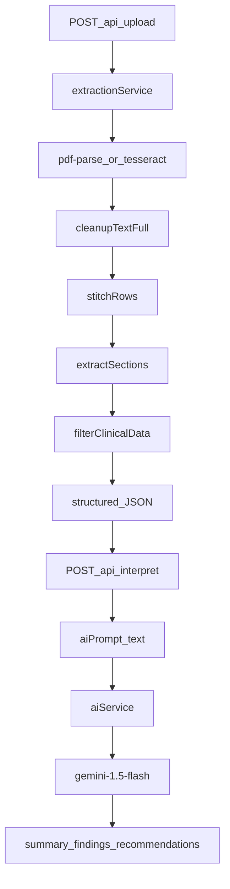

# HealthLens AI — Project Context

**Last Updated:** Saturday, June 6, 2026  
**Status:** Day 3 / 6 (AI Interpretation Layer Done — Day 4 React UI Next)

---

## 1. Project Vision & Identity

**HealthLens AI** is an AI-Powered Personal Health Intelligence System.  
*Do not describe it as a simple "medical report summarizer".*

It is a web-based platform that helps patients understand, organize, and analyze their medical records by extracting structured data, tracking longitudinal trends over time, identifying anomalies, and generating actionable, practical health insights.

**Core Objectives:**
1. Extract structured information (vitals/dates) deterministically.
2. Simplify medical terminology via AI.
3. Detect abnormal values and risk indicators.
4. Maintain a visual health timeline and trend analytics.
5. Generate explainable AI-powered recommendations.

---

## 2. Tech Stack & Infrastructure

### Target platform (full product)

| Layer | Stack |
|-------|-------|
| Frontend | React.js, Tailwind CSS, Recharts, FullCalendar |
| Backend | Node.js, Express.js |
| Database | MongoDB |
| Authentication | JWT, bcrypt |
| OCR & Extraction | PDF.js (`pdf-parse`), Tesseract.js, `sharp` |
| AI | Google Gemini API (`gemini-1.5-flash`) |

### Currently in repo (MVP — Day 1–3)

- **Backend only:** Node.js + Express 5 (CommonJS)
- **No MongoDB, no JWT, no React app** yet
- **Local extraction:** `pdf-parse`, `pdfjs-dist`, `@napi-rs/canvas`, `tesseract.js`, `sharp`
- **Manual UI:** [`index.html`](index.html) — browser upload tester (fetch → `POST /api/upload`)
- **Workspace:** `c:\Users\aryan\Downloads\College\Projects\HealthLens AI`
- **Commands:** `npm install` · `npm run dev` (port 5000) · `npm test`

### Core endpoints (current)

| Endpoint | Status | Purpose |
|----------|--------|---------|
| `GET /health` | Live | System health check |
| `POST /api/upload` | Live | Multer upload (`report` field). Deterministic OCR/extraction. Returns `structured` JSON + cleaned text fields |
| `POST /api/interpret` | Live | Accepts `{ structured }`. Builds prompt via [`utils/aiContextGenerator.js`](utils/aiContextGenerator.js), calls Gemini via [`services/aiService.js`](services/aiService.js). Returns `{ success, aiPrompt, data }` where `data` is `{ summary, findings, recommendations }` |

**Typical flow:** Upload → copy `structured` → call `/api/interpret` → receive `data` for UI (and `aiPrompt` for debugging).

**Env:** `GEMINI_API_KEY` required for interpret (documented in `.env.example`).

---

## 3. Current Architecture & Pipeline

The backend strictly isolates **deterministic extraction** from **AI interpretation**. LLMs are **NEVER** used to extract numbers from raw OCR text.

**Pipeline steps:**
1. **Upload:** [`routes/upload.js`](routes/upload.js) — PDF/JPG/JPEG/PNG via Multer
2. **Raw extraction:** [`services/extractionService.js`](services/extractionService.js) → [`pdfService.js`](services/pdfService.js) (digital) or [`ocrService.js`](services/ocrService.js) (scanned/images)
3. **Full cleanup:** [`utils/textCleanup.js`](utils/textCleanup.js)
4. **Row stitching:** [`utils/rowStitcher.js`](utils/rowStitcher.js) — multi-line table rows
5. **Section scoping:** [`services/sectionExtractor.js`](services/sectionExtractor.js) — CBC, LIPID, KIDNEY, etc.
6. **Clinical extraction:** [`utils/clinical/parameterRegexMap.js`](utils/clinical/parameterRegexMap.js) — **Universal Range-Stripping Pattern** + **label masking** (`maskLabels`) on 38 canonical parameters from [`utils/canonicalMap.json`](utils/canonicalMap.json)
7. **Enrichment:** [`services/clinicalFilterService.js`](services/clinicalFilterService.js) — units, status (low/normal/high), validation, dedupe, flags, OCR traceability
8. **Metadata:** [`utils/clinical/metadataPrepass.js`](utils/clinical/metadataPrepass.js) — **date only** (`patient_info.reportDate`); name/age/gender deferred to future auth profile
9. **AI prompt:** [`utils/aiContextGenerator.js`](utils/aiContextGenerator.js) — `MEDICAL REPORT CONTEXT` string (token-efficient for LLM)
10. **AI interpretation:** [`services/aiService.js`](services/aiService.js) — Gemini 1.5 Flash with strict `responseSchema` JSON output

**Extraction method on measurements:** `generalized_stripper`

---

## 4. What's Done vs. In Progress

### DONE (Day 1 & Day 2)

- **Plans 1–4:** Extraction MVP, clinical filtering, enrichment delta, section stitching
- **Plan 5:** Parser precision hardening — **rolled back**
- **CBC.pdf fixes:** Full lines into stitcher; haemogram header; Indian ref-before-value tables
- **Universal parser:** Range-stripping + longest-alias-wins + exclusion guards (Hb/HbA1c, RBC/RDW, bilirubin direct)
- **Stripper hotfix:** Label masking for B12 / 25-OH Vitamin D; `Customer Since: 25/Apr/2026` date support
- **Interpret endpoint (prompt-only):** [`routes/interpret.js`](routes/interpret.js) mounted in [`server.js`](server.js)
- **Metadata:** Date-only extraction (no name/age/gender in API)
- **AI context generator:** Structured JSON → optimized prompt text
- **Testing UI:** [`index.html`](index.html) — visual upload tester
- **AI Interpretation Layer:** [`services/aiService.js`](services/aiService.js) — Gemini 1.5 Flash, strict JSON schema (`summary`, `findings`, `recommendations`)
- **Interpret endpoint (live):** `/api/interpret` returns `{ success, aiPrompt, data }`
- **Env:** `GEMINI_API_KEY` in `.env.example`
- **Tests:** **37/37 passing**

### TO DO (Days 4–6)

- **Day 4:** React upload UI & dashboard (cards, radial charts, color system)
- **Day 5:** Health score engine, risk detection, trend DB (MongoDB)
- **Day 6:** Production polish — error handling, PDF export, branding

---

## 5. Milestone history (backend plans)

| Plan | Status | Summary |
|------|--------|---------|
| Plan 1 — Extraction MVP | Done | Upload → PDF/OCR → cleanup → JSON |
| Plan 2 — Clinical filtering | Done | cleanedTextClinical, structured.measurements |
| Plan 3 — Enrichment delta | Done | Canonical IDs, units, validation, flags, traceability |
| Plan 4 — Section stitching | Done | Row stitcher, section blocks, scoped regex |
| Plan 5 — Parser precision | Rolled back | Too complex / new bugs |
| CBC parsing fixes | Done | Orchestration order, haemogram, ref-before-value |
| Range-stripping universal parser | Done | canonicalMap-driven extractor |
| Stripper hotfix + interpret API | Done | B12/25-OH/date fixes; separate interpret route |
| Gemini AI interpretation | Done | aiService + live `/api/interpret` with schema-enforced JSON |

---

## 6. Known bugs & quirks

- **OCR label overlap:** Labels blend with values (e.g. "Vitamin B12 515", "25-OH Vitamin D 11")
  - *Mitigation:* `maskLabels()` masks canonical aliases before value extraction
- **Missing minor decimals:** OCR may parse `1.18` as `118` in dense tables
  - *Status:* Accepted quirk; AI layer expected to contextualize via reference ranges
- **Digital traceability:** `pdf-parse` has no bounding boxes — `sourceBBox`/`sourcePage` null; `confidenceSource: "text_only"`
- **Footer false CBC section:** `"CBC DONE ON..."` can spawn duplicate short CBC block
- **Lakh/cumm:** Value extracts; unit not in normalizer
- **Plan 4 edge cases (open):** Bilirubin total/direct, platelets/MPV, eGFR ref leakage, T3/T4 false positives

---

## 7. Test status

- **Unit tests:** **37/37 passing** (`npm test`)
- **Coverage includes:** row stitcher, section extractor, generalized stripper, metadata prepass, interpret handler, aiContextGenerator, aiService, CBC PDF fixture, integration extraction, validation, traceability, unit normalizer
- **Golden layouts:** `CBC.pdf` (9/9 core CBC measurements), `reports.pdf` (vitamins, lipids, etc.)

---

## 8. Key files map

| Area | Files |
|------|-------|
| Entry | `server.js`, `routes/upload.js`, `routes/interpret.js` |
| Orchestration | `services/extractionService.js` |
| Clinical pipeline | `services/clinicalFilterService.js` |
| Sectioning | `services/sectionExtractor.js`, `utils/rowStitcher.js` |
| Extractor | `utils/clinical/parameterRegexMap.js`, `utils/canonicalMap.json` |
| Metadata | `utils/clinical/metadataPrepass.js` |
| AI prep | `utils/aiContextGenerator.js` |
| AI interpretation | `services/aiService.js` |
| Enrichment | `unitNormalizer.js`, `validationSanityEngine.js`, `reportClassifier.js`, `clinicalFlags.js`, `traceability.js` |
| Manual UI | `index.html` |

---

## 9. Changelog (recent)

- **2026-06-06:** Gemini AI layer wired (`services/aiService.js`); `/api/interpret` returns `{ success, aiPrompt, data }`; `GEMINI_API_KEY` in `.env.example`; 37 tests
- **2026-06-06:** Stripper hotfix (B12, 25-OH, Customer Since date); `POST /api/interpret` prompt-only; upload decoupled from aiPrompt; 35 tests
- **2026-06-06:** Universal range-stripping parser; date-only metadata; aiContextGenerator
- **Earlier:** CBC.pdf fixes; Plans 1–4; section stitching; enrichment

---

## 10. Maintenance

This file **must be updated** after every plan implementation or meaningful code change.  
See [`.cursor/rules/project-context-maintenance.mdc`](.cursor/rules/project-context-maintenance.mdc).

**Update checklist:** Last Updated date · Changelog prepend · affected sections (endpoints, test count, Done/In Progress, known issues).
