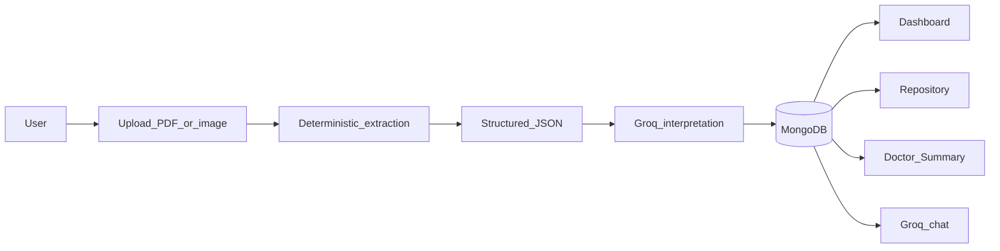
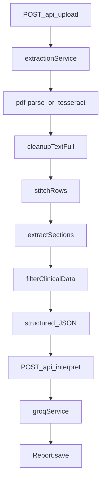

# HealthLens AI — Project Context

**Last Updated:** Friday, June 12, 2026 (Groq/Gemini AI provider split)  
**Status:** Eval-ready · **221/221** tests · freeze (bug fixes + docs only)

> Contributor and agent reference. For onboarding, start with [README.md](README.md).

---

## 1. Vision

**HealthLens AI** is an AI-Powered Personal Health Intelligence System.  
*Do not describe it as a simple "medical report summarizer".*

It is a web-based platform that helps patients understand, organize, and analyze their medical records by extracting structured data, tracking longitudinal trends over time, identifying anomalies, and generating actionable, practical health insights.

**Core objectives:**

1. Extract structured information (vitals/dates) deterministically.
2. Simplify medical terminology via AI.
3. Detect abnormal values and risk indicators.
4. Maintain a visual health timeline and trend analytics.
5. Generate explainable AI-powered recommendations.

---

## 2. System overview

**Typical user flow:** Landing (`/`) → register/login → `/dashboard` upload (`POST /api/upload`) → interpret (`POST /api/interpret`) → dashboard with timeline, trends, and insights. Browse history via `/vault`; cross-report rollups at `/repository`; printable export at `/doctor-summary`.

**Commands:** `npm install` · `npm run dev` (API `:5000` + frontend `:5173`) · `npm test` · `npm run seed:demo` (see [docs/DEMO.md](docs/DEMO.md))

**Vercel (full-stack):** `vercel-build` → `copyDist.js` + `validateServerlessAssets.js`. Do **not** stage full packages to `api/.deps/` (exceeds 250MB). Use targeted `includeFiles` in `vercel.json` for untraced assets (`pdf.worker.mjs`, tesseract WASM/worker, Linux `@napi-rs/canvas` + `@img/sharp` binaries). No `outputDirectory: public`. API: [`api/index.js`](api/index.js).

---

## 3. Tech stack (as shipped)

| Layer | Stack |
|-------|-------|
| Frontend | React, Vite, Tailwind CSS v3 (Vitality Core), lucide-react, Recharts, react-router-dom, react-to-print |
| Backend | Node.js, Express 5 (CommonJS), port 5000 |
| Database | MongoDB via Mongoose — `MONGODB_URI` in [`config/db.js`](config/db.js) (Atlas or local fallback) |
| Auth | JWT (`jsonwebtoken`), bcrypt (`bcryptjs`), `protect` middleware |
| Extraction | pdf-parse, pdfjs-dist, @napi-rs/canvas, tesseract.js, sharp |
| AI | Groq (`groq-sdk`, Llama 3.3 70B) for text; Google Gemini (`@google/generative-ai`) for prescription Vision only |
| File storage | Cloudinary (`cloudinary`) — optional; authenticated assets + signed Vault download URLs |
| Rate limiting | express-rate-limit on auth, upload, interpret, chat |

**Frontend routes:** `/`, `/login`, `/register`, `/dashboard`, `/vault`, `/repository`, `/chat`, `/profile`, `/doctor-summary`, `/privacy`, `/terms`, `/contact`, `/careers`, `/blog` — dev proxy `/api` → `localhost:5000`.

---

## 4. Application routes (frontend)

| Route | Page | Notes |
|-------|------|-------|
| `/` | Landing | Public marketing |
| `/login`, `/register` | Auth | JWT stored in `localStorage` |
| `/dashboard` | Dashboard | Upload, report view, trends, insights |
| `/dashboard?upload=1` | Upload mode | Skips auto-resolve to latest report |
| `/dashboard?reportId=<id>` | Report deep-link | Timeline scrubber + Vault links |
| `/vault` | Health Vault | Lazy-loaded report archive |
| `/repository` | Personal Health Repository | Lazy-loaded; uses `GET /api/repository/overview` |
| `/doctor-summary` | Doctor Summary | Lazy-loaded; print via react-to-print |
| `/chat` | AI Assistant | Bounded context chat |
| `/profile` | Profile | Account / Security / Health tabs |
| `/privacy` | Privacy Policy | Public legal |
| `/terms` | Terms of Service | Public legal |
| `/contact` | Contact Support | Founders + team info |
| `/careers` | Careers | Not hiring; mission + future interest |
| `/blog` | Health Blog index | Public articles |
| `/blog/regular-health-checkups` | Blog article | Preventive check-ups |

---

## 5. API reference

| Endpoint | Auth | Purpose |
|----------|------|---------|
| `GET /health` | — | Health check |
| `POST /api/auth/register` | — | Create user; returns JWT |
| `POST /api/auth/login` | — | Login; returns JWT |
| `POST /api/upload` | JWT + rate limit | Multer upload (`report`, 10MB, PDF/JPG/JPEG/PNG) + optional `documentType`. Routes to lab pipeline, prescription Vision, or text entity lane |
| `POST /api/interpret` | JWT + rate limit | Accepts `{ structured }`; profile-aware Groq prompt; persists Report; fallback save on AI failure |
| `GET /api/reports/history` | JWT | User reports sorted by `reportDate`; includes `vitalityScore` virtual |
| `GET /api/reports/:id` | JWT | Single report; `400` invalid ObjectId; `403`/`404` as appropriate |
| `GET /api/reports/:id/file` | JWT | Signed download URL for stored original (Cloudinary); `404` when no file on record |
| `DELETE /api/reports/:id` | JWT | Owner-scoped delete; removes Cloudinary asset when present; `400` invalid ObjectId |
| `GET /api/users/me` | JWT | Current user + profile |
| `PUT /api/users/profile` | JWT | Health profile fields |
| `PUT /api/users/account` | JWT | Name / email |
| `PUT /api/users/password` | JWT | Password change |
| `POST /api/chat` | JWT + rate limit | Message max 1500 chars; bounded history; `503` on AI failure |
| `POST /api/prescriptions` | JWT | Reviewed prescription save (back-compat) |
| `POST /api/documents` | JWT | Generalized reviewed-document save |
| `GET /api/repository/overview` | JWT | **Perf bundle** — one DB read + all rollups (Repository UI + dashboard snapshot) |
| `GET /api/repository/medications` | JWT | Deduped medication rollups |
| `GET /api/repository/diagnoses` | JWT | Deduped diagnosis rollups |
| `GET /api/repository/symptoms` | JWT | Deduped symptom rollups |
| `GET /api/repository/advice` | JWT | Doctor advice + tests advised rollups |
| `GET /api/repository/timeline` | JWT | Computed event stream |
| `GET /api/repository/summary` | JWT | Lightweight counts |
| `GET /api/repository/insights` | JWT | Longitudinal brief; deterministic-first; AI gated by `LONGITUDINAL_AI_ENABLED` |
| `GET /api/repository/doctor-summary` | JWT | Deterministic doctor-readable summary (no Gemini) |

**Environment:** See [.env.example](.env.example). Key vars: `MONGODB_URI`, `JWT_SECRET`, `GROQ_API_KEY`, `GROQ_MODEL`, `GEMINI_API_KEY` (Vision only), `LONGITUDINAL_AI_ENABLED`, `GEMINI_VISION_MODEL`, `CLOUDINARY_CLOUD_NAME`, `CLOUDINARY_API_KEY`, `CLOUDINARY_API_SECRET` (optional — when unset, uploads extract only with no Vault download).

---

## 6. Extraction & AI pipeline

The backend strictly isolates **deterministic extraction** from **AI interpretation**. LLMs are **never** used to extract numbers from raw OCR text.

**AI provider split:** Groq (`llama-3.3-70b-versatile`) handles all text — entity extraction, lab interpretation, chat, longitudinal rewording. Gemini Vision ([`services/geminiVisionService.js`](services/geminiVisionService.js)) handles prescription images only.

**Lab pipeline steps:**
2. Raw extraction — [`services/extractionService.js`](services/extractionService.js)
3. Cleanup, stitch, section — [`utils/textCleanup.js`](utils/textCleanup.js), [`utils/rowStitcher.js`](utils/rowStitcher.js), [`services/sectionExtractor.js`](services/sectionExtractor.js)
4. Clinical extraction — [`utils/clinical/parameterRegexMap.js`](utils/clinical/parameterRegexMap.js) + [`utils/canonicalMap.json`](utils/canonicalMap.json)
5. Enrichment — [`services/clinicalFilterService.js`](services/clinicalFilterService.js)
6. AI interpret — [`services/groqService.js`](services/groqService.js) via [`routes/interpret.js`](routes/interpret.js)

**Document routing (three lanes):**

| Lane | Types | Handler |
|------|-------|---------|
| Lab | `lab_report` (default) | Deterministic regex pipeline |
| Prescription | `prescription` | Gemini Vision — [`services/geminiVisionService.js`](services/geminiVisionService.js) → [`prescriptionService.js`](services/prescriptionService.js) |
| Entity | `scan_report`, `discharge_summary`, `typed_note`, `unknown` | Groq text — [`services/groqService.js`](services/groqService.js) → [`documentEntityService.js`](services/documentEntityService.js) |

**Upload latency optimizations** ([`services/extractionService.js`](services/extractionService.js), [`routes/upload.js`](routes/upload.js)):

- Explicit UI hint `prescription` skips pdf-parse/Tesseract (`skipped-ocr-forced-vision`) and routes straight to Vision.
- Cloudinary upload runs concurrently with extraction when `CLOUDINARY_*` is set; 503 unchanged if storage fails after extraction.
- Scanned-PDF OCR fallback reuses rendered page buffers for the Vision lane (avoids duplicate `renderPdfPagesToImages`).

**Dashboard report switcher:** Prescriptions are excluded from “Your Reports” / mini-calendar selection (`getDashboardSelectableHistory`); auto-select and post-save navigation resolve to the latest lab report. Repository/Vault still surface prescription data.

**Auto documentType fallback** ([`services/reportClassifier.js`](services/reportClassifier.js)): when keyword scoring finds no match, any lab-panel token → `lab_report`; otherwise non-empty text → `prescription` (routes handwritten scripts to Vision instead of `unknown`/text lane).

User reviews extracted entities before save (`ReviewExtraction` → `POST /api/documents` or `/api/prescriptions`).

---

## 7. Data model (summary)

### User ([`models/User.js`](models/User.js))

- `name`, `email`, `password` (bcrypt-hashed)
- Nested `profile`: DOB, gender, blood group, height/weight, chronic conditions, lifestyle

### Report ([`models/Report.js`](models/Report.js))

- `userId` (ObjectId ref), `reportDate`, `reportType`, `documentType`
- `measurements[]` — lab biomarkers with status, units, reference ranges
- `medications[]`, `diagnoses[]`, `symptoms[]`, `doctorAdvice[]`, `testsAdvised[]`
- `aiInterpretation` — `{ summary, findings, recommendations }`
- `provenance` — filename, extraction method, confidence; optional Cloudinary refs (`cloudinaryPublicId`, `cloudinaryResourceType`, `mimeType`, `bytes`) when storage is enabled
- `vitalityScore` virtual — weighted deduction from abnormal measurements

Repository rollups are **computed on read** (no separate collection) via [`utils/repositoryAggregator.js`](utils/repositoryAggregator.js) and [`utils/timelineBuilder.js`](utils/timelineBuilder.js).

---

## 8. Key files map

| Area | Files |
|------|-------|
| Entry | `server.js`, `createApp.js`, `routes/*.js`, `config/db.js` |
| Auth | `middleware/authMiddleware.js`, `middleware/rateLimiters.js`, `routes/auth.js` |
| Extraction | `services/extractionService.js`, `services/clinicalFilterService.js`, `utils/clinical/` |
| AI | `services/groqService.js`, `services/geminiVisionService.js`, `utils/aiHelpers.js`, `utils/aiContextGenerator.js`, `utils/profileContextBuilder.js`, `utils/chatContextBuilder.js` |
| Repository | `routes/repository.js`, `utils/repositoryAggregator.js`, `utils/timelineBuilder.js`, `utils/longitudinalInsights.js`, `utils/doctorSummaryBuilder.js` |
| File storage | `config/cloudinary.js`, `services/cloudinaryService.js` |
| Demo | `scripts/seedDemoPatient.js`, `scripts/demoPatientData.js`, `scripts/qaStage31.mjs` |
| Frontend shell | `client/src/App.jsx`, `client/src/lib/api.js`, `client/src/pages/` |
| Dashboard UI | `client/src/components/Dashboard/` |
| Layout | `client/src/components/Layout/Navbar.jsx`, `Footer.jsx` |

---

## 9. Known limitations

- **Vercel serverless:** Upload/OCR (`sharp`, `tesseract.js`, `@napi-rs/canvas`, `pdfjs-dist`) may hit the 250MB function bundle limit or timeout on Hobby (10s default; 60s requires Pro). In-memory rate limits reset per instance. If extraction fails in production, split hosting: Vercel for `client/dist`, Railway/Render/Fly for the API.
- **Legacy reports:** `userId: "anonymous_patient"` string docs won't appear in scoped queries
- **Legacy dev tester removed:** use React client or curl with Bearer token for API debugging
- **OCR quirks:** Label overlap, occasional decimal misreads — mitigated by `maskLabels()`; AI contextualizes via reference ranges
- **Digital PDFs:** No bounding boxes from `pdf-parse` — `sourceBBox` often null
- **Prescription PDFs:** Vision lane uses page 0 only
- **Open parser edge cases:** Bilirubin total/direct, platelets/MPV, eGFR ref leakage, T3/T4 false positives
- **Cloudinary legacy uploads:** Reports stored before the public-id/resource-type fix may need re-upload for reliable Vault download/delete; new uploads use `raw` for PDFs and retry delete across id/type variants

---

## 10. Testing & QA

| Gate | Command | Expected |
|------|---------|----------|
| Unit tests | `npm test` | **221/221** passing |
| Frontend build | `npm run build --prefix client` | Green |
| API smoke | `node scripts/qaStage31.mjs` | P0: 0 (destructive — re-seed demo after) |

Frontend has no test harness; pure logic in `client/src/lib/trends.js` and `biomarkerIntelligence.js`.

---

## 11. Milestones (shipped)

| Milestone | Summary |
|-----------|---------|
| Extraction MVP + clinical pipeline | Deterministic PDF/OCR → structured measurements |
| Groq interpretation + MongoDB | Persist reports; JWT auth; user-scoped routes |
| React app + Dashboard | Upload flow, trends, vitality, Vault, Chat |
| Prescription Vision + entity lanes | Review-then-save for non-lab documents |
| Personal Health Repository (backend) | Cross-report rollups + timeline API |
| Dashboard premium UI | VitalitySnapshot, NeedsAttention, TrendAnalytics, LongitudinalInsightsCard |
| Demo seed | Priya Sharma 4-report narrative; `npm run seed:demo` |
| Longitudinal insights | Deterministic-first; `LONGITUDINAL_AI_ENABLED` opt-in |
| Doctor Summary | Backend builder + printable `/doctor-summary` UI |
| Repository UI | `/repository` via `GET /api/repository/overview` |
| Upload entry fix | `?upload=1` mode; Navbar Upload CTA |
| Profile + delete | Tabbed profile; Vault report delete; account/password APIs |
| Stage 3.1–3.3 QA | `qaStage31.mjs`; J1 malformed-id fix; `docs/DEMO.md` rewrite |
| Cloudinary Vault storage | Upload originals to Cloudinary; `GET /api/reports/:id/file`; Vault download button |

---

## 12. Changelog (recent)

- **2026-06-12:** Groq/Gemini split — Groq (`llama-3.3-70b-versatile`) for entity extraction, lab interpret, chat, longitudinal AI; Gemini isolated to prescription Vision (`geminiVisionService.js`); `utils/aiHelpers.js` + JSON fence stripping; 221 tests.
- **2026-06-12:** Dashboard excludes prescriptions from report switcher/calendar; auto `classifyDocumentType` fallback routes non-lab OCR to prescription; 216 tests.
- **2026-06-12:** Upload pipeline latency — prescription UI hint short-circuits OCR; Cloudinary upload runs in parallel with extraction; PDF OCR fallback page buffers reused for Vision; `handleUpload` exported for route tests; 214 tests.
- **2026-06-12:** Eval-prep dead UI cleanup — removed unwired Biometric/SSO blocks, forgot-password, and remember-me from Login/Register; wired auth footers to `/privacy`, `/terms`, `/contact`; removed dead Chat menu/attach and Vault Filter buttons; Landing honest CTA + copy; Dashboard print label fix; `NotFound` catch-all route; `MiniCalendarCard` non-event days as static spans. Client build green; 207 tests unchanged.
- **2026-06-10:** Vercel 250MB fix — removed `api/.deps/` full-package staging; single-string `includeFiles` glob for untraced PDF/OCR/native assets (~8MB, not full packages).
- **2026-06-10:** Vercel PDF upload fix — `utils/pdfParseLoader.js` + `includeFiles` for `pdf.worker.mjs`.
- **2026-06-10:** Vercel entrypoint fix — removed `outputDirectory: public` from `vercel.json` (with `api/` present, that setting makes Vercel scan `public/` for Node entrypoints); `framework: null` + `rewrites` for SPA; dashboard Output Directory override must be cleared.
- **2026-06-10:** Vercel static routing fix — `scripts/copyDist.js` replaces inline `cpSync` with explicit error if `index.html` missing from `public/`.
- **2026-06-10:** Vercel static JS fix — Vite emits `.mjs` chunks so Vercel does not transpile browser bundles to CommonJS (`exports is not defined`); `format: 'es'` + `npm ci --include=dev` in `vercel-build`.
- **2026-06-10:** Vercel static/API split — `outputDirectory: public` + `api/index.js` for API; `.vercelignore` excludes root `server.js`; local dev UI on `:5173`.
- **2026-06-10:** Vercel SPA fix — `attachProductionFrontend` in `createApp.js` (local-only after split).
- **2026-06-10:** Vercel runtime fix — lazy-load extraction on upload; `@napi-rs/canvas` polyfill before `pdf-parse`; `includeFiles` for native canvas on `server.js`; explicit `/api` rewrite.
- **2026-06-10:** Vercel restore — re-applied `createApp.js`, serverless `server.js` export, mongoose connection cache, tmp uploads, `vercel-build` → `public/`; `/health` rewrite to `server.js`; 203 tests.
- **2026-06-10:** Vercel static deploy fix — `vercel-build` copies `client/dist` → `public/`; removed `outputDirectory` from `vercel.json` (fixes “No entrypoint found in output directory”).
- **2026-06-10:** Vercel deployment fix — `createApp.js` factory (renamed from `app.js`); `server.js` exports Express for Vercel with DB middleware + `require.main` listen guard; removed broken `api/[...path].js` catch-all; `vercel.json` `maxDuration: 60`; mongoose connection cache + tmp upload dir retained; 203 tests.
- **2026-06-10:** Cloudinary delivery-type fix — uploads use `type: "authenticated"` (not `access_mode`); downloads default to `upload` delivery for legacy assets and probe resource/delivery variants; `cloudinaryDeliveryType` on provenance; 207 tests.
- **2026-06-10:** Cloudinary download/delete fix — `private_download_url` for all authenticated assets; PDFs upload as `raw`; delete retries alternate public id + resource type; Vault download opens signed URL in new tab; 207 tests.
- **2026-06-10:** Cloudinary file storage — optional `CLOUDINARY_*` env; uploads persist authenticated originals; `GET /api/reports/:id/file` signed download; Vault download button; delete syncs Cloudinary asset; 203 tests.
- **2026-06-10:** Public static pages — `/privacy`, `/terms`, `/contact`, `/careers`, `/blog` (+ check-ups article); Footer links wired via React Router. Repo cleanse: removed root `index.html`, `eng.traineddata`, `Context.txt`, dead dashboard components, unused `clsx`/`tailwind-merge`.
- **2026-06-10:** Public documentation rewrite — [README.md](README.md), [client/README.md](client/README.md), and this file restructured for open-source onboarding; technical reference consolidated.
- **2026-06-10:** Stage 3.3 — [docs/DEMO.md](docs/DEMO.md) updated (Atlas, eval script, Repository + Doctor Summary acts, freeze guidance).
- **2026-06-10:** Stage 3.2 — malformed report id → `400` on `GET`/`DELETE /api/reports/:id`; 191 tests.
- **2026-06-10:** Profile + account APIs + Vault delete; tabbed Profile UI.
- **2026-06-10:** Repository perf — `GET /api/repository/overview` replaces five parallel fetches; client overview cache.
- **2026-06-10:** Upload bugfix (`?upload=1`); Navbar redesign; Vault stat relabel.
- **2026-06-10:** Stage 2.3 Repository UI; Stage 2.2 Doctor Summary UI; Stage 2.1 doctor-summary API.
- **2026-06-10:** Stage 1.2 longitudinal insights + client-side insights cache.

---

## 13. Maintenance

This file **must be updated** after every plan implementation or meaningful code change.  
See [`.cursor/rules/project-context-maintenance.mdc`](.cursor/rules/project-context-maintenance.mdc).

**Update checklist:** Last Updated date · Changelog prepend · affected sections (endpoints, test count, milestones, known issues).
